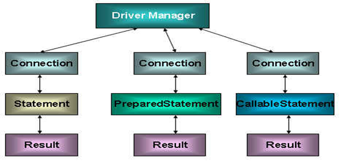

# 大纲
##什么是JDBC
##使用JDBC
###JDBC中的重要类
* DriverManager：驱动管理器
  * 注册驱动：静态方法registerDriver(Driver driver)
  * 获取数据库连接：static Connection getConnection(String url, String user, String password)    
* Connection：连接实例
  * 获取执行sql的对象：Statement createStatement()
  * 释放资源：void close()  
* Statement：执行sql的对象
  * 执行sql：int executeUpdate(String sql)
  * 释放资源：void close()  
* PreparedStatement：预编译的sql语句对象
  * 执行sql：int executeUpdate()
  * 释放资源：void close()  
* ResultSet：结果集
  * 判断是否有下一条记录：boolean next()
  * 获取数据：getXxx(参数)
  * 释放资源：void close()

###连接数据库


**代码思路**

```
1.加载驱动
2.配置驱动（配置连接信息：URL，用户名，密码等）
综上：可以通过读取Properties配置文件的方式读取所有配置信息（URL，用户名，密码以及驱动类型）

3.获取连接
通过驱动管理器DriverManager的
DriverManager.getConnection方法获取连接
```

###操作数据库




**代码思路**

```
1.通过Connection连接获取PreperedStatement操作类
2.向PreperedStatement类中添加预编译的sql语句
3.通过PreperedStatement类中的set方法操作数据库
4.通过execute方法提交操作
```