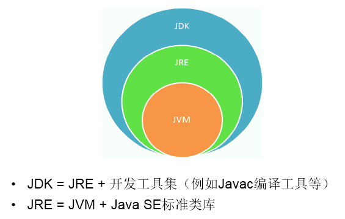
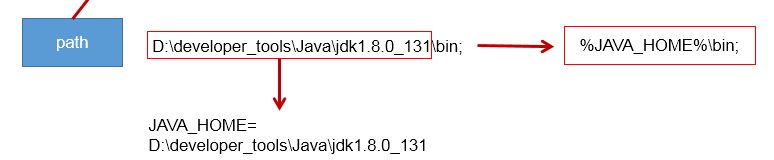

## 1.开发环境的搭建（重点）
### 1.1 JDK、JRE、JVM的关系

### 1.2 JDK的下载、安装
下载：官网，github
安装：傻瓜式安装：JDK 、JRE
   注意问题：安装软件的路径中不能包含中文、空格。
### 1.3 path环境变量的配置
#### 1.3.1 为什么配置path环境变量？
path环境变量：windows操作系统执行命令时所要搜寻的路径
为什么要配置path:希望java的开发工具（javac.exe,java.exe)在任何的文件路径下都可以执行成功。
#### 1.3.2 如何配置？

#### 1.3.3 配置后如何验证？
* 打开命令行工具(cmd或者PowerShell)
* 输入命令
   ```shell
   #查看
   java -verson 
   ```
###安装JDK源码以及文档
库源文件在JDK中以一个压缩文件src.zp的形式发布，必须将其解压缩后才能够访问源代码。
####源码
https://github.com/openjdk/jdk
按照下面所述的步骤进行操作：
1. 确保JDK已经安装，并且jdk/bin目录在执行路径中。
2. 打开shell窗口。
3. 进入jdk目录（例如：cd/usr/local/jdk1.6.0或cd c:\jdk1.6.0)。
4. 建立一个子目录src
   ```shell
   #创建src目录
   mkdir src 
   #进入src目录
   cd src
   ```
5. 执行命令：
   ```shell
   #Liunx
   jar xvf ../src.zip
   #Windows
   jar xvf.\src.zip
   ```
提示：在sre.zip文件中包含了所有公共类库的源代码：编译器、虚拟机、本地方法以及私有辅助类，要想获得更多的源代码请访问:[网站](http://download.java.net/jdk6)
####文档
文档以一个压缩文件的形式发布，其中包括HTML格式的API文档以及PDF格式的用户指南。

获得这个文档。操作步骤如下：
1. 确认JDK已经安装，并且jdk/bin目录在执行路径上。
2. 下载文档压缩文件并将其存放在jdk目录下。这个文件名为jdk-version-doc.zip,其中的version表示版本号，例如，6。
3. 打开一个shell窗口
4. 进入jdk目录
5. 执行命令：
   ```shell
   jar xvf jdk-version-doc.zip
   #其中version是相应的版本号
   ```

#[JDK源码仓库](https://github.com/openjdk/jdk)


