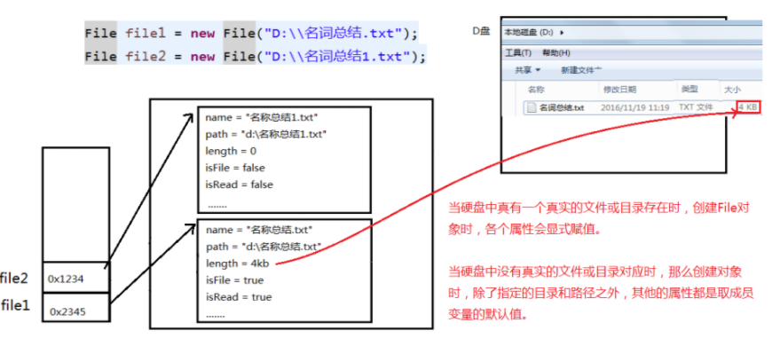
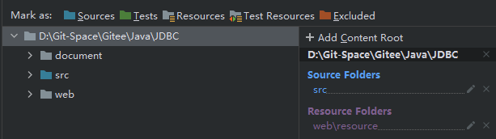

# File类的理解
1. File类的一个对象，代表`一个文件`或一个`文件目录`(俗称：文件夹)
2. File类声明在java.io包下
3. File类中涉及到关于文件或文件目录的`创建`、`删除`、`重命名`、`修改时间`、`文件大小`等方法，
   1. 并未涉及到写入或读取文件内容的操作。如果需要读取或写入文件内容，必须使用IO流来完成。
4. 后续File类的对象常会作为参数传递到流的构造器中，指明读取或写入的"终点".


**File对象并不是文件本身，当实例化一个文件对象时，文件本身并不会被读到内存中**
# File对象的实例化
## 常用构造器
* `File(File parent, String child)`  
从父抽象路径名和子路径名字符串创建新的 File实例。
* `File(String pathname)`  
通过将给定的路径名字符串转换为抽象路径名来创建新的 File实例。
* `File(String parent, String child)`  
从父路径名字符串和子路径名字符串创建新的 File实例。
* `File(URI uri)`  
通过将给定的file: URI转换为抽象路径名来创建新的 File实例
## 路径的分类
- 绝对路径：包含盘符在内的文件或文件目录的路径，或者说以整个系统作为参照，来表示当前文件或文件夹的路径
    - 绝对路径名是完整的，因为不需要其他信息来定位其表示的文件
- 相对路径：以某个路径作为参照，来表示当前文件或文件夹的路径。
   - 相对路径名必须根据从其他路径名获取的信息进行解释
        1. **File对象会默认以`当前项目目录`，作为相对路径的基准路径**
        2. **在Junit中File对象会默认以`当前模块`，作为相对路径的基准路径**。
     <font color="red">默认情况下，java.io包中的类始终会**根据当前用户目录**解析相对路径名。 该目录由系统属性`user.dir`，通常是调用Java虚拟机的目录，也就是**当前的项目目录。**
     </font>    
###区别
绝对路径和相对路径最大的区别就是`参照路径不同`
####相对路径表示
相对路径是相对于当前工作目录或另一个基准路径而言的路径表示法。它指定如何从当前位置或基准位置导航到目标文件或目录。


1. **相对于当前工作目录：**
    - 在大多数情况下，相对路径是相对于当前工作目录的。例如：
        - `file.txt`：表示当前工作目录下的文件。
        - `images/photo.jpg`：表示当前工作目录下的 images 子目录中的 photo.jpg 文件。

2. **使用 `..` 表示上级目录：**
    - `../folder/file.txt`：表示当前目录的上一级目录中的 folder 子目录下的 file.txt 文件。

3. **使用 `.` 表示当前目录：**
    - `./subfolder/file.txt`：表示当前目录下的 subfolder 子目录中的 file.txt 文件。

4. **相对于类路径（在 Java 或类似环境中）：**
    - 在 Java 等环境中，相对路径可以相对于类路径。例如：
        - `resources/config.properties`：表示类路径下的 resources 目录中的 config.properties 文件。

请注意，相对路径的基准点取决于当前执行程序的上下文。在不同的操作系统和应用程序中，相对路径的含义可能会有所不同。因此，确保了解当前工作目录或基准路径，以正确构造相对路径。

```java
@Test
    public void test(){
        File file = new File("file_demo");
        if (!file.exists()) {
            file.mkdirs();
        }
        System.out.println("file.getPath() = " + file.getPath());
        //当我们不清楚当前相对路径的基准路径时，可以通过获取绝对路径来确定
        System.out.println("file.getAbsolutePath() = " + file.getAbsolutePath());
    }
```

### 说明
#### IDEA中的相对路径
如果大家开发使用JUnit中的单元测试方法测试，相对路径即为当前Module下。
如果大家使用main()测试，相对路径即为当前的Project下。
#### Eclipse中的相对路径
不管使用单元测试方法还是使用main()测试，相对路径都是当前的Project下。
#### 路径分隔符
* `Windows`和`DOS`系统默认使用`“\”`来表示，但是实际在字符串中必须使用`"\\"`
* `UNIX`和`URL`使用`“/”`来表示
# 常用方法
## 获取
* `public String getAbsolutePath()`：获取绝对路径
* `public String getPath()`：获取路径
* `public String getName()`：获取名称
* `public String getParent()`：获取上层文件目录路径。若无，返回null
* `public long length()`：获取文件长度（即：字节数）。不能获取目录的长度。
* `public long lastModified()`：获取最后一次的修改时间，毫秒值
* `public String[] list()`：获取指定目录下的所有文件或者文件目录的名称数组
* `public File[] listFiles()`：获取指定目录下的所有文件或者文件目录的File数组
## 修改
* `public boolean renameTo(File dest)`：把文件重命名为指定的文件路径
## 判断
* `public boolean isDirectory()`：判断是否是文件目录
* `public boolean isFile()`：判断是否是文件
* `public boolean exists()`：判断是否存在
* `public boolean canRead()`：判断是否可读
* `public boolean canWrite()`：判断是否可写
* `public boolean isHidden()`：判断是否隐藏
## 创建
* `public boolean createNewFile()`：创建文件。若文件存在，则不创建，返回false
* `public boolean mkdir()`：创建文件目录。如果此文件目录存在，就不创建了。如果此文件目录的上层目录不存在，也不创建。
* `public boolean mkdirs()`：创建文件目录。如果上层文件目录不存在，一并创建

**注意：如果没有写绝对路径，那么会按照相对路径创建(相对路径=本项目目录)**
## 删除
* `public boolean delete()`：删除文件或者文件夹

删除注意事项：
Java中的删除不走回收站。
要删除一个文件目录，请注意该文件目录内不能包含文件或者文件目录

# 实践
##Java项目的文件读取(相对路径实践)
<font color="red">我们在理解相对目录时一定要以打包过后的classes目录结构来理解</font>
 
编译后的src目录，会被编译成classes目录，classes目录会被打包成jar包，jar包会被部署到服务器上
* 可以说：`src目录`=`classes目录`=`jar包`=`服务器项目根目录`。


  
**Sources和Resources级别的目录都会被打包到classes目录下**
```
ProjectName
	| -- src
		| -- aa.properties : 直接在src下面的配置文件
		| -- config
			| -- jdbc-mysql.properties : 在一个配置目录下的配置文件
		| -- com.northcastle.file
			| -- bb.properties : 在一个包中的配置文件
			| -- ApplicationFilePath.java : 一个普通的java类，测试读取不同位置的配置文件

```
###Classloader方式
```java
ClassLoader.getResourceAsStream(filePath)  
//【可以读取classes下的任意级目录的文件】
//【在IDEA的开发环境中要求要在Sources和Resources级别的目录下】

// 注意这里的包路径与我们上面描述的项目结构一致
package com.northcastle.file;

import java.io.IOException;
import java.io.InputStream;
import java.util.Properties;

/**
 * author : northcastle
 * createTime:2022/1/10
 * 本案例进行探究一下java中的使用 ClassLoader+文件相对路径 读取文件
 */
public class ApplicationFilePath {
    public static void main(String[] args) throws IOException {

        /**
         * 1.ClassLoader.getResourceAsStream(filePath)
         *   【可以读取src下的任意级目录的文件】
         *   【当前类的包也需要在src目录下】
         */

        //1.准备三个文件再项目中的相对路径 ： 相对于 src 的路径
        String path01 = "aa.properties"; // 直接在src下
        String path02 = "com/northcastle/file/bb.properties"; // 在某个包下
        String path03 = "config/jdbc-mysql.properties"; // 在某个包下

        //2.准备一个 ClassLoader 对象 : 通过当前类获取即可
        ClassLoader classLoader = ApplicationFilePath.class.getClassLoader();

        //3.下面分别读取三个配置文件的内容
        System.out.println("========ClassLoader 读取 aa.properties 开始==============");
        InputStream is01_01 = classLoader.getResourceAsStream(path01);
        Properties properties01_01 = new Properties();
        properties01_01.load(is01_01);
        properties01_01.list(System.out);
        System.out.println("========ClassLoader 读取 aa.properties 结束==============");
        System.out.println();

        System.out.println("========ClassLoader 读取 bb.properties 开始==============");
        InputStream is01_02 = classLoader.getResourceAsStream(path02);
        Properties properties01_02 = new Properties();
        properties01_02.load(is01_02);
        properties01_02.list(System.out);
        System.out.println("========ClassLoader 读取 bb.properties 结束==============");
        System.out.println();

        System.out.println("========ClassLoader 读取 jdbc-mysql.properties 开始==============");
        InputStream is01_03 = classLoader.getResourceAsStream(path03);
        Properties properties01_03 = new Properties();
        properties01_03.load(is01_03);
        properties01_03.list(System.out);
        System.out.println("========ClassLoader 读取 jdbc-mysql.properties 结束==============");
        System.out.println();

    }
}


```


###Class方式
```java
class.getResourceAsStream(filePath)
//【其实与 ClassLoader.getResourceAsStream(filePath)一致，
//【不过需要确保path的前面必须要有一个"/"】
//【特例：如果被读取的文件与当前类在同一个包下，则可以只写文件名即可!
//     （这一点与ClassLoader是不同的；ClassLoader只写文件名的时候，是该配置文件在src目录下）】


/**
 * author : northcastle
 * createTime:2022/1/10
 * 本案例进行探究一下 java中的文件路径的问题
 */
public class ApplicationFilePath {
    public static void main(String[] args) throws IOException {

        /**
         * 2.class.getResourceAsStream(filePath)
         *    【其实与 ClassLoader.getResourceAsStream(filePath)一致，
         *     不过需要确保path的前面必须要有一个"/"】
         */

        //1.准备三个文件再项目中的相对路径 ： 相对于 src 的路径
        //   注意 ： 此时，每个相对路径的前面必须以 “/” 开始！！！
        String path01 = "/aa.properties"; // 直接在src下
        String path02 = "/com/northcastle/file/bb.properties"; // 在某个包下
        String path03 = "/config/jdbc-mysql.properties"; // 在某个包下
        String path04 = "bb.properties"; // 同包下的一个文件

        //2.准备一个Class对象 ： 直接使用当前类即可
        Class<ApplicationFilePath> applicationFilePathClass = ApplicationFilePath.class;

        //3.下面进行文件的读取操作
        System.out.println("========Class.getResourceAsStream 读取 aa.properties 开始==============");
        InputStream is02_01 = applicationFilePathClass.getResourceAsStream(path01);
        Properties properties02_01 = new Properties();
        properties02_01.load(is02_01);
        properties02_01.list(System.out);
        System.out.println("========Class.getResourceAsStream 读取 aa.properties 结束==============");
        System.out.println();

        System.out.println("========Class.getResourceAsStream 读取 bb.properties 开始==============");
        InputStream is02_02 = applicationFilePathClass.getResourceAsStream(path02);
        Properties properties02_02 = new Properties();
        properties02_02.load(is02_02);
        properties02_02.list(System.out);
        System.out.println("========Class.getResourceAsStream 读取 bb.properties 结束==============");
        System.out.println();

        System.out.println("========Class.getResourceAsStream 读取 jdbc-mysql.properties 开始==============");
        InputStream is02_03 = applicationFilePathClass.getResourceAsStream(path03);
        Properties properties02_03 = new Properties();
        properties02_03.load(is02_03);
        properties02_03.list(System.out);
        System.out.println("========Class.getResourceAsStream 读取 jdbc-mysql.properties 结束==============");
        System.out.println();

        System.out.println("========Class.getResourceAsStream 读取 bb.properties 开始==============");
        InputStream is02_04 = applicationFilePathClass.getResourceAsStream(path04);
        Properties properties02_04 = new Properties();
        properties02_04.load(is02_04);
        properties02_04.list(System.out);
        System.out.println("========Class.getResourceAsStream 读取 bb.properties 结束==============");
        System.out.println();
    }

}


```
###FileInputStream方式
java.io包中的类的相对路径前缀由系统属性`user.dir`提供，通常是调用Java虚拟机的目录，也就是当前的项目目录。

<font color = "red">当前的项目目录并不是模块目录</font>

1. `(无)`开头表示以默认目录为参照
2. `(/)`开头的目录表示该目录为根目录的一个子目录
3. `(./)`开头的目录表示该目录为当前目录（当前目录所在的目录）的一个子目录
4. `(../)`开头的目录表示该目录为当前目录的父目录

[JAVA IO - 一文搞懂java项目中的相对路径](https://blog.csdn.net/qq_39505245/article/details/122708998)


