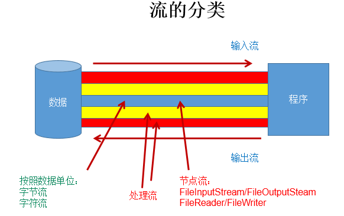
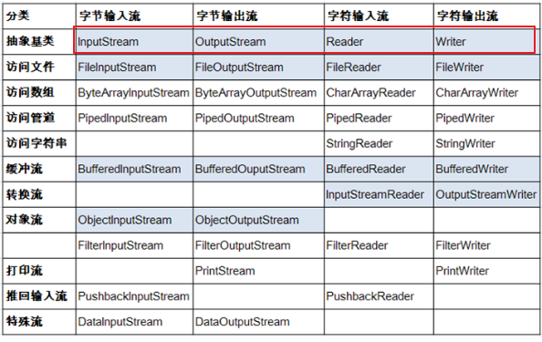

 `I/O`技术是非常实用的技术，用于处理**设备之间的数据传输**。如**读/写文件**，**网络通讯**等
# 流的分类

1. 操作数据单位：`字节流`、`字符流`
   1. 字节流：输入输出的基本单位是字节
   2. 字符流：输入输出的基本单位是字符
2. 数据的流向：`输入流`、`输出流`
   1. 输入流：从外部程序到本程序内部
   2. 输出流：从本程序内部到外部程序
3. 流的角色：`节点流`、`处理流`
   1. 节点流： 直接从数据源或目的地读写数据  
   2. 处理流： `包裹在已存在的流`（节点流或处理流）之上，对正在流动的数据进行处理**


# 流的体系结构

说明：红框对应的是IO流中的4个抽象基类。**蓝框的流需要大家重点关注**。

1. InputStream ----------------------字节输入流
- `int read()`：
   - 从输入流中读取数据的下一个字节，返回`0`-`255`范围内的int字节值，读取完毕返回-1 
- `int read(byte[] b)`： 
   - 从此输入流中将最多`b.length`个字节的数据读入一个`byte数组`中。读取完毕返回-1。否则以整数形式返回实际读取的字节数。  
- `int read(byte[] b, int off, int len)` ： 
   - 将输入流中最多`len`个数据字节读入`byte数组`。尝试读取len个字节，但读取的字节也可能小于该值。以整数形式返回实际读取的字节数。读取完毕返回-1。  
2. OutputStream--------------------字节输出流
- `void write(int b/int c)`： 
   - 将指定的字节写入此输出流。write 的常规协定是：向输出流写入一个字节。要写入的字节是参数b的八个低位。b 的24个高位将被忽略。 即写入0~255范围的。  
- `void write(byte[] b)`： 
   - 将 `b.length`个字节从指定的 byte 数组写入此输出流  
- `void write(byte[] b, int off, int len)`： 
   - 将指定 byte 数组中从偏移量 off 开始的 len 个字节写入此输出流  
- `void flush()`： 刷新此输出流并强制写出所有缓冲的输出字节， 字节立即写入它们预期的目标。  
- `void close()`： 关闭此输出流并释放与该流关联的所有系统资源  
3. Reader --------------------------字符输入流
- `int read()`： 
   - 读取单个字符， 范围在`0`到`65535`之间 (0x00-0xffff)（2个 字节的Unicode码）读取完毕返回-1  
- `int read(char [] c) `： 
   - 将字符读入数组。  读取完毕返回-1
- `int read(char [] c, int off, int len)`: 
   - 将字符读入数组的某一部分。存到数组cbuf中，从off处开始存储，最多读len个字符。 读取完毕返回-1 
4. Writer---------------------------字符输出流
- `void write(int c)`：  写入单个字符 
- `void write(char[] cbuf)`： 写入字符数组  
- `void write(char[] buff, int off, int len)`： 
   - 写入字符数组的某一部分。从off开始，写入len个字符  
- `void write(String str)`：写入字符串
- `void write(String str,int off,int len)`：写入字符串的一部分
- `void flush()`：
- `void close()`：

**程序中打开的文件IO资源不属于内存里的资源，`垃圾回收机制无法回收该资源`，所以应该显式关闭文件IO资源。**
# 输入、输出的标准化过程
## 输入过程

1. 创建File类的对象，指明读取的数据的来源。（要求此文件一定要存在）
2. 创建相应的输入流，将File类的对象作为参数，传入流的构造器中
3. 具体的读入过程：

    创建相应的byte[] 或 char[]。

4. 关闭流资源

说明：程序中出现的异常需要使用try-catch-finally处理。
```java
 @Test
    public void testFileReader() throws IOException {

        FileReader fr = null;
        try {
            fr = new FileReader(new File("F:\\Git-Space\\JAVA_SE\\file_demo\\20230613复习.txt"));
            char[] buf = new char[1024];
            int len;
            while ((len = fr.read(buf)) != -1) {
                System.out.print(new String(buf, 0, len));
            }
        } catch (IOException e) {
            System.out.println("read-Exception :" + e.getMessage());
        } finally {
            if (fr != null) {
                try {
                    fr.close();
                } catch (IOException e) {
                    System.out.println("close-Exception :" + e.getMessage());
                }
            }
        }

        try (FileReader reader = new FileReader(new File("F:\\Git-Space\\JAVA_SE\\file_demo\\20230613复习.txt"))){
            char[] buf = new char[1024];
            int len;
            while ((len = reader.read(buf)) != -1) {
                System.out.print(new String(buf, 0, len));
            }
        }

    }
```
## 输出过程

1. 创建File类的对象，指明写出的数据的位置。（不要求此文件一定要存在）
2. 创建相应的输出流，将File类的对象作为参数，传入流的构造器中
3. 具体的写出过程：

    write(char[]/byte[] buffer,0,len)

4. 关闭流资源

说明：程序中出现的异常需要使用try-catch-finally处理。
# 
