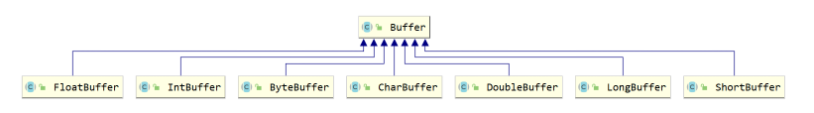

NIO

1. NIO与原来的IO**同样的作用和目的**，但是使用的方式完全不同，NIO**支持面向缓冲区**的(IO是面向流的)、**基于通道**的IO操作。
2. NIO将以更加高效的方式进行文件的读写操作。
- 可简单认为：**IO是面向流的处理，NIO是面向块(缓冲区)的处理**
   - 面向流的I/O 系统**一次一个字节地处理数据**
   - 一个面向块(缓冲区)的I/O系统**以块的形式处理数据**
## 核心组件


Java NIO的核心组件 包括：

- 通道（Channel）**-->双向运输**
   - 相对于传统IO而言，**流是单向的**。对于NIO而言，有了Channel管道这个概念，我们的**读写都是双向**的
   - Channel除了能够接到文件上，也能被接到Scoket上
- 缓冲区（Buffer）**-->数据**
   - 缓冲区，用来存放具体要被传输的数据，本质是一个**不同类型的数组**
  - 选择器（Selector）
   - 一个选择器可以同时监听多个服务器端口, 帮多个服务器端口同时等待客户端的访问
   - **Selector是因为NIO可以使用异步的非阻塞模式才加入的东西**
### Buffer API

- Buffer接口
   - ByteBuffer：存储字节数据到缓冲区
   - ShortBuffer：存储字符串数据到缓冲区
   - CharBuffer： 存储字符数据到缓冲区
   - IntBuffer：存储整数数据到缓冲区
   - LongBuffer：存储长整型数据到缓冲区
   - DoubleBuffer：存储小数到缓冲区
   - FloatBuffer：存储小数到缓冲区对于

Java 中的基本数据类型，都有一个 Buffer 类型与之相对应，最常用的自然是**ByteBuffer** 类（二进制数据）
#### 方法
创建

- 在堆中创建缓冲区：`allocate(int capacity)`
- 在系统内存创建缓冲区：`allocateDirect(int capacity)`
- 通过普通数组创建缓冲区：`wrap(byte[] arr)`

操作

- `put(byte b)` : 给数组添加元素
- `get()` :获取一个元素
- `filp()`：“切换成读模式”**
```java
import java.nio.ByteBuffer;

public class Demo01Buffer创建方式 {
    public static void main(String[] args) {
        //在堆中创建缓冲区：allocate(int capacity)*
        ByteBuffer buffer1 = ByteBuffer.allocate(10);

        //在系统内存创建缓冲区：allocateDirect(int capacity)
        ByteBuffer buffer2 = ByteBuffer.allocateDirect(10);

        //通过普通数组创建缓冲区：wrap(byte[] arr)
        byte[] arr = {97,98,99};
        ByteBuffer buffer3 = ByteBuffer.wrap(arr);

        //put(byte b) : 给数组添加元素
    buffer.put((byte)10);
    buffer.put((byte)20);
    buffer.put((byte)30);

    //把缓冲数组变成普通数组
    byte[] arr = buffer.array();

    //打印
    System.out.println(Arrays.toString(arr));

    //get() :获取一个元素
    byte b = buffer.get(1);
    System.out.println(b);   //20
    }
}
```
#### 核心属性

- 容量Capacity：**缓冲区能够容纳的数据元素的最大数量**。容量在缓冲区创建时被设定，并且永远不能被改变。(不能被改变的原因也很简单，底层是数组嘛)
- 界限Limit：**缓冲区中可以操作数据的大小**，代表了当前缓冲区中一共有多少数据（从limit开始后面的位置不能操作）。
- 位置Position：**下一个要被读或写的元素的位置**。Position会自动由相应的 `get()`和 `put()`函数更新。
- 标记Mark：一个备忘位置。**用于记录上一次读写的位置**。
```java
public static void main(String[] args) {

        // 创建一个缓冲区
        ByteBuffer byteBuffer = ByteBuffer.allocate(1024);

        // 看一下初始时4个核心变量的值
        System.out.println("初始时-->limit--->"+byteBuffer.limit());
        System.out.println("初始时-->position--->"+byteBuffer.position());
        System.out.println("初始时-->capacity--->"+byteBuffer.capacity());
        System.out.println("初始时-->mark--->" + byteBuffer.mark());

        System.out.println("--------------------------------------");

        // 添加一些数据到缓冲区中
        String s = "JavaEE";
        byteBuffer.put(s.getBytes());

        // 看一下初始时4个核心变量的值
        System.out.println("put完之后-->limit--->"+byteBuffer.limit());
        System.out.println("put完之后-->position--->"+byteBuffer.position());
        System.out.println("put完之后-->capacity--->"+byteBuffer.capacity());
        System.out.println("put完之后-->mark--->" + byteBuffer.mark());
    }
```

### **Channel API**

- Channel接口
   - FileChannel：用于读取、写入、映射和操作文件的通道。
   - DatagramChannel：通过UDP读写网络中的数据通道。
   - SocketChannel：通过TCP读写网络中的数据。
   - ServerSocketChannel：可以监听新进来的TCP连接，对每一个新进来的连接都会创建一个SocketChannel-(服务端)
```java
@Test
    public void test() throws FileNotFoundException {
        FileChannel channel = new FileOutputStream("F:\\Git-Space\\JAVA_SE\\file_demo\\测试文本.txt").getChannel();
    }

//创建客户端
SocketChannel sc = SocketChannel.open();

//创建服务端对象
ServerSocketChannel ssc = ServerSocketChannel.open();
```
#### 使用Channel完成文件复制
```java
public static Boolean copyFileByNIO(String sFile, String tFile){
        Boolean tag = true;
        try (FileInputStream reader = new FileInputStream(sFile);
             FileOutputStream writer = new FileOutputStream(tFile)){
            FileChannel readerChannel = reader.getChannel();
            FileChannel writerChannel = writer.getChannel();
            //创建缓冲区
            ByteBuffer buffer = ByteBuffer.allocate(1024);
            //循环
            while(readerChannel.read(buffer) != -1){
                //切换
                buffer.flip();
                //输出
                writerChannel.write(buffer);
                //还原所有指针位置
                buffer.clear();
            }
        } catch (IOException e) {
            e.printStackTrace();
            tag = false;
        }

        return tag;
    }
```
#### 使用Channel网络编程收发信息
```java
public class Demo客户端 {

    public static void main(String[] args) throws IOException {

        //创建客户端
        SocketChannel sc = SocketChannel.open();
        //指定要连接的服务器ip和端口
        sc.connect(new InetSocketAddress("127.0.0.1",9000));

        //创建缓冲输出
        ByteBuffer buffer = ByteBuffer.allocate(1024);

        //给数组添加数据
        buffer.put("哈哈哈".getBytes());

        //切换
        buffer.flip();

        //输出数据
        sc.write(buffer);

        //关闭资源
        sc.close();
    }
}
```
```java
public class Demo服务端 {
    //阻塞的
    public static void main(String[] args) throws IOException {

        //创建服务端对象
        ServerSocketChannel ssc = ServerSocketChannel.open();
        //绑定端口号
        ssc.bind(new InetSocketAddress(9000));

        //连接客户端
        SocketChannel sc = ssc.accept();

        //创建缓冲数组
        ByteBuffer buffer = ByteBuffer.allocate(1024);

        //读取数据
        int len = sc.read(buffer);

        //打印
        System.out.println(new String(buffer.array(),0,len));
    }
}
```
```java
public class Demo服务端非阻塞 {
    //阻塞的
    public static void main(String[] args) throws IOException, InterruptedException {

        //创建服务端对象
        ServerSocketChannel ssc = ServerSocketChannel.open();
        //绑定端口号
        ssc.bind(new InetSocketAddress(9000));

        //设置非阻塞
        ssc.configureBlocking(false);

        while(true) {
            //连接客户端
            //如果连接成功就是sc对象,如果没有连接就是sc=null
            SocketChannel sc = ssc.accept();

            //判断
            if(sc != null) {
                //创建缓冲数组
                ByteBuffer buffer = ByteBuffer.allocate(1024);

                //读取数据
                int len = sc.read(buffer);

                //打印
                System.out.println(new String(buffer.array(), 0, len));

                //结束循环
                break;
            }else{
                //没有客户访问
                //在这里可以写别的业务代码
                System.out.println("去忙点别的事儿...");
                Thread.sleep(3000);

            }
        }
    }
}
```
### Selector API
`选择器`是`通道`的`多路复用器`，Selector**可以同时监控多个通道的 IO（输入输出） 状况**
**Selector允许单线程处理多个Channel**。仅用单个线程来处理多个Channels的好处是，只需要更少的线程来处理通道。事实上，可以只用一个线程处理所有的通道，这样会大量的**减少线程之间上下文切换的开销**。

- SelectableChannel接口
- AbstractSelectableChannel
   - SocketChannel
   - ServerSocketChannel
   - DatagramChannel
#### Selector & Channel的绑定
**一个通道**可以被注册到**多个选择器**上，但对**每个选择器**而言只能被**注册一次**
**注册方式：**

- `Channel.register（Selector sel，int ops）`：将一个通道注册到一个选择器
   - sel：指定的选择器
   - ops：指定选择器需要查询的通道操作
      - 可读 : `SelectionKey.OP_READ`
      - 可写 : `SelectionKey.OP_WRITE`
      - 连接 : `SelectionKey.OP_CONNECT`
      - 接收 : `SelectionKey.OP_ACCEPT`
      - 多操作可以用“位或”操作符来实现：`SelectionKey.OP_READ` |` SelectionKey.OP_WRITE `
#### 常用方法

- `select()` : 选择器等待客户端连接的方法
   - 阻塞问题:
      - 在开始没有客户访问的时候是阻塞的
      - 在有客户来访问的时候方法会变成非阻塞的
      - 如果客户的访问被处理结束之后,又会恢复成阻塞的
- `selectedKeys()` : 选择器会把被连接的服务端对象放在Set集合中,这个方法就是返回一个Set集合
#### 使用流程

1. **创建Selector**
2. **Channel注册**
   1. 与Selector一起使用时，Channel**必须处于非阻塞模式**下，否则将抛出异常IllegalBlockingModeException
3. 轮询查询就绪操作
#### 编程实例(网络编程)
```java
public static void main(String[] args) throws IOException {

    //创建客户端
    SocketChannel sc = SocketChannel.open();
    //指定要连接的服务器ip和端口
    sc.connect(new InetSocketAddress("127.0.0.1",9000));

    //创建缓冲输出
    ByteBuffer buffer = ByteBuffer.allocate(1024);

    //给数组添加数据
    buffer.put("拉勾教育".getBytes());

    //切换
    buffer.flip();

    //输出数据
    sc.write(buffer);

    //关闭资源
    sc.close();
}
```
```java
public class Demo服务端 {
    public static void main(String[] args) throws IOException {
        //创建服务端对象
        ServerSocketChannel ssc1 = ServerSocketChannel.open();
        ssc1.bind(new InetSocketAddress(8000));
        //设置非阻塞
        ssc1.configureBlocking(false);

        //创建服务端对象
        ServerSocketChannel ssc2 = ServerSocketChannel.open();
        ssc2.bind(new InetSocketAddress(9000));
        ssc2.configureBlocking(false);

        //创建服务端对象
        ServerSocketChannel ssc3 = ServerSocketChannel.open();
        ssc3.bind(new InetSocketAddress(10001));
        ssc3.configureBlocking(false);

        //创建选择器对象
        Selector s = Selector.open();

        //两个服务器都要交给选择器来管理
        ssc1.register(s, SelectionKey.OP_ACCEPT);
        ssc2.register(s, SelectionKey.OP_ACCEPT);
        ssc3.register(s, SelectionKey.OP_ACCEPT);

        //获取集合
        //selectedKeys() :返回集合,集合作用存放的是被连接的服务对象的key
        Set<SelectionKey> set = s.selectedKeys();

        System.out.println("集合中元素的个数: " + set.size());  //0(没有服务端被访问的时候显示0)

        //select():这是选择器连接客户端的方法
        s.select();

        System.out.println("集合中元素的个数: " + set.size());  //1(有一个服务端被访问的时候显示1)
    }
}
```
```java
public class Selector服务端 {

    public static void main(String[] args) throws IOException {

        // 1、获取Selector选择器
        Selector selector = Selector.open();

        // 2、获取通道
        ServerSocketChannel ssc1 = ServerSocketChannel.open();
        ServerSocketChannel ssc2 = ServerSocketChannel.open();
        ServerSocketChannel ssc3 = ServerSocketChannel.open();

        // 3.设置为非阻塞
        ssc1.configureBlocking(false);
        ssc2.configureBlocking(false);
        ssc3.configureBlocking(false);

        // 4、绑定连接
        ssc1.bind(new InetSocketAddress(8000));
        ssc2.bind(new InetSocketAddress(9000));
        ssc3.bind(new InetSocketAddress(10000));


        // 5、将通道注册到选择器上,并注册的操作为："接收"操作
        ssc1.register(selector, SelectionKey.OP_ACCEPT);
        ssc2.register(selector, SelectionKey.OP_ACCEPT);
        ssc3.register(selector, SelectionKey.OP_ACCEPT);


        // 6、采用轮询的方式，查询获取"准备就绪"的注册过的操作
        while (selector.select() > 0) {
            // 7、获取当前选择器中所有注册的选择键（“已经准备就绪的操作”）
            Iterator<SelectionKey> selectedKeys = selector.selectedKeys().iterator();
            while (selectedKeys.hasNext()) {

                // 8、获取"准备就绪"的事件
                SelectionKey selectedKey = selectedKeys.next();

                // 9、获取ServerSocketChannel
                ServerSocketChannel serverSocketChannel = (ServerSocketChannel) selectedKey.channel();
                // 10、接受客户端发来的数据
                SocketChannel socketChannel = serverSocketChannel.accept();

                // 11、读取数据
                ByteBuffer byteBuffer = ByteBuffer.allocate(1024);
                int length = 0;
                while ((length = socketChannel.read(byteBuffer)) != -1) {
                    byteBuffer.flip();
                    System.out.println(new String(byteBuffer.array(), 0, length));
                    byteBuffer.clear();
                }
                socketChannel.close();
            }
            // 12、移除选择键
            selectedKeys.remove();
        }
        // 13、关闭连接
        ssc1.close();
        ssc2.close();
        ssc3.close();
    }

}
```
# Path、Paths、Files的使用
## Path
Path**替换原有的File类**
如何实例化：

### 常用方法

## Files工具类
操作文件或文件目录的工具类
### 常用方法：


# 参考
- [NIO零拷贝与传统IO的文件传输性能比较_nio文件传输-CSDN博客](https://blog.csdn.net/PacosonSWJTU/article/details/126442150)
- [NIO](https://zhuanlan.zhihu.com/p/378465826)


