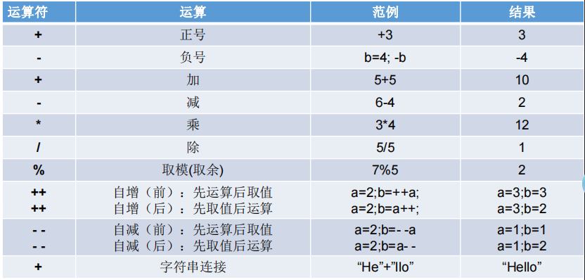

# 算术运算符


运算符： `+0` `-0` `+` `-` `*` `/` `%` `(前)++` `(后)++` `(前)--` `(后)--` `+`

1. 算数运算的`结果`只能是`数值`
2. **当参与运算的类型不一致时，会进行隐式转换，返回结果的类型是容量最大那个类型**
3. 除法的注意事项：
   1. 整数相除会自动省略小数
   2. 表达式中有负数，结果为负数
   3. 0不能做除数
4. `模数`的负号可以忽略，但`被模数`是负数则不可忽略。此外，取模运算的结果不一定总是整数。
5.  **连接符**：+：只能使用在String与其他数据类型变量之间使用，其本质就是new StringBuilder().append(a).append(b).toString();

   
###为什么模数的符号可以忽略不计？
取余运算的数学定义：`x mod y`= `x`-`y` * `(x/y)的下界`
```java
5%2 = 5-2*(5/2)的下界 = 5-2*2.5 = 5-2*2 = 5-4 = 1
-5%2 = -5-2*(-5/2)的下界 = -5-2*(-2.5) = -5-2*(-3) = -5+6 = 1

5%-2 = 5-(-2)*(5/-2)的下界 = 5+2*(-2.5) = 5+2*(-3) = 5-6 = -1
-5%-2 = -5-(-2)*(-5/-2)的下界 = -5-(-2)*2.5 = -5-(-2)*2 = -5+4 = -1
所以综合来看被模数的符号可以忽略不计
```
## 隐式类型转换
在Java中，当运算符两边的操作数类型不同时，系统会自动将类型转换成容量大的那种类型，这个过程称为隐式类型转换
```markdown
byte 、char 、short --> int --> long --> float --> double 
```
>char、byte、short 类型参与运算时，会自动转换成 int 类型

## 强制类型转换
在Java中，当我们需要将一个容量大的数据类型转换为容量小的数据类型时，就需要使用强制类型转换。
### 强制类型转换的注意事项
1. 强制类型转换可能会造成精度损失
2. 强制类型转换可能会造成溢出
3. 强制类型转换可能会造成引用数据类型的`ClassCastException`


##【典型代码】
```java
    //除号：/
    int num1 = 12;
    int num2 = 5;
    int result1 = num1 / num2;
    System.out.println(result1);//2
    // %:取余运算
    //结果的符号与被模数的符号相同
    //开发中，经常使用%来判断能否被除尽的情况。
    int m1 = 12;
    int n1 = 5;
    System.out.println("m1 % n1 = " + m1 % n1);
    
    int m2 = -12;
    int n2 = 5;
    System.out.println("m2 % n2 = " + m2 % n2);
    
    int m3 = 12;
    int n3 = -5;
    System.out.println("m3 % n3 = " + m3 % n3);
    
    int m4 = -12;
    int n4 = -5;
    System.out.println("m4 % n4 = " + m4 % n4);
    //(前)++ :先自增1，后运算
    //(后)++ :先运算，后自增1
    int a1 = 10;
    int b1 = ++a1;
    System.out.println("a1 = " + a1 + ",b1 = " + b1);
    
    int a2 = 10;
    int b2 = a2++;
    System.out.println("a2 = " + a2 + ",b2 = " + b2);
    
    int a3 = 10;
    ++a3;//a3++;
    int b3 = a3;
    //(前)-- :先自减1，后运算
    //(后)-- :先运算，后自减1
    
    int a4 = 10;
    int b4 = a4--;//int b4 = --a4;
    System.out.println("a4 = " + a4 + ",b4 = " + b4);
```
## 【特别说明的】
**单独使用++i和i++没有任何区别**

1. (前)++ :先自增1，后运算
2. (后)++ :先运算，后自增1
3. (前)-- :先自减1，后运算
4. (后)-- :先运算，后自减1

```java
//下面的是神经病代码，这种代码在C或者C++里被称为未定义式，编译都过不了，正常开发没人会写这种代码，但是可以研究一下原理
    int i = 1;
    i = i++;
    System.out.println("i++ =" + i);

    //字节码反编译：
    // iconst_1        常量1入栈                    栈中数据：1
    // istore_1      栈顶数据出栈到局部常量表[1]       空栈
    // iload_1       局部常量表[1]数据入栈            栈中数据：1
    // iinc 1 by 1   局部常量表[1]数据+1             栈中数据：1
    // istore_1      栈顶数据出栈到局部常量表[1]       空栈
    // 省略
    // dup           复制栈顶数据并入栈               空栈
    // 省略
    // ldc #43       字符串入栈                      栈中数据1："i++ ="
    // 省略
    // iload_1       局部常量表[1]数据入栈              栈栈中数据1："i++ =",1
            
    int j = 1;
    j = ++j;
    System.out.println("j++ =" + j);
    // iconst_1         常量1入栈                   栈中数据：1
    // istore_2      栈顶数据出栈到局部常量表[2]       空栈
    // iinc 2 by 1   局部常量表[2]数据+1             空栈
    // iload_2       局部常量表[2]数据入栈            栈中数据：2
    // istore_2      栈顶数据出栈到局部常量表[2]       空栈
    // 省略
    // dup           复制栈顶数据并入栈               空栈
    // 省略
    // iload_2       局部常量表[2]数据入栈            栈中数据：2
        // 省略
```
# 参考
* [彻底搞懂i++和++i的区别，谁的效率更高？](https://zhuanlan.zhihu.com/p/391942337?utm_id=0)C)
* [字节码指令](https://blog.csdn.net/qq_42200163/article/details/121898700)