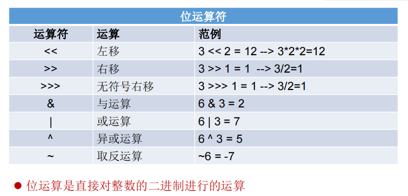

# 位运算符：`<<`  `>>` `>>>` `&` `|` `^` `~`
```java
int i = 21;
i = -21;
System.out.println("i << 2 :" + (i << 2));
System.out.println("i << 3 :" + (i << 3));
System.out.println("i << 27 :" + (i << 27));

int m = 12;
int n = 5;
System.out.println("m & n :" + (m & n));
System.out.println("m | n :" + (m | n));
System.out.println("m ^ n :" + (m ^ n));
```
## 与
### 用途
* **清零**  
任何数与0做与运算结果都为0。  
  比如：要清零一个byte类型的变量，则可用 `x & 0x00`。
* **取指定位**  
比如要取一个数的低4位，则只需使用该数与`16(0000 1111)`做与运行，结果就是这个数的低4位的值。
* **奇偶判断**  
只要二进制的末尾为0则是偶数，为1则为奇数。因此可用 `(x&1)==0`判断是否是偶数。
## 或
### 用途
**将某位设置为1**  
如`x=0101`，需要将第2位设置为1，结果变为0111，则只需和（0010）进行或运算，`0101|0010=0111`。
## 异或
### 用途
**翻转指定位**  
如要将`X=0101 1010`的低4位翻转为0101，则只需和Y=0000 1111进行异或运行，`X^Y=0101 0101` 。

**交换两数值**  
如`X=0101`，`Y=0100`，需要将X和Y的值进行交换
* 原理：x^y^y = x,两次异或y会相互消除
```java
x = x^y
y = x^y
x = x^y
```
#### 一个数据集合中，只有1个数字出现1次，其他数字都出现两次，找出这个数?

思路：只需要将所有数据进行异或运算，结果就是这个数。

#### 一个数据集合中，只有2个数字出现过1次，其他数字都出现过两次，找出这两个数。

思路：假设这两个数是X,Y,所有数字进行异或的结果就是X^Y，因为异或运算逻辑是相同为0，不同为1，
则找出这个结果的二进制中等于1的位置，然后将所有数字按照该位是否为1分成两部分，那么X和Y会被分开，
然后分别做异或运算，结果便是X和Y.

## 位移
### 【特别说明的】

1. 位运算符操作的都是整型的数据
2. `<<` ：在一定范围内，每向左移1位，相当于`* 2`  
   `>>` :  在一定范围内，每向右移1位，相当于 `/ 2`
# 面试

### **你能否写出最高效的2 * 8的实现方式？**

答案：2 << 3  或  8 << 1

### **交换两个变量的值**

方式一：定义临时变量
局限：只能作用于**数值型**

方式二：
可能超出最大值
```java
a=a+b;
b=a-b;
a=a-b;
```
方式三：
**【推荐】不会超出最大值**
```java
a=a^b //将b和a的值同时放到a中(现在a中保存了a和b的值)
b=a^b //消去b值剩下a值赋给b变量
a=a^b //消去a值剩下b值赋给a变量
```
### 实现60的二进制到十六进制的转换
# 参考
[一文读懂位运算](https://www.cnblogs.com/heiz123/p/15337749.html)

