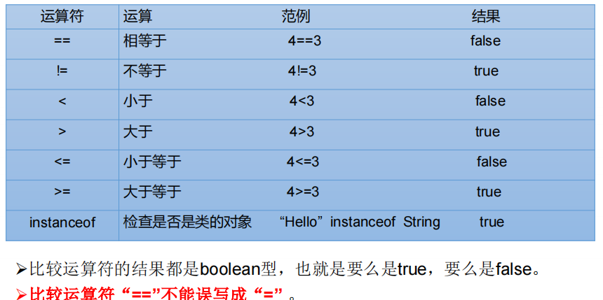

##比较运算符（关系运算符）: `==` `!=`` >`  `<`  `>=`  `<=`  `instanceof`
###【典型代码】
```java
int i = 10;
int j = 20;

System.out.println(i == j);//false
System.out.println(i = j);//20

boolean b1 = true;
boolean b2 = false;
System.out.println(b2 == b1);//false
System.out.println(b2 = b1);//true
```

###【特别说明的】
1. 比较运算符的结果是`boolean`类型  
2. `>`  `<`  `>=`  `<=` :只能使用在数值类型的数据之间。
3. `==` 和 `!=`: 不仅可以使用在数值类型数据之间，还可以使用在其他引用类型变量之间。
```java
Account acct1 = new Account(1000);
Account acct2 = new Account(1000);
boolean b1 = (acct1 == acct2);//比较两个Account是否是同一个账户。
boolean b2 = (acct1 != acct2);//
```


