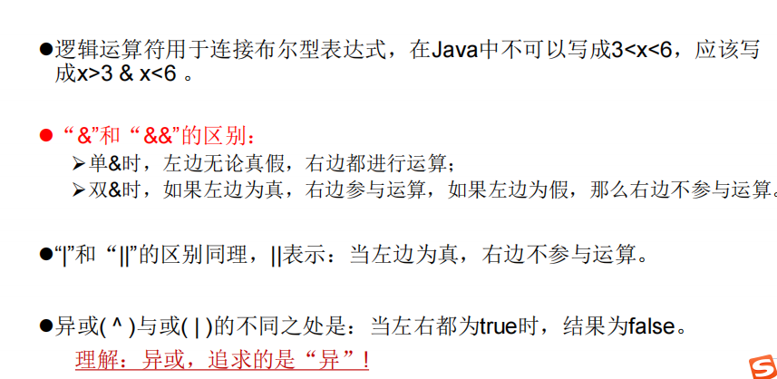

## 逻辑运算符：`&` `&&`  `|`  `||` `!`  `^`

###【典型代码】
```java
		//区分& 与 &&
		//相同点1：& 与  && 的运算结果相同
		//相同点2：当符号左边是true时，二者都会执行符号右边的运算
		//不同点：当符号左边是false时，&继续执行符号右边的运算。&&不再执行符号右边的运算。
		//开发中，推荐使用&&
public class Test{
	public static void main(String[] args) {
		boolean b1 = true;
		b1 = false;
		int num1 = 10;
		if(b1 & (num1++ > 0)){
			System.out.println("我现在在北京");
		}else{
			System.out.println("我现在在南京");
		}

		System.out.println("num1 = " + num1);


		boolean b2 = true;
		b2 = false;
		int num2 = 10;
		if(b2 && (num2++ > 0)){
			System.out.println("我现在在北京");
		}else{
			System.out.println("我现在在南京");
		}

		System.out.println("num2 = " + num2);

		// 区分：| 与 || 
		//相同点1：| 与  || 的运算结果相同
		//相同点2：当符号左边是false时，二者都会执行符号右边的运算
		//不同点3：当符号左边是true时，|继续执行符号右边的运算，而||不再执行符号右边的运算
		//开发中，推荐使用||
		boolean b3 = false;
		b3 = true;
		int num3 = 10;
		if(b3 | (num3++ > 0)){
			System.out.println("我现在在北京");
		}else{
			System.out.println("我现在在南京");
		}
		System.out.println("num3 = " + num3);


		boolean b4 = false;
		b4 = true;
		int num4 = 10;
		if(b4 || (num4++ > 0)){
			System.out.println("我现在在北京");
		}else{
			System.out.println("我现在在南京");
		}
		System.out.println("num4 = " + num4);
	}
}
		
```
		
###【特别说明的】
1.逻辑运算符操作的都是boolean类型的变量。而且结果也是boolean类型
