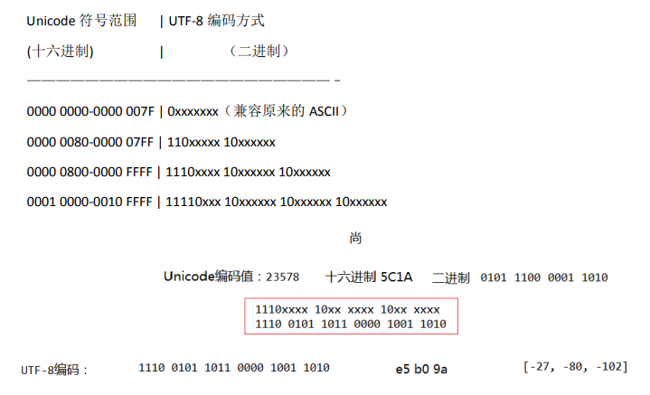

# 编码

## 字符

是各种`文字`和`符号`的==总称==，包括各个国家的文字，标点符号，图形符号，数字等

## 字符集

字符集是多个符号的集合，每个字符集包含的字符个数不同。有些字符集除了字符形式还有其对应的==数字码形式==，比如：ASCII码和Unicode码，其中一个**`数字码`**对应一个**`字符`**.

- ASCII字符集
  - 主要用于显示==现代英语==和==其他西欧语言==。它是最通用的==单字节编码==系统，并等同于国际标准ISO 646
- GB2312
  - 中国国家标准的简体中文字符集,==双字节表示==
- BIG5
  - 台湾财团法人信息工业策进会和五家软件公司创立，==双字节==储存
- GB18030
  - 2001年8月31日后在中国市场上发布的软件必须符合本标准，==单字节、双字节和四字节==三种方式
- **Unicode**
  - **统一支持现今世界各种不同语言的书面文本的交换、处理及显示**
  - 十六进制数字
  - 比如Unicode码：`中`《--》`\u4e2d`
  - `\u`的意思就是使用了Unicode编码。后面加上十六进制代码来表示Unicode字符
  - Java的String使用的编码是Unicode

```java
Integer num = Integer.valueOf("4e2d", 16);
System.out.println(num.intValue()); // 20013
```

### ASCII

美国国家标准协会`ANSI`制定了一个标准，规定了常用字符以及每个字符对应的编号，这就是 `ASCII`字符集（Character Set）,也称`ASCII码`

### Unicode

对于不同的国家有不同的文字和符号，自然也就出现了基于 `ASCII`字符集的`衍生字符集`。虽然通过使用不同字符集，我们可以在一台机器上查阅不同语言的文档，但是我们仍然无法解决一个问题：如果一份文档中含有不同国家的不同语言的字符，那么无法在一份文档中显示所有字符。为了解决这个问题，我们需要一个==全人类通用字符集==，这就是`Unicode字符集`。

## 字符编码

`字符编码格式`，是用来**`序列化`**或**`存储`**上文中提到的那个“编号(数字)”的一种“格式”,即**编号(数字)**到**二进制序列**的映射关系

GBK是对GB18030的实现，那么UTF系列就是对Unicode的实现

**为了统一字符集有三个问题：**

1. 我们已经知道，英文字母只用一个字节表示就够了，
2. 如何才能区别`Unicode`和`ASCII`？计算机怎么知道两个字节表示一个符号，而不是分别表示两个符号呢？
3. 如果和 GBK 等双字节编码方式一样，用最高位是`1`或`0`表示两个字节和一个字节，就少了很多值无法用于表示字符，不够表示所有字符。
   
   为解决 Unicode 如何在网络上传输的问题，于是面向传输的**众多**`UTF（UCS Transfer Format）`标准出现了

- UTF-8：每次 **8** 个位传输数据，这是为传输而设计的编码
  
  UTF-8 最大的一个特点，就是它是一种==变长的编码方式==。它可以使用== 1~4 个字节表示一个符号==。从 unicode 到 uft-8 并不是直接的对应，而是要过一些算法和规则来转换（即 Uncidoe 字符集≠UTF-8 编码方式）。
  1. 对于==**单字节**的符号==，字节的==第一位设为`0`==，==后面7位为这个符号的`unicode码`==。因此对于英语字母，UTF-8编码和ASCII码是相同的。
  2. 对于==**n字节**的符号==（n>1），==第一个字节的前`n`位都设为`1`==，==第`n+1`位设为`0`==，==后面字节==的==前两位一律设为`10==`。==剩下==的没有提及的二进制位，全部==为这个符号的unicode码==。
  3. **大小端模式**：大端法)是指低地址存放最高有效字节（MSB）(小端法)则是低地址存放最低有效字节（LSB）
  
  
  - **UTF-8-BOM头模式**
    - BOM头：Byte Order Mark 就是文本文件中开始的几个并不表示任何字符的字节
      - UTF-8 的 BOM 头为 0xEF 0xBB 0xBF
  - **UTF-8无BOM头模式**
- UTF-16：每次 **16** 个位传输数据
  - UTF-16大端模式为 0xFE 0xFF
  - UTF-16小端模式为 0xFF 0xFE
- GBK
  
  **ANSI表示的是系统默认编码格式**

### 字符集和字符编码的关系

1. **字符编码是字符集的二进制表示形式**

2. 在Unicode出现之前，所有的字符集都是和具体编码方案绑定在一起的（即==字符集≈编码方式==）

3. 对于Unicode来说，Unicode 只是定义了一个庞大的、全球通用的字符集，并为每个字符规定了唯一确定的编号，具体存储成什么样的字节流，取决于字符编码方案(即 ==Uncidoe字符集≠UTF-8 编码方式==)

4. 推荐的 Unicode 编码是 UTF-16 和UTF-8。

#### JAVA当中的Unicode

Java的String使用的编码是Unicode，当String存在于**内存中**时(在代码中用string类型的引用对它进行操作时)，是"==只有编码而没有编码格式的=="，所以java程序中的任何String对象，说它是gbk还是utf-8都是错的，**String在内存中不需要“编码格式”, 它只是一个Unicode的字符串而已**。当字符串需要在网络中传输或要被写入文件时，就需要使用编码格式了。乱码问题也因此出现。

1. 只有文件在硬盘中存储时才有编码格式的概念
   1. 写入硬盘是以某种编码格式存储在硬盘中
   2. 当读入内存时则必须使用正确的解码方式才能得到正确的数据
2. 在内存中