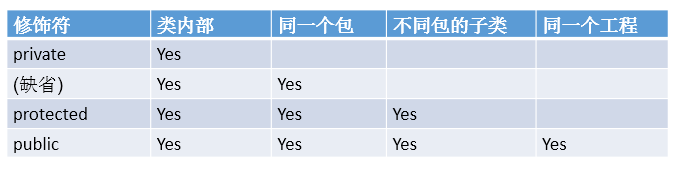

# 面向对象的特征一：封装与隐藏
## 为什么要引入封装性？
为了安全。封装隐藏了类内部的实现细节，外部只能使用对暴露的方法。降低系统的复杂度和提高`健壮性`。
## 问题引入： 
当我们创建一个类的对象以后，我们可以通过`对象.属性`的方式，对对象的属性进行赋值。这里，赋值操作要受到属性的数据类型和存储范围的制约。
除此之外，没其他制约条件。但是，在实际问题中，我们往往需要给属性赋值加入额外的限制条件。
这个条件就不能在属性声明时体现，我们只能通过方法进行限制条件的添加。（比如：setLegs()同时，我们需要避免用户再使用`对象.属性`的方式对属性进行赋值。则需要将属性声明为私有的(private).
  -->**此时，针对于属性就体现了封装性。**
## 广义上的封装性：

## 封装性思想具体的代码体现：
* 体现一：将类的属性xxx私化(private),同时，提供公共的(public)方法来获取(getXxx)和设置(setXxx)此属性的值
```java
private double radius;
public void setRadius(double radius){
	this.radius = radius;
}

public double getRadius(){
	return radius;
}
```
* 体现二：不对外暴露的私有的方法
* 体现三：单例模式（将构造器私有化）
* 体现四：如果不希望类在包外被调用，可以将类设置为缺省的。
## Java规定的四种权限修饰符

   1. 权限从小到大顺序为：private <  缺省 < protected < public
   2. 具体的修饰范围：


## 权限修饰符可用来修饰的结构说明：

   1. 4种权限都可以用来修饰类的内部结构：属性、方法、构造器、内部类
   2. 修饰类的话，只能使用：缺省、public


