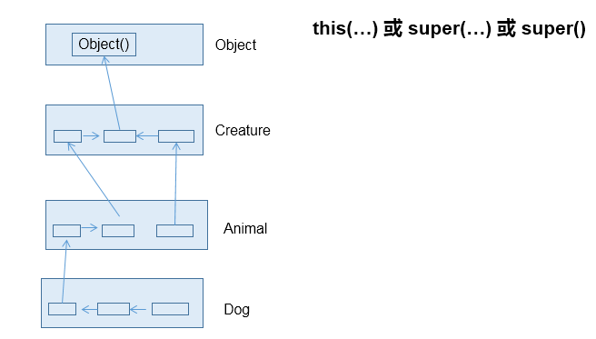
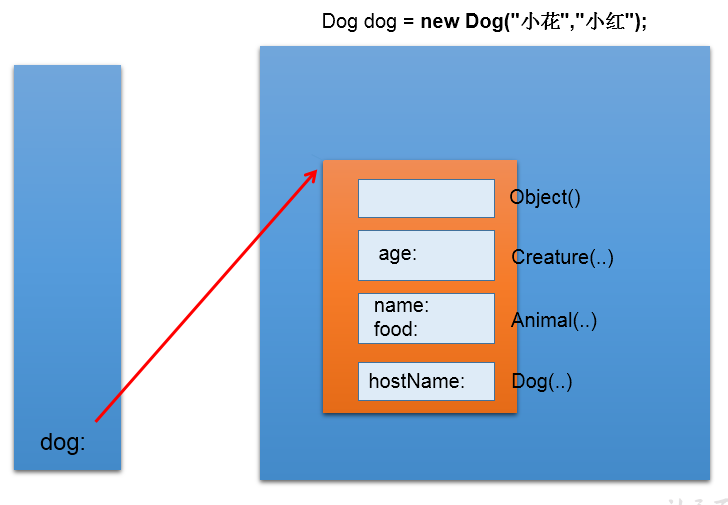

理解即可。
#代码执行流程
##类的加载
`静态成员`：静态成员会随着类的加载而加载，所以静态成员优先于对象存在。
##对象的实例化
在Java类的实例化过程中，构造方法、成员变量的初始化、实例代码块的执行顺序如下：
1. **成员变量的初始化：**
    - 首先，类的成员变量（包括实例变量和类变量）会被赋予默认值。如果有显示的初始化语句，这些初始化语句会在默认值的基础上进行覆盖。类变量的初始化在类加载时进行，而实例变量的初始化在对象实例化时进行。

2. **实例代码块的执行：**
    - 接着，如果类中包含实例代码块（instance block），这些实例代码块会在构造方法之前执行。实例代码块是在每次创建对象时执行的，且先于构造方法执行。

3. **构造方法的执行：**
    - 最后，构造方法会在实例代码块之后执行。构造方法用于完成对象的初始化工作，包括对成员变量的最终赋值、执行其他构造方法等。在一个对象的生命周期中，构造方法只会执行一次，即在对象第一次被实例化时。
   
#子类的实例化
## 从结果上看：继承性
1. 子类继承父类以后，就获取了父类中声明的属性或方法。
2. 创建子类的对象，在堆空间中，就会`加载所父类中声明的属性`。
## 从过程上看：
当我们通过子类的构造器创建子类对象时，我们一定会`直接`或`间接`的调用其父类的构造器，进而调用父类的父类的构造器，
...直到调用了java.lang.Object类中空参的构造器为止。

`正因为`**加载**`过所的父类的结构`，所以才可以看到内存中父类中的结构，
子类对象才可以考虑进行调用。

图示：  

## 强调说明：
虽然创建子类对象时，调用了父类的构造器，但是自始至终就创建过一个对象，即为new的子类对象。

##从内存上看类的实例化