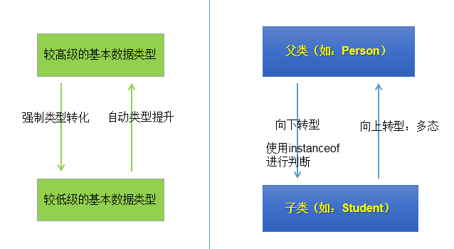

**所谓多态就是指一个类实例的相同方法在`不同情形`有`不同表现形式`。多态机制使具有`不同内部结构`的对象可以共享`相同的外部接口`。**虽然针对不同对象的具体操作不同，但通过一个公共的类，它们（那些操作）可以通过相同的方式予以调用。
## 多态性的理解：
可以理解为一个事物的多种形态。
## 多态性在代码中的体现：
对象的多态性：父类的引用指向子类的对象（或子类的对象赋给父类的引用）
```java
举例：
Person p = new Man();
Object obj = new Date();
```
## 多态性的使用：虚拟方法调用

1. 有了对象的多态性以后，我们在编译期，只能调用父类中声明的方法，但在运行期，我们`实际执行的是子类重写父类的方法`。

总结：编译，看左边；运行，看右边。
## 多态性的使用前提：

1. 类的继承关系 
2. 方法的重写
## 多态性的应用举例：
```java
举例一：
	public void func(Animal animal){//Animal animal = new Dog();
		animal.eat();
		animal.shout();
	}

举例二：
public void method(Object obj){
		
	}

举例三：
class Driver{
	
	public void doData(Connection conn){//conn = new MySQlConnection(); / conn = new OracleConnection();
		//规范的步骤去操作数据
//		conn.method1();
//		conn.method2();
//		conn.method3();
		
	}
	
}
```
## 多态性使用的注意点：
对象的多态性，只适用于方法，不适用于属性（编译和运行都看左边）
## 关于向上转型与向下转型
### 向上转型：多态
通过子类对象（小范围）实例化父类对象（大范围），这种属于自动转换
```java
class A {
         public void print() {
                  System.out.println("A:print");
         }
}

class B extends A {
         public void print() {        
                  System.out.println("B:print");
         }
}

public class Test{
         public static void main(String args[])
         {
                  A a = new B();          //通过子类去实例化父类
                  a.print();
         }
}
```
### 向下转型：
通过父类对象（大范围）实例化子类对象（小范围），通过父类强制转换为子类，从而来调用子类独有的方法（向下转型，在工程中很少用到），这种属于制转换。
#### 为什么使用向下转型
有了对象的多态性以后，内存中实际上是加载了子类特有的属性和方法的，但是由于变量声明为父类类型，导致编译时，只能调用父类中声明的属性和方法。子类特有的属性和方法不能调用。如何才能调用子类特的属性和方法？使用向下转型。
#### 如何实现向下转型：
使用强制类型转换符：()
使用时的注意点：

1. 使用强转时，可能出现ClassCastException的异常。
2. 为了避免在向下转型时出现ClassCastException的异常，我们在向下转型之前，先进行instanceof的判断，一旦返回true，就进行向下转型。如果返回false，不进行向下转型。
#### instanceof的使用：

1. a instanceof A:判断对象a是否是类A的实例。如果是，返回true；如果不是，返回false。
2. 如果 a instanceof A返回true,则 a instanceof B也返回true.其中，类B是类A的父类。
3. 要求a所属的类与类A必须是子类和父类的关系，否则编译错误。
```java
class A {
         public void print() {
                  System.out.println("A:print");
         }
}

class B extends A {
         public void print() {        
                  System.out.println("B:print");
         }
         public void funcB(){
                  System.out.println("funcB");
         }
}

class C extends A {
         public void print() {        
                  System.out.println("C:print");
         }
         public void funcC(){
                  System.out.println("funcC");
         }
}

public class Test{
         public static void func(A a)
         {
                  a.print();
                  if(a instanceof B)
                  {
                          B b = (B)a;   //向下转型,通过父类实例化子类
                          b.funcB();    //调用B类独有的方法
                  }
                  else if(a instanceof C)
                  {
                          C c = (C)a;  //向下转型,通过父类实例化子类
                          c.funcC();   //调用C类独有的方法
                  }
         }

         public static void main(String args[])
         {
                  func(new A());   
                  func(new B());
                  func(new C());
         }
}
```

## 面试题：
谈谈你对多态性的理解？
* 实现代码的通用性。
* Object类中定义的public boolean equals(Object obj){  }
  * JDBC:使用java程序操作(获取数据库连接、
  * CRUD)数据库(MySQL、Oracle、DB2、SQL Server)
* 抽象类、接口的使用肯定体现了多态性。（抽象类、接口不能实例化）
多态是编译时行为还是运行时行为？
* 运行时行为。


