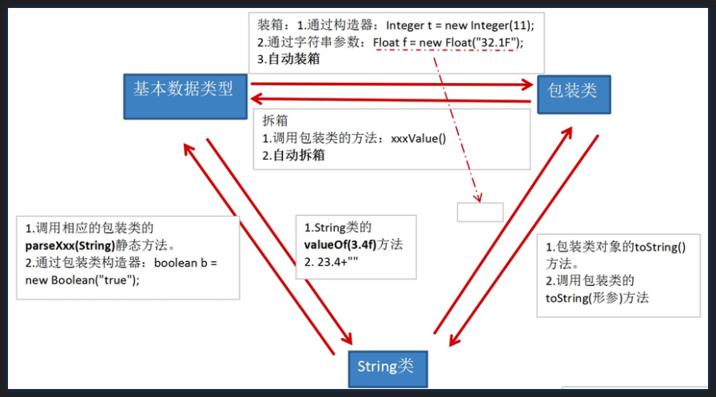

## 为什么要有包装类(或封装类）
为了使基本数据类型的变量具有类的特征，引入包装类。

## 基本数据类型与对应的包装类：
`byte`---------->`Byte`  
`short`--------->`Short`  
`int`------------>`Integer`  
`long`---------->`Long`  
`float`--------->`Float`  
`double`-------->`Double`  
`char`----------->`Character`  
`boolean`------->`Boolean`  

## 需要掌握的类型间的转换：（基本数据类型、包装类、String）

## 简易版：
基本数据类型<--->包装类：JDK 5.0 新特性：自动装箱 与自动拆箱  
基本数据类型、包装类--->String:调用String重载的valueOf(Xxx xxx)  
String--->基本数据类型、包装类:调用包装类的parseXxx(String s)  
     注意：转换时，可能会报NumberFormatException

应用场景举例：  
① Vector类中关于添加元素，只定义了形参为Object类型的方法：  
v.addElement(Object obj);   //基本数据类型 --->包装类 --->使用多态

