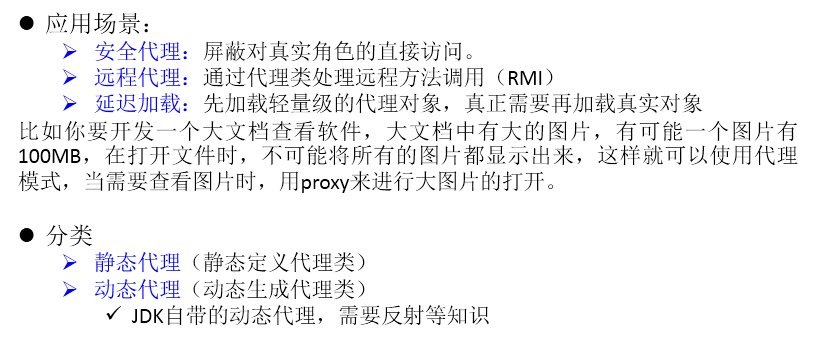

## 解决的问题
代理模式是Java开发中使用较多的一种设计模式。代理设计就是为**其他对象**提供一种代理以**控制对这个对象**的访问。 
## 举例
```java
interface NetWork{
	
	public void browse();
	
}

//被代理类
class Server implements NetWork{

	@Override
	public void browse() {
		System.out.println("真实的服务器访问网络");
	}

}
//代理类
class ProxyServer implements NetWork{
	
	private NetWork work;
	
	public ProxyServer(NetWork work){
		this.work = work;
	}
	

	public void check(){
		System.out.println("联网之前的检查工作");
	}
	
	@Override
	public void browse() {
		check();
		
		work.browse();
		
	}
	
}
```

## 应用场景



