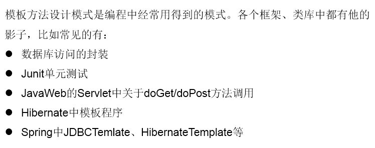

#解决的问题

在软件开发中实现一个算法时，整体步骤很固定、通用，这些步骤已经在父类中写好了。但是某些部分易变，易变部分可以抽象出来，供不同子类实现。这就是一种模板模式。
##举例
```java
  abstract class Template{
	
	//计算某段代码执行所需要花费的时间
	public void spendTime(){
		
		long start = System.currentTimeMillis();
		
		this.code();//不确定的部分、易变的部分
		
		long end = System.currentTimeMillis();
		
		System.out.println("花费的时间为：" + (end - start));
		
	}
	
	public abstract void code();
	
}

```
```java

class SubTemplate extends Template{

	@Override
	public void code() {
		
		for(int i = 2;i <= 1000;i++){
			boolean isFlag = true;
			for(int j = 2;j <= Math.sqrt(i);j++){
				
				if(i % j == 0){
					isFlag = false;
					break;
				}
			}
			if(isFlag){
				System.out.println(i);
			}
		}

	}
	
}
```

##应用场景
