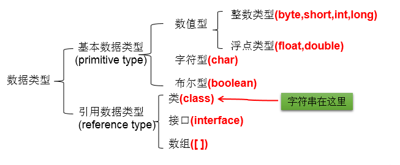
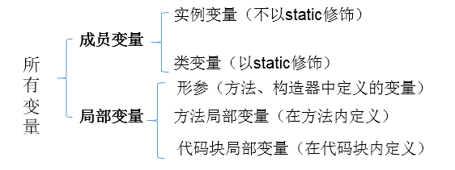

# 类的设计中，两个重要结构之一：属性
## 对比：属性(成员变量)  vs  局部变量
### 相同点：

   1. 定义变量的格式：数据类型  变量名 = 变量值
   2. 先声明，后使用
   3. 变量都其对应的作用域 
### 不同点：

   1. 在类中声明的位置的不同
      - **成员变量**：直接定义在类的一对{}内
      - **局部变量**：声明在方法内、方法形参、代码块内、构造器形参、构造器内部的变量
   2. 关于权限修饰符的不同
      - **成员变量**：可以在声明属性时，指明其权限，使用权限修饰符。
         - 常用的权限修饰符：private、public、缺省、protected  --->封装性
      - **局部变量**：不可以使用权限修饰符。
   3. 默认初始化值的情况：
      - **成员变量**：类的属性，根据其类型，都默认初始化值。
         - 整型（byte、short、int、long：0）
         - 浮点型（float、double：0.0）
         - 字符型（char：0  （或'\u0000'））
         - 布尔型（boolean：false）
         - 引用数据类型（类、数组、接口：null）
      - **局部变量**：没默认初始化值。

 意味着，我们在调用局部变量之前，一定要显式赋值。
 特别地：形参在调用时，我们赋值即可。

   4. 在内存中加载的位置：
      - **成员变量**：加载到**堆空间**中 （非static）
      - **局部变量**：加载到**栈空间**

### 补充：回顾变量的分类：
#### 方式一：按照数据类型：  
  
#### 方式二：按照在类中声明的位置：  

