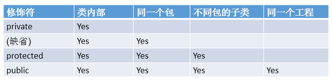

# 类的设计中，两个重要结构之二：方法
## 方法：描述类应该具的功能。
  比如：
- Math类：sqrt()\random() \...
- Scanner类：nextXxx() ...
- Arrays类：sort() \ binarySearch() \ toString() \ equals() \ ...
  1.举例：
```java
    public void eat(){}
    public void sleep(int hour){}
    public String getName(){}
    public String getNation(String nation){}
```
 
## 方法的声明
```java
权限修饰符 返回值类型 方法名(形参列表){方法体}
```
注意：static、final、abstract 也能来修饰的方法
* static：代表静态成员
* final：最终的，代表方法不能被重写
* abstract：代表抽象方法，不能有方法体

说明：
### 权限修饰符

- Java规定的4种权限修饰符：`private`、`public`、`缺省`、`protected`

  
* **权限修饰符封装性的具体表现，通过权限控制符控制对象中成员的访问权限，以达到封装的目的。**
### 返回值类型

   1. 如果方法**有返回值**，则必须在方法声明时，**指定返回值的类型**。同时，方法中，需要使用return关键字来返回指定类型的变量或常量：“return 数据”。
   2. 如果方法**没返回值**，则方法声明时，**使用void来表示**。通常，没返回值的方法中，就不需要使用return但是，如果使用的话，只能“return;”表示结束此方法的意思。
### 方法名

   1. 属于标识符，遵循标识符的规则和规范，“见名知意”
### 形参列表
   1. 方法可以声明`n`个形参，`n>=0`
### 方法体
方法功能的体现


