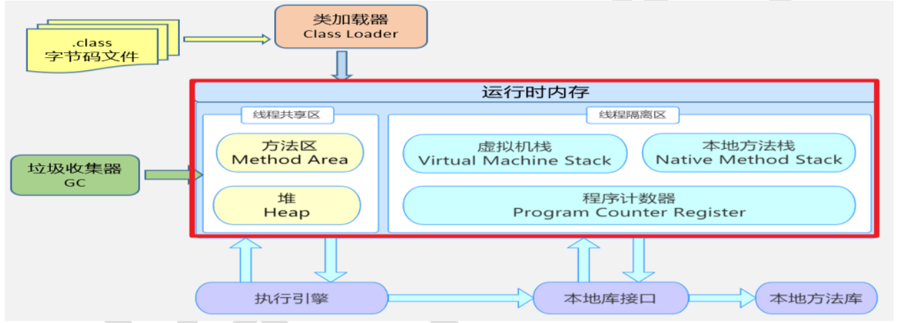
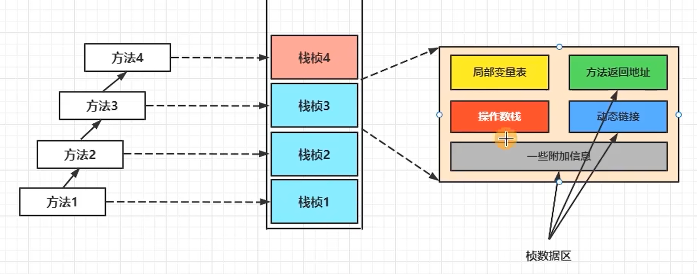
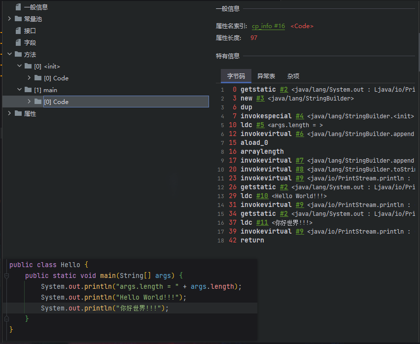

编译完源程序以后，生成一个或多个字节码文件。
我们使用JVM中的类的加载器和解释器对生成的字节码文件进行解释运行。意味着，需要将字节码文件对应的类加载到内存中，涉及到内存解析。

#《JVM规范》
Jva中内存结构划分为：`虚拟机栈`、`堆`、`方法区`；`程序计数器`、`本地方法栈`
* 所有线程共享的内存区域：
    * `堆`：我们将new出来的结构（比如：数组、对象）加载在对空间中。补充：数组的元素、对象的成员变量。
    * `方法区`：
       * `类的加载信息`：
       * `常量池`：
       * `静态域`：
* 线程隔离的内存区域：  
    * `虚拟机栈`：以**栈帧**为基本单位，有**入栈**和**出栈**操作；每个栈帧入栈操作对应一个方法的执行；方法内的局
      部变量会存绪在栈帧中。
      
    * `本地方法栈`：为虚拟机使用到的Native方法服务。Native方法是指用Java语言调用本地C/C++语言实现的方法。
    * `程序计数器`：记录当前线程所执行的字节码的行号。
    

