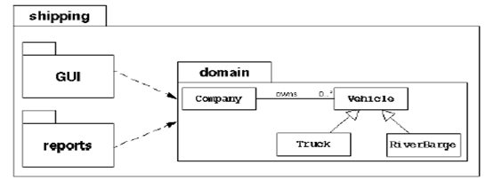
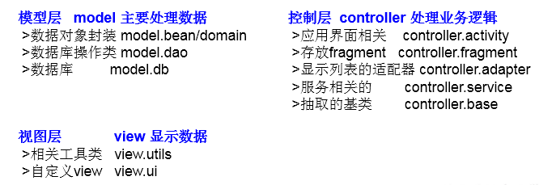
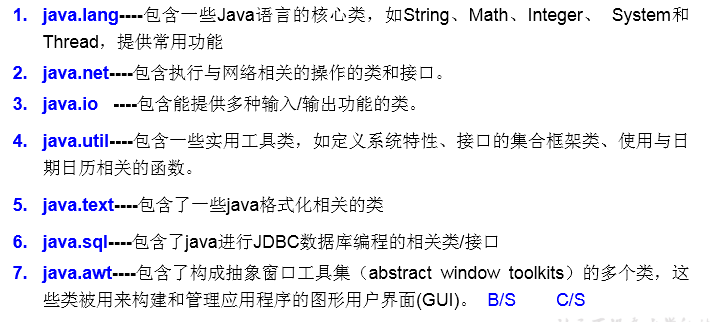

# package的使用
使用说明：

1. 为了更好的实现项目中类的管理，提供包的概念
2. 使用package声明类或接口所属的包，声明在源文件的首行
3. 包，属于标识符，遵循标识符的命名规则、规范(xxxyyyzzz)、“见名知意”
4. 每"."一次，就代表一层文件目录。

###举例一：某航运软件系统包括：一组域对象、GUI和reports子系统  

###举例二：MVC设计模式  

###JDK中的主要包介绍

# import的使用：
import:导入

- 在源文件中显式的使用import结构导入指定包下的类、接口
- 声明在包的声明和类的声明之间
- 如果需要导入多个结构，则并列写出即可
- 可以使用"xxx.*"的方式，表示可以导入xxx包下的所结构
- 如果使用的类或接口是java.lang包下定义的，则可以省略import结构
- 如果使用的类或接口是本包下定义的，则可以省略import结构
- 如果在源文件中，使用了不同包下的同名的类，则必须至少一个类需要以全类名的方式显示。
- 使用"xxx.*"方式表明可以调用xxx包下的所结构。但是如果使用的是xxx子包下的结构，则仍需要显式导入
- import static:导入指定类或接口中的静态结构:属性或方法。 

