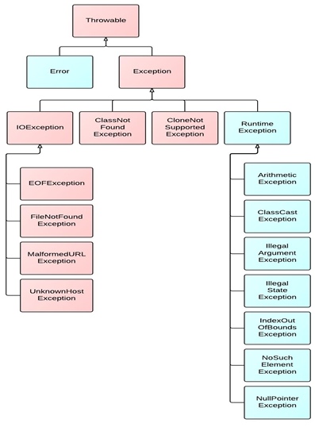

# **任何异常都会影响程序的正常运行**
# 异常的体系结构

- `Exception`和 `Error`都是Java异常处理的重要⼦类，各⾃都包含⼤量⼦类。均继承自`Throwable`类。
```java
java.lang.Throwable
		|-----java.lang.Error:一般不编写针对性的代码进行处理。
		|-----java.lang.Exception:可以进行异常的处理
			|------编译时异常(checked)
					|-----IOException IO异常
						|-----FileNotFoundException 文件找不到异常
					|-----ClassNotFoundException
			|------运行时异常(unchecked,RuntimeException)
					|-----NullPointerException 空指针异常
					|-----ArrayIndexOutOfBoundsException 数组越界异常
					|-----ClassCastException 类不匹配异常(张冠李戴)
					|-----NumberFormatException 数值格式化异常
					|-----InputMismatchException 
					|-----ArithmeticException
```
## Error
Error表⽰`系统级`的`错误`， 是java运⾏环境内部错误或者硬件问题， **不能指望程序来处理这样的问题**， 除了退出运⾏外别⽆选择， 它是Java虚拟机抛出的。
## Exception
**Exception表⽰程序需要`捕捉`、 需要`处理`的常**， 是由与程序设计的不完善⽽出现的问题， 程序必须处理的问题。
### 从程序执行过程，看编译时异常和运行时异常
`Java源程序.java` ----通过javac.exe编译---->`字节码文件.class`----通过java.exe运行---->`在内存中运行`

1. `编译时异常`：执行javac.exe命名时，可能出现的异常
   1. **编译时异常是指编译器要求必须处置的异常**。**即程序在运行时由于外界因素造成的一般性异常**。
      1. `不处理编译都过不了 `
2. `运行时异常`：执行java.exe命名时，出现的异常
   1. **是指编译器不要求强制处置的异常**。**一般是指编程时的逻辑错误**，是程序员应该积极避免其出现的异常。
      1. `因为是运行时的异常，编译器肯定不要求必须处理，但是程序不能运行还叫程序吗`

**任何异常都会影响程序的正常运行** 
# 常见的异常类型，请举例说明：
```java
******************以下是运行时异常***************************
	//ArithmeticException
	@Test
	public void test6(){
		int a = 10;
		int b = 0;
		System.out.println(a / b);
	}
	
	//InputMismatchException
	@Test
	public void test5(){
		Scanner scanner = new Scanner(System.in);
		int score = scanner.nextInt();
		System.out.println(score);
		
		scanner.close();
	}
	
	//NumberFormatException
	@Test
	public void test4(){
		
		String str = "123";
		str = "abc";
		int num = Integer.parseInt(str);
		
		
		
	}
	
	//ClassCastException
	@Test
	public void test3(){
		Object obj = new Date();
		String str = (String)obj;
	}
	
	//IndexOutOfBoundsException
	@Test
	public void test2(){
		//ArrayIndexOutOfBoundsException
//		int[] arr = new int[10];
//		System.out.println(arr[10]);
		//StringIndexOutOfBoundsException
		String str = "abc";
		System.out.println(str.charAt(3));
	}
	
	//NullPointerException
	@Test
	public void test1(){
		
//		int[] arr = null;
//		System.out.println(arr[3]);
		
		String str = "abc";
		str = null;
		System.out.println(str.charAt(0));
		
	}
```
```java
******************以下是编译时异常***************************
	@Test
	public void test7(){
//		File file = new File("hello.txt");
//		FileInputStream fis = new FileInputStream(file);
//		
//		int data = fis.read();
//		while(data != -1){
//			System.out.print((char)data);
//			data = fis.read();
//		}
//		
//		fis.close();
		
	}
```

