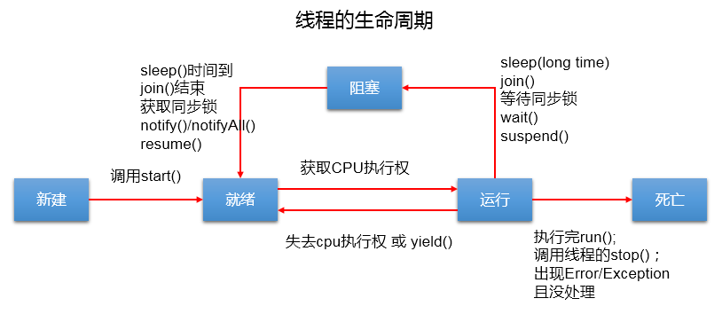
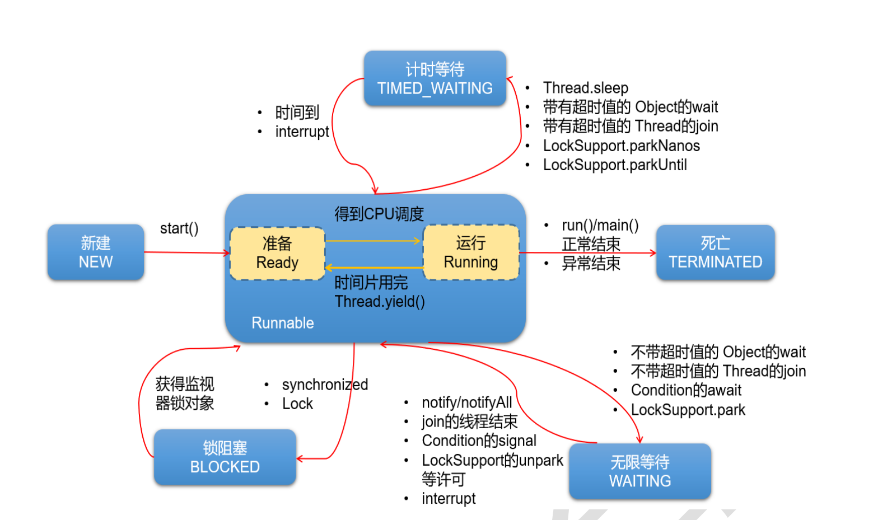

# 线程的生命周期
##JDK1.5之前的线程状态



1. `新建`：线程被创建
2. `就绪`：线程等待被CPU执行
3. `运行`：CPU正在执行
4. `阻塞`：临时状态，被挂起
5. `死亡`：运行完毕

生命周期关注两个概念：`状态`、以及`改变状态的相应的方法`
##JDK1.5之后的线程状态

jdk5.0及之后：Thread类中定义了一个内部类State

```java
public enum State {
        
        NEW,
    
        RUNNABLE,

        BLOCKED,

        WAITING,

        TIMED_WAITING,
 
        TERMINATED;
}
```
1. NEW:`新建`
2. RUNNABLE:`可运行`
3. TERMINATED:`被终止`
* 阻塞状态分为三种:
4. BLOCKED:锁阻塞
   * 一个正在阻塞、等待一个监视器锁（锁对象）的线程处于这一状态
5. TIMED_WAITING:计时等待（自动被唤醒）
   * 当前线程执行过程中遇到Thread类的`sleep`或`join`，Object类的`wait`，LockSupport类的`park`方法，
    并且在调用这些方法时，设置了时间，那么当前线程会进入TIMED_WAITING，直到时间到，或被中断。
6. WAITING:无限等待（手动动被唤醒）
   * 当前线程执行过程中遇到Thread类的`sleep`或`join`，Object类的`wait`，LockSupport类的`park`方法，
     并且在调用这些方法时， 没有设置等待时间，那么当前线程会进入WAITING，直到被唤醒。
     * 通过 Object 类的 wait 进入 WAITING 状态的要有 Object 的
     notify/notifyAll 唤醒；
     * 通过 Condition 的 await 进入 WAITING 状态的要有
     Condition 的 signal 方法唤醒；
     * 通过 LockSupport 类的 park 方法进入 WAITING 状态的要有
     LockSupport 类的 unpark 方法唤醒
     * 通过 Thread 类的 join 进入 WAITING 状态，只有调用 join
     方法的线程对象结束才能让当前线程恢复；
       
注意：当从 WAITING 或 TIMED_WAITING 恢复到 Runnable 状态时，如果发现
       当前线程没有得到监视器锁，那么会立刻转入 BLOCKED 状态。

## 线程的优先级
线程的优先级是一个就绪状态的概念，等级从`1-10`分为：  
* `MAX_PRIORITY`：`10`
* `MIN _PRIORITY`：`1`
* `NORM_PRIORITY`：`5`  --> **默认优先级**
### 改变线程优先级的方法
* `getPriority()`:`获取`线程的优先级
* `setPriority(int p)`:`设置`线程的优先级  
说明：高优先级的线程要抢占低优先级线程cpu的执行权。但是只是从概率上讲，高优先级的线程高概率的情况下被执行。并不意味着只当高优先级的线程执行完以后，低优先级的线程才执行。
# 常用的方法

1. `start()`:启动当前线程；调用当前线程的`run()`
2. `run()`: 通常需要重写Thread类中的此方法，将创建的线程要执行的操作声明在此方法中
3. `currentThread()`:静态方法，返回执行当前代码的线程
4. `getName()`:获取当前线程的名字
5. `setName()`:设置当前线程的名字
6. `yield()`:释放当前cpu的执行权，使自身进入就绪状态，下一秒cpu的执行权有可能还是归到当前线程，不会释放锁
7. `join()`:在线程a中调用线程b的join(),此时线程a就进入阻塞状态，直到线程b完全执行完以后，线程a才结束阻塞状态。
8. `stop()`:~~已过时。当执行此方法时，强制结束当前线程。~~
9. `sleep`(long millitime):让当前线程“睡眠”指定的millitime毫秒。在指定的millitime毫秒时间内，当前线程是阻塞状态。
    * 说明：这里的当前线程是指调用此方法的线程，也就是说，如果在一个线程A中使用B线程.sleep(1000),那么线程A会阻塞1000毫秒。
10. `isAlive()`:判断当前线程是否存活


