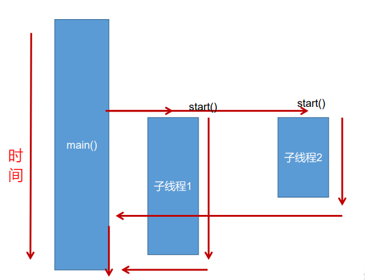

# 方式一：继承Thread类的方式
1. <font color = "#2a6e3f">创建</font>一个继承于Thread类的子类
2. <font color = "#2a6e3f">重写</font>Thread类的`run()` --> 将此线程执行的操作声明在`run()`中
3. <font color = "#2a6e3f">创建</font>Thread类的子类的对象
4. 通过此对象<font color = "#2a6e3f">调用</font>`start()`方法：`start()`方法会启动线程，并调用`run()`方法
```java
public class ThreadTest extends Thread{
    @Override
    public void run() {
        System.out.println(Thread.currentThread().getName());
    }

    public static void main(String[] args) {
        ThreadTest threadTest = new ThreadTest();
        threadTest.start();
    }
}
```
说明两个问题：
* 问题一：我们启动一个线程，必须调用`start()`，不能调用`run()`的方式启动线程。
* 问题二：如果再启动一个线程，必须重新创建一个Thread子类的对象，调用此对象的`start()`.
  

# 方式二：实现Runnable接口的方式

1. <font color = "#2a6e3f">创建</font>一个实现了Runnable接口的类
2. 实现类去<font color = "#2a6e3f">实现</font>Runnable中的抽象方法：`run()`
3. <font color = "#2a6e3f">创建</font>实现类的对象
4. 将此对象作为参数传递到Thread类的构造器中，<font color = "#2a6e3f">创建</font>Thread类的对象
5. 通过Thread类的对象<font color = "#2a6e3f">调用</font>`start()`方法启动线程
```java
public class RunnableTest implements Runnable{
    @Override
    public void run() {
        System.out.println("实现Runnable接口的线程："+Thread.currentThread().getName());
    }


    public static void main(String[] args) {
        RunnableTest runnableTest = new RunnableTest();
        Thread thread = new Thread(runnableTest);
        thread.start();
    }
}
```
# 方式三：Callable接口和FutrueTask实现类

1. <font color = "#2a6e3f">创建</font>一个实现了Callable接口的类
2. 实现类去<font color = "#2a6e3f">实现</font>Callable中的抽象方法：`call()`
   1. `call()`可以有返回值，通过泛型定义返回值的类型
   2. 可以抛出异常
3. <font color = "#2a6e3f">创建</font>实现类的对象
4. 将此对象作为参数传递到FutureTask类的构造器中，<font color="#2a6e3f">创建</font>FutureTask类的对象
5. 将FutureTask类的对象作为参数传递到Thread类的构造器中，<font color="#2a6e3f">创建</font>Thread类的对象
6. 通过Thread类的对象<font color="#2a6e3f">调用</font>`start()`方法启动线程
   1. 线程启动后可以通过futureTask实例的`get()`方法获取返回值
```java
public class CallableTest implements Callable<String> {
    @Override
    public String call() throws Exception {
        System.out.println("实现Callable接口的线程："+Thread.currentThread().getName());
        return "执行成功";
    }

    public static void main(String[] args) {

        CallableTest callableTest = new CallableTest();
        FutureTask<String> futureTask = new FutureTask<String>(callableTest);
        new Thread(futureTask).start();
        try {
            String value = futureTask.get();
            System.out.println(value);
        } catch (InterruptedException | ExecutionException e) {
            e.printStackTrace();
        }

    }
}
```
# 方式四： 线程池 
JDK 5.0起提供了线程池相关API：`ExecutorService` 和 `Executors` 
### ExecutorService：真正的线程池接口。常见子类ThreadPoolExecutor 

- `void execute`(Runnable command) ：执行任务/命令，没有返回值，一般用来执行Runnable 
- `<T> Future <T> submit`(Callable<T> task)：执行任务，有返回值，一般又来执行 Callable 
- `void shutdown`() ：关闭连接池  
## 创建线程池
### Executors：工具类、线程池的工厂类，用于创建并返回不同类型的线程池 

- `Executors.newCachedThreadPool()`：**创建**一个可根据需要创建新线程的线程池
- `Executors.newFixedThreadPool(n)`; **创建**一个可重用固定线程数的线程池
- `Executors.newSingleThreadExecutor()` ：**创建**一个只有一个线程的线程池
- `Executors.newScheduledThreadPool(n)`：**创建**一个线程池，它可安排在给定延迟后运行 
```java
public class ThreadPoolTest {
    public static void main(String[] args) {
        // 1.调用Executors的newFixedThreadPool(),返回指定线程数量的ExecutorService
        ExecutorService pool = Executors.newFixedThreadPool(10);
        // 2.将Runnable实现类的对象作为形参传递给ExecutorService的submit()方法中，开启线程
        // 并执行相关的run()
        pool.execute(new ThreadTest());
        pool.execute(new RunnableTest());
        Future<String> submit = pool.submit(new CallableTest());
        // 3.结束线程的使用
        pool.shutdown();
    }
}
```
```java
1. newFixedThreadPool的创建方法如下：：
public static ExecutorService newFixedThreadPool(int nThreads) {
        returnnew ThreadPoolExecutor(nThreads, nThreads,
                                    0L, TimeUnit.MILLISECONDS,
                                    new LinkedBlockingQueue<Runnable>());
    }
//newFixedThreadPool方法其任务队列用的是LinkedBlockingQueue,且没有指定容量，相当于无界队列，
//这种情况下就可以添加大量的任务，甚至达到Integer.MAX_VALUE的数量级
如果任务大量堆积，可能会导致 OOM。


1. CachedThreadPool的创建方法如下：
public static ExecutorService newCachedThreadPool() {
        returnnew ThreadPoolExecutor(0, Integer.MAX_VALUE,
                                    60L, TimeUnit.SECONDS,
                                    new SynchronousQueue<Runnable>());
    }
//这个虽然使用了有界队列SynchronousQueue，但是最大线程数设置成了Integer.MAX_VALUE，
这就意味着可以创建大量的线程，也有可能导致 OOM。

还有一个问题就是这些线程池的线程都是使用 JDK 自带的线程工厂 (ThreadFactory)创建的，
线程名称都是类似pool-1-thread-1的形式，第一个数字是线程池编号，第二个数字是线程编号，
这样很不利于系统异常时排查问题，你根本不知道那个地方创建的线程
```
### 手动创建线程池：ThreadPoolExecutor
通过ThreadPoolExecutor设置`线程池的大小`、`线程池中任务队列的大小`以及`拒绝策略`等。

```java
 @Test
    public void test(){
        /*
         * 各参数含义
         * corePoolSize    : 线程池中常驻的线程数量。核心线程数，默认情况下核心线程会一直存活，即使处于闲置状态也不会
         *                   受存活时间 keepAliveTime 的限制，除非将 allowCoreThreadTimeOut 设置为 true。
         * maximumPoolSize : 线程池所能容纳的最大线程数。超过这个数的线程将被阻塞。当任务队列为没有设置大小的
         *                   LinkedBlockingQueue时，这个值无效。
         * keepAliveTime   : 当线程数量多于 corePoolSize 时，空闲线程的存活时长，超过这个时间就会被回收
         * unit            : keepAliveTime 的时间单位
         * workQueue       : 存放待处理任务的队列
         * threadFactory   : 线程工厂
         * handler         : 拒绝策略，拒绝无法接收添加的任务
         */
        //创建线程工厂
        ThreadFactory factory = new ThreadFactory() {
            @Override
            public Thread newThread(Runnable r) {
                Thread thread = new Thread(r);
                thread.setName("xxx线程池"+r.hashCode());
                thread.setPriority(Thread.MAX_PRIORITY);
                return thread;
            }
        };
        ThreadPoolExecutor threadPool = new ThreadPoolExecutor(2, 2, 10, TimeUnit.SECONDS,
                new LinkedBlockingQueue<>(100), factory, new RejectedExecutionHandler() {
            
            //拒绝策略
            @Override
            public void rejectedExecution(Runnable r, ThreadPoolExecutor executor) {
                System.out.println("My rejectExecution");
            }
        });
        for (int i = 0; i < 100; i++) {
            int finalI = i;
            threadPool.submit(new Runnable() {
                @Override
                public void run() {
                    System.out.println(Thread.currentThread().getName()+"任务："+ finalI);
                }
            });
        }
    }
```
[文章]()
[java线程池详解]()
### ForkJoinPool
```java
public class Test {

    public static void main(String[] args) {
        // jdk7的写法
        long startTime = System.currentTimeMillis();
        ForkJoinPool forkJoinPool = new ForkJoinPool();
        ForkJoinCalculate forkJoinCalculate = new ForkJoinCalculate(0, 1000000000L);
        Long res = forkJoinPool.invoke(forkJoinCalculate);
        System.out.println("jdk7 result " + res + " cost " + (System.currentTimeMillis() - startTime));

        // jdk8的写法
        long start = System.currentTimeMillis();
        // 只有并行流才会使用fork/join框架，否则就是单线程执行
        sum = LongStream.rangeClosed(0, 1000000000L).parallel().sum();
        System.out.println("jdk8 parallel exe result " + sum + " cost " + (System.currentTimeMillis() - start));
    }

    private static class ForkJoinCalculate extends RecursiveTask<Long> {

        private long start;

        private long end;

        private static final long THRESHOLD = 10000;

        public ForkJoinCalculate(long start, long end) {
            this.start = start;
            this.end = end;
        }

        @Override
        protected Long compute() {
            if (end - start <= THRESHOLD) {
                long sum = 0;
                for (long i = start; i <= end; i++) {
                    sum += i;
                }
                return sum;
            } else {
                long middle = (start + end) / 2;
                ForkJoinCalculate leftFork = new ForkJoinCalculate(start, middle);
                // 把任务分配到异步线程池中
                leftFork.fork();
                ForkJoinCalculate rightFork = new ForkJoinCalculate(middle + 1, end);
                // 把任务分配到异步线程池中
                rightFork.fork();
                // 把结果合并
                return leftFork.join() + rightFork.join();
            }
        }
    }
}
————————————————
版权声明：本文为CSDN博主「融极」的原创文章，遵循CC 4.0 BY-SA版权协议，转载请附上原文出处链接及本声明。
原文链接：https://blog.csdn.net/tianzhonghaoqing/article/details/116465479
```
[线程池之ForkJoinPool](https://blog.csdn.net/tianzhonghaoqing/article/details/116465479)
# 实践
两种方式的对比：
开发中：**优先选择：实现Runnable接口的方式**
原因：

1. 实现的方式没类的单继承性的局限性
2. 实现的方式更适合来处理多个线程共享数据的情况。

* 联系：public class Thread implements Runnable
* 相同点：
  * 两种方式都需要重写run(),将线程要执行的逻辑声明在run()中。
  * 目前两种方式，要想启动线程，都是调用的Thread类中的start()。

