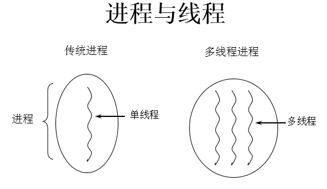
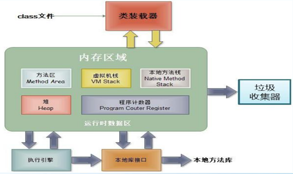

## 程序(programm)
* 概念：是为完成特定任务、用某种语言编写的一组`指令的集合`。即指一段静态的代码。
## 进程(process)
* 概念：程序的一次`执行过程`，或是正在运行的一个程序。
* 说明：进程作为资源分配的单位，系统在运行时会为每个进程分配不同的内存区域

## 线程(thread)
* 概念：进程可进一步细化为线程，是一个程序内部的一条执行路径。
* 说明：线程作为调度和执行的单位，每个线程拥独立的运行栈和程序计数器(pc)，线程切换的开销小。

###补充：
*   内存结构：  

进程可以细化为多个线程。
每个线程，拥有自己独立的：栈、程序计数器
多个线程，共享同一个进程中的结构：方法区、堆。
## 并行与并发

1. 单核CPU与多核CPU的理解  
* 单核CPU，其实是一种假的多线程，因为在一个时间单元内，也只能执行一个线程的任务。 
  * 例如：虽然有多车道，但是收费站只有一个工作人员在收费，只有收了费才能通过，那么CPU就好比收费人员。如果某个人不想交钱，那么收费人员可以把他“挂起”（晾着他，等他想通了，准备好了钱，再去收费。）但是因为CPU时间单元特别短，因此感觉不出来。
如果是多核的话，才能更好的发挥多线程的效率。（现在的服务器都是多核的）
* 一个Java应用程序java.exe，其实至少三个线程：main()主线程，gc()垃圾回收线程，异常处理线程。当然如果发生异常，会影响主线程。

2. 并行与并发的理解
* 并行：多个CPU同时执行多个任务。比如：多个人同时做不同的事。
* 并发：一个CPU(采用时间片)同时执行多个任务。比如：秒杀、多个人做同一件事

