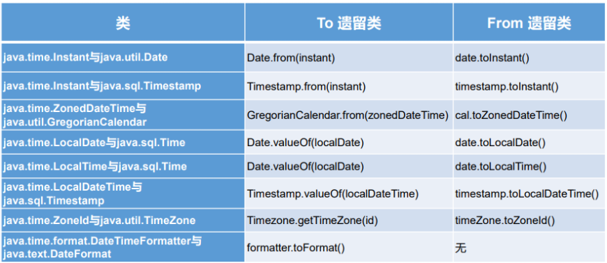

# 前两代存在的问题举例
* `可变性`：像日期和时间这样的类应该是不可变的。
* `偏移性`：Date中的年份是从1900开始的，而月份都从0开始。
* `格式化`：格式化只对Date用，Calendar则不行。

**此外，它们也不是线程安全的；不能处理闰秒等。**
# java 8 中新的日期时间API
## LocalDate / LocalTime / LocalDateTime
* `LocalDate`：本地日期  
* `LocalTime`：本地时间  
* `LocalDateTime`：本地日期时间 

它们的实例是`不可变的对象`，分别表示使用 ISO-8601日历系统的日期、时间、日期和时间。 它们提供了简单的本地日期或时间，并不包含当前的时间信息，也不包含与时区相关的信息。  
```java
LocalDate的核心数据
    /**
     * The year.
     */
    private final int year;
    /**
     * The month-of-year.
     */
    private final short month;
    /**
     * The day-of-month.
     */
    private final short day;
```
### 常用方法
* `now()`/`now(ZoneId zone)`： 静态方法，根据当前时间创建对象 / 指定时区的对象 
* `of()`： 静态方法，根据指定日期 / 时间创建对象 
* `getDayOfMonth()`/`getDayOfYear()` ：获得月份天数(1-31) / 获得年份天数(1-366) 
* `getDayOfWeek()` ：获得星期几(返回一个 DayOfWeek 枚举值) 
* `getMonth()`： 获得月份, 返回一个 Month 枚举值 
* `getMonthValue()`/`getYear()`： 获得月份(1-12) / 获得年份 
* `getHour()`/`getMinute()`/`getSecond()` ：获得当前对象对应的小时、分钟、秒
* `withDayOfMonth()`/`withDayOfYear()`/ `withMonth()`/`withYear()` ：  
  将月份天数、年份天数、月份、年份修改为指定的值并返回新的对象 
* `plusDays()`/`plusWeeks()`/`plusMonths()`/ `plusYears()`/`plusHours()` ：向当前对象添加几天、几周、几个月、几年、几小时 
* `minusMonths()`/`minusWeeks()`/`minusDays()`/`minusYears()`/`minusHours()`： 从当前对象减去几月、几周、几天、几年、几小时  
```java
@Test
    public void test(){
        1. // now()/now(ZoneId zone)： 静态方法，根据当前时间创建对象 / 指定时区的对象
        LocalDateTime dateTime = LocalDateTime.now();
        System.out.println("LocalDateTime的默认输出 = " + dateTime);
        LocalDate date = LocalDate.now();
        System.out.println("LocalDate的默认输出 = " + date);
        LocalTime time = LocalTime.now();
        System.out.println("LocalTime的默认输出 = " + time);
        输出：
        //LocalDateTime的默认输出 = 2023-09-16T16:18:01.725
		//LocalDate的默认输出 = 2023-09-16
		//LocalTime的默认输出 = 16:18:01.726
        
        2. // of()： 静态方法，根据指定日期 / 时间创建对象
        LocalDateTime of = LocalDateTime.of(2023, 12, 12, 19, 50);
        System.out.println("of = " + of);
        输出
        //of = 2023-12-12T19:50
        
        3.// getDayOfMonth()/getDayOfYear() ：获得月份天数(1-31) / 获得年份天数(1-366)
        int dayOfMonth = dateTime.getDayOfMonth();
        int dayOfYear = dateTime.getDayOfYear();
        System.out.println("今天是本年的第 " + dayOfYear+"天");
        System.out.println("今天是本月的第 "  + dayOfMonth+"天");
        输出
        //今天是本年的第 259天
		//今天是本月的第 16天
        
        4.// getDayOfWeek() ：获得星期几(返回一个 DayOfWeek 枚举值)
        
        5.// getMonth()： 获得月份, 返回一个 Month 枚举值
        6.// getMonthValue()/getYear()： 获得月份(1-12) / 获得年份
        7.// getHour()/getMinute()/getSecond() ：获得当前对象对应的小时、分钟、秒
        8.// withDayOfMonth()/withDayOfYear()/ withMonth()/withYear() ：将月份天数、年份天数、月份、年份修改为指定的值并返回新的对象
        9.// plusDays()/plusWeeks()/plusMonths()/ plusYears()/plusHours() ：向当前对象添加几天、几周、几个月、几年、几小时
        10// minusMonths()/minusWeeks()/minusDays()/minusYears()/minusHours()： 从当前对象减去几月、几周、几天、几年、几小时
    }
```
## 时间点：Instant
类似于 java.util.Date类，Instant类存的是从**1970年1月1日0时0分0秒（UTC）开始的`秒数`**。
```java

    /**
     * The number of seconds from the epoch of 1970-01-01T00:00:00Z.
     */
    private final long seconds;
    /**
     * The number of nanoseconds, later along the time-line, from the seconds field.
     * This is always positive, and never exceeds 999,999,999.
     */
    private final int nanos;
```
### 常用方法
* `now()`：静态方法，返回默认UTC时区的Instant类的对象 
* `ofEpochMilli(long epochMilli)`： 静态方法，返回在1970-01-01 00:00:00基础上加上指定毫秒数之后的Instant类的对象 
* `atOffset(ZoneOffset offset)`：结合即时的偏移来创建一个OffsetDateTime  
* `OffsetDateTime toEpochMilli()`：返回1970-01-01 00:00:00到当前时间的毫秒数，即为时间戳  
## 日期时间格式化类：DateTimeFormatter
**类似于SimpleDateFormat，用于格式化以及解析时间对象**
### 常用方法
* `ofPattern(String pattern)`：静态方法 ， 返回一个指定字符串格式 DateTimeFormatter
    - 预定义的标准格式。如：`ISO_LOCAL_DATE_TIME`;`ISO_LOCAL_DATE`;`ISO_LOCAL_TIME`
    - 本地化相关的格式。如：`ofLocalizedDateTime(FormatStyle.LONG)`
    - 自定义的格式。如：`ofPattern(“yyyy-MM-dd hh:mm:ss”)`
* `format(TemporalAccessor t)`： 格式化一个日期、时间，返回字符串 
* `parse(CharSequence text)`：将指定格式的字符序列解析为一个日期、时间  
```java
特别的：自定义的格式。如：ofPattern(“yyyy-MM-dd hh:mm:ss”)
//  重点：自定义的格式。如：ofPattern(“yyyy-MM-dd hh:mm:ss”)
DateTimeFormatter formatter3 = DateTimeFormatter.ofPattern("yyyy-MM-dd hh:mm:ss");
//格式化
String str4 = formatter3.format(LocalDateTime.now());
System.out.println(str4);//2019-02-18 03:52:09

//解析
TemporalAccessor accessor = formatter3.parse("2019-02-18 03:52:09");
System.out.println(accessor);
```
## 其它API的使用
### 带时区的日期时间：ZonedDateTime / ZoneId 
```java
举例：
// ZoneId:类中包含了所的时区信息
	@Test
	public void test1(){
		//getAvailableZoneIds():获取所的ZoneId
		Set<String> zoneIds = ZoneId.getAvailableZoneIds();
		for(String s : zoneIds){
			System.out.println(s);
		}
		System.out.println();
		
		//获取“Asia/Tokyo”时区对应的时间
		LocalDateTime localDateTime = LocalDateTime.now(ZoneId.of("Asia/Tokyo"));
		System.out.println(localDateTime);
		
		
	}

//ZonedDateTime:带时区的日期时间
	@Test
	public void test2(){
		//now():获取本时区的ZonedDateTime对象
		ZonedDateTime zonedDateTime = ZonedDateTime.now();
		System.out.println(zonedDateTime);
		//now(ZoneId id):获取指定时区的ZonedDateTime对象
		ZonedDateTime zonedDateTime1 = ZonedDateTime.now(ZoneId.of("Asia/Tokyo"));
		System.out.println(zonedDateTime1);
	}
```
### 时间间隔：Duration
**用于计算两个“时间”间隔，以秒和纳秒为基准**
```java

举例：
@Test
	public void test3(){
		LocalTime localTime = LocalTime.now();
		LocalTime localTime1 = LocalTime.of(15, 23, 32);
		//between():静态方法，返回Duration对象，表示两个时间的间隔
		Duration duration = Duration.between(localTime1, localTime);
		System.out.println(duration);
		
		System.out.println(duration.getSeconds());
		System.out.println(duration.getNano());
		
		LocalDateTime localDateTime = LocalDateTime.of(2016, 6, 12, 15, 23, 32);
		LocalDateTime localDateTime1 = LocalDateTime.of(2017, 6, 12, 15, 23, 32);
		
		Duration duration1 = Duration.between(localDateTime1, localDateTime);
		System.out.println(duration1.toDays());
		
	}
```
### 日期间隔：Period 
**用于计算两个“日期”间隔，以年、月、日衡量**
```java
举例：
	@Test
	public void test4(){
		LocalDate localDate = LocalDate.now();
		LocalDate localDate1 = LocalDate.of(2028, 3, 18);
		
		Period period = Period.between(localDate, localDate1);
		System.out.println(period);
		
		System.out.println(period.getYears());
		System.out.println(period.getMonths());
		System.out.println(period.getDays());
		
		Period period1 = period.withYears(2);
		System.out.println(period1);
		
	}
```
### 日期时间校正器：TemporalAdjuster
```java
举例：
	@Test
	public void test5(){
		//获取当前日期的下一个周日是哪天？
		TemporalAdjuster temporalAdjuster = TemporalAdjusters.next(DayOfWeek.SUNDAY);
		
		LocalDateTime localDateTime = LocalDateTime.now().with(temporalAdjuster);
		System.out.println(localDateTime);
		
		//获取下一个工作日是哪天？
		LocalDate localDate = LocalDate.now().with(new TemporalAdjuster(){

			@Override
			public Temporal adjustInto(Temporal temporal) {
				LocalDate date = (LocalDate)temporal;
				if(date.getDayOfWeek().equals(DayOfWeek.FRIDAY)){
					return date.plusDays(3);
				}else if(date.getDayOfWeek().equals(DayOfWeek.SATURDAY)){
					return date.plusDays(2);
				}else{
					return date.plusDays(1);
				}
					
			}
			
		});
		
		System.out.println("下一个工作日是：" + localDate);
	}
```
##  与传统日期处理的转换  



