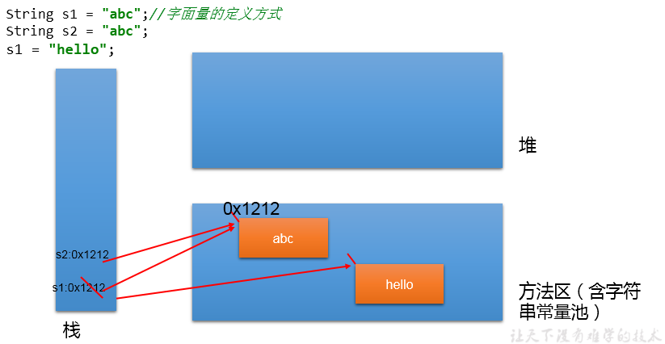
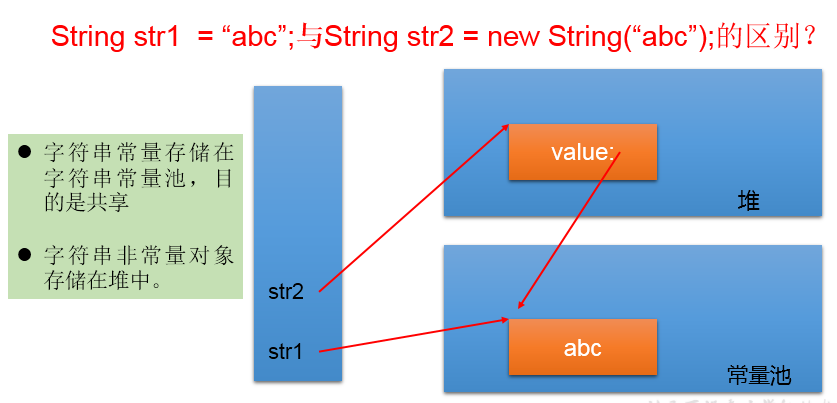

# java.lang.String类的使用
##概述
String:字符串，使用一对`""`引起来表示。

1. String声明为final的，不可被继承
2. String实现了Serializable接口：表示字符串是支持序列化的。
   * 实现了Comparable接口：表示String可以比较大小
3. String内部定义了final char[] value用于存储字符串数据
4. 通过字面量的方式（区别于new给一个字符串赋值，此时的字符串值声明在字符串常量池中)。
5. 字符串常量池中是不会存储相同内容(使用String类的equals()比较，返回true)的字符串的。
##String的不可变性
###说明

**String的底层是一个`final`的`char[]`，并且被声明为`private final`。**
1. 当对字符串重新赋值时，需要重写指定内存区域赋值，不能使用原有的value进行赋值。
2. 当对现的字符串进行连接操作时，也需要重新指定内存区域赋值，不能使用原有的value进行赋值。
3. 当调用String的replace()方法修改指定字符或字符串时，也需要重新指定内存区域赋值，不能使用原有的value进行赋值。
###代码举例
```java
String s1 = "abc";//字面量的定义方式
String s2 = "abc";
s1 = "hello";

System.out.println(s1 == s2);//比较s1和s2的地址值

System.out.println(s1);//hello
System.out.println(s2);//abc

System.out.println("*****************");

String s3 = "abc";
s3 += "def";
System.out.println(s3);//abcdef
System.out.println(s2);

System.out.println("*****************");

String s4 = "abc";
String s5 = s4.replace('a', 'm');
System.out.println(s4);//abc
System.out.println(s5);//mbc
```
###图示

## String实例化的不同方式
### 方式说明
* 方式一：通过字面量定义的方式，**此时栈中的引用指向的字符串常量池中的值**。
* 方式二：通过new + 构造器的方式，**此时栈中的引用指向的是堆空间中的对象**。
### 代码举例
```java
//通过字面量定义的方式：此时的s1和s2的数据javaEE声明在方法区中的字符串常量池中。
String s1 = "javaEE";
String s2 = "javaEE";
//通过new + 构造器的方式:此时的s3和s4保存的地址值，是数据在堆空间中开辟空间以后对应的地址值。
String s3 = new String("javaEE");
String s4 = new String("javaEE");

System.out.println(s1 == s2);//true
System.out.println(s1 == s3);//false
System.out.println(s1 == s4);//false
System.out.println(s3 == s4);//false
```
### 面试题
String s = new String("abc");方式创建对象，在内存中创建了几个对象？

两个:一个是堆空间中new结构，另一个是char[]对应的常量池中的数据："abc"
### 图示

## 字符串拼接方式赋值的对比
### 说明
1. 常量与常量的拼接结果在常量池。且常量池中不会存在相同内容的常量。
2. 只要其中一个是变量，结果就在堆中。
3. 调用intern()方法，如果拼接的结果已经在常量池中，则返回来自池的字符串，否则，将堆中的数据放入池中，并返回池中的数据副本。
4. concat方法拼接，哪怕是两个常量对象拼接，结果也是在堆。

    
### 代码举例
```java
String s1 = "javaEE";//s1指向字符串常量池中的值
String s2 = "hadoop";//s2指向字符串常量池中的值
String s3 = "javaEEhadoop";//s3指向字符串常量池中的值
String s4 = "javaEE" + "hadoop";//s4指向字符串常量池中的值
String s5 = s1 + "hadoop";//s5指向堆中的对象
String s6 = "javaEE" + s2;//s6指向堆中的对象
String s7 = (s1 + s2).intern();//s7指向字符串常量池中的值,intern方法必定会返回在常量池中已经存在的一个字符串的引用
String s8  = s1 + s2;//s8指向堆中的对象

System.out.println(s3 == s4);//true
System.out.println(s3 == s5);//false
System.out.println(s3 == s6);//false
System.out.println(s3 == s7);//true
System.out.println(s5 == s6);//false
System.out.println(s5 == s7);//false
System.out.println(s6 == s7);//false

String s8 = s6.intern();//返回值得到的s8使用的常量值中已经存在的“javaEEhadoop”
System.out.println(s3 == s8);//false
****************************
String s1 = "javaEEhadoop";
String s2 = "javaEE";
String s3 = s2 + "hadoop";
System.out.println(s1 == s3);//false

final String s4 = "javaEE";//s4:常量
String s5 = s4 + "hadoop";
System.out.println(s1 == s5);//true
```
## 常用方法：

* int `length()`：返回字符串的长度： return value.length
* char `charAt(int index)`： 返回某索引处的字符return value[index]
* boolean `isEmpty()`：判断是否是空字符串：return value.length == 0
* String `toLowerCase()`：使用默认语言环境，将 String 中的所字符转换为小写
* String `toUpperCase()`：使用默认语言环境，将 String 中的所字符转换为大写
* String `trim()`：返回字符串的副本，忽略前导空白和尾部空白
* boolean `equals(Object obj)`：比较字符串的内容是否相同
* boolean `equalsIgnoreCase(String anotherString)`：与equals方法类似，忽略大小写
* String `concat(String str)`：将指定字符串连接到此字符串的结尾。 等价于用“+”
* int `compareTo(String anotherString)`：比较两个字符串的大小
* String `substring(int beginIndex)`：  
返回一个新的字符串，它是此字符串的从beginIndex开始截取到最后的一个子字符串。
* String `substring(int beginIndex, int endIndex)` ：  
返回一个新字符串，它是此字符串从beginIndex(含)开始截取到endIndex(不包含)的一个子字符串。
* boolean `endsWith(String suffix)`：测试此字符串是否以指定的后缀结束
* boolean `startsWith(String prefix)`：测试此字符串是否以指定的前缀开始
* boolean `startsWith(String prefix, int offset)`：
测试此字符串从指定索引开始的子字符串是否以指定前缀开始
* boolean `contains(CharSequence s)`：
当且仅当此字符串包含指定的 char 值序列时，返回 true
* int `indexOf(String str)`：返回指定子字符串在此字符串中第一次出现处的索引
* int `indexOf(String str, int fromIndex)`：
返回指定子字符串在此字符串中第一次出现处的索引，从指定的索引开始
* int `lastIndexOf(String str)`：返回指定子字符串在此字符串中最右边出现处的索引
* int `lastIndexOf(String str, int fromIndex)`：
返回指定子字符串在此字符串中最后一次出现处的索引，从指定的索引开始反向搜索

注：indexOf和lastIndexOf方法如果未找到都是返回-1

###替换
* String `replace(char oldChar, char newChar)`：  
返回一个新的字符串，它是通过用 newChar 替换此字符串中出现的所 oldChar 得到的。
* String `replace(CharSequence target, CharSequence replacement)`：  
使用指定的字面值替换序列替换此字符串所匹配字面值目标序列的子字符串。
* String `replaceAll(String regex, String replacement)`：  
使用给定的 replacement 替换此字符串所匹配给定的正则表达式的子字符串。
* String `replaceFirst(String regex, String replacement)`：  
使用给定的 replacement 替换此字符串匹配给定的正则表达式的第一个子字符串。

### 匹配:
* boolean `matches(String regex)`：告知此字符串是否匹配给定的正则表达式。

### 切片：
* String[] `split(String regex)`：根据给定正则表达式的匹配拆分此字符串。
* String[] `split(String regex, int limit)`：根据匹配给定的正则表达式来拆分此字符串，最多不超过limit个，如果超过了，剩下的全部都放到最后一个元素中。

## String与其它结构的转换	 
### 与基本数据类型、包装类之间的转换
* String --> 基本数据类型、包装类：调用包装类的静态方法：parseXxx(str)
* 基本数据类型、包装类 --> String:调用String重载的valueOf(xxx)
```java
 @Test
    public void test1(){
        String str1 = "123";
//        int num = (int)str1;//错误的
        int num = Integer.parseInt(str1);

        String str2 = String.valueOf(num);//"123"
        String str3 = num + "";

        System.out.println(str1 == str3);
    }
```

### 与字符数组之间的转换
```java
String --> char[]:调用String的toCharArray()
char[] --> String:调用String的构造器

@Test
public void test2(){
    String str1 = "abc123";  //题目： a21cb3

    char[] charArray = str1.toCharArray();
    for (int i = 0; i < charArray.length; i++) {
        System.out.println(charArray[i]);
    }

    char[] arr = new char[]{'h','e','l','l','o'};
    String str2 = new String(arr);
    System.out.println(str2);
}
```
### 与字节数组之间的转换
* 编码：String --> byte[]:调用String的getBytes()
* 解码：byte[] --> String:调用String的构造器

* 编码：字符串 -->字节  (看得懂 --->看不懂的二进制数据)
* 解码：编码的逆过程，字节 --> 字符串 （看不懂的二进制数据 ---> 看得懂  
说明：解码时，要求解码使用的字符集必须与编码时使用的字符集一致，否则会出现乱码。
  
```java
@Test
public void test3() throws UnsupportedEncodingException {
    String str1 = "abc123中国";
    byte[] bytes = str1.getBytes();//使用默认的字符集，进行编码。
    System.out.println(Arrays.toString(bytes));

    byte[] gbks = str1.getBytes("gbk");//使用gbk字符集进行编码。
    System.out.println(Arrays.toString(gbks));

    System.out.println("******************");

    String str2 = new String(bytes);//使用默认的字符集，进行解码。
    System.out.println(str2);

    String str3 = new String(gbks);
    System.out.println(str3);//出现乱码。原因：编码集和解码集不一致！


    String str4 = new String(gbks, "gbk");
    System.out.println(str4);//没出现乱码。原因：编码集和解码集一致！


}
```
### 与StringBuffer、StringBuilder之间的转换
* String -->StringBuffer、StringBuilder：调用StringBuffer、StringBuilder构造器
* StringBuffer、StringBuilder -->String：①调用String构造器；②StringBuffer、StringBuilder的toString()
##JVM中字符串常量池存放位置说明：
在不同版本的Java开发工具包（JDK）中，字符串常量池的位置可能会有所不同。以下是几个Java版本中字符串常量池的主要特征：

1. **Java 6及之前：**
   - 字符串常量池位于永久代（Permanent Generation）中,永久代是堆(Heap)的一部分。
   - 永久代是Java 6及之前版本的一部分，它主要用于存储类的元数据信息和字符串常量池。

2. **Java 7至Java 8：**
   - 字符串常量池的位置仍然位于永久代，但在Java 7 中开始逐步减少对永久代的依赖。
   - 在Java 8 中，随着永久代的移除，字符串常量池被移到了堆中，这是因为新引入的元空间（Metaspace）替代了永久代。

3. **Java 9及以后：**
   - 字符串常量池仍然位于堆中，但在Java 9 中，元空间的概念被引入，用于存储类的元数据信息。
   - 在Java 9 中，字符串常量池的一部分被移到了元空间。


## 8. 常见算法题目的考查：
1. 模拟一个trim方法，去除字符串两端的空格。
2. 将一个字符串进行反转。将字符串中指定部分进行反转。比如“abcdefg”反转为”abfedcg”
3. 获取一个字符串在另一个字符串中出现的次数。
      比如：获取“ ab”在 “abkkcadkabkebfkabkskab” 中出现的次数
4. 获取两个字符串中最大相同子串。比如： str1 = "abcwerthelloyuiodef“;str2 = "cvhellobnm"
   * 提示：将短的那个串进行长度依次递减的子串与较长的串比较。
5. 对字符串中字符进行自然顺序排序。
    * 提示：
        1. 字符串变成字符数组。
        2. 对数组排序，择，冒泡，Arrays.sort();
        3. 将排序后的数组变成字符串。


