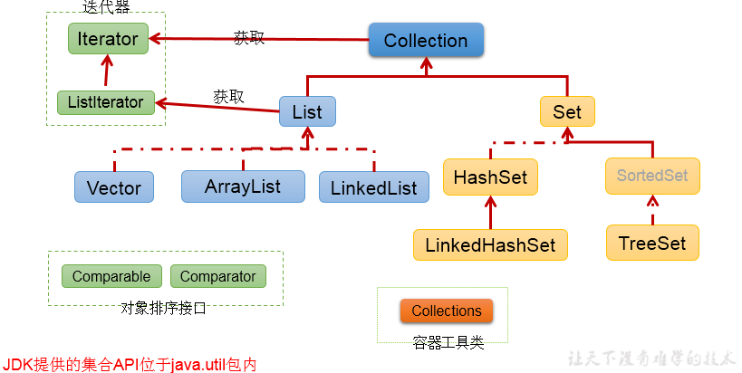

## 单列集合框架结构
- Collection接口：单列集合，用来存储一个一个的对象
   - List接口：存储`有序的`、`可重复`的数据。  -->“**动态”数组**
      - ArrayList、LinkedList、Vector
   - Set接口：存储`无序的`、`不可重复`的数据   -->**高中讲的“集合”**
      - HashSet、LinkedHashSet、TreeSet

## Collection接口常用方法
* `add(Object obj)`/`addAll(Collection coll)`：添加单个元素 / 添加另一个集合的元素
* `size()`：集合中实际元素的个数
* `isEmpty()`：集合是否为空
* `clear()`：清空集合
* `contains(Object obj)`/`containsAll(Collection coll)`：是否包含某个元素/某些元素
* `remove(Object obj)`/`removeAll(Collection coll)`：从集合中删除某个元素/某些元素
* `removeIf`(Predicate<? super E> filter):删除满足给定谓词的此集合的所有元素。
* `retainsAll(Collection coll)`：从本集合中删除coll集合元素外的所有元素
* `equals(Object obj)`：是否相等
* `hasCode()`：返回哈希值
* `toArray()`：返回一个集合元素的数组
* `iterator()`：返回一个迭代器

## 集合与数组的转换

1. 集合转数组
   - `toArray()`方法
2. "数组转List"
    - Arrays.asList(T ... t)方法

**为什么要将这个打引号呢？**
**因为Arrays.asList(T ... t)方法返回的List并不是严格意义上的List，这个List是Arrays的一个内部类，虽然都继承于AbstractList，但是Arrays的List的方法和真正的List不同。**
## 使用Collection集合存储对象，要求对象所属的类满足：
向Collection接口的实现类的对象中添加数据obj时，**要求obj所在类要重写equals()方法，因为不管是要有序还是不重复都需要判断元素是否相等**

