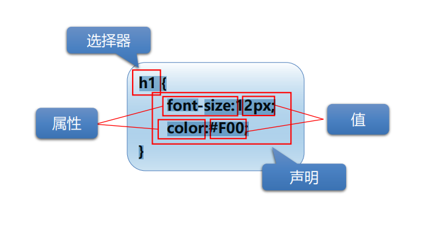
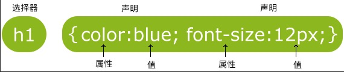

#CSS
层叠样式表，又称为风格样式表 (Style Sheet)，表现HTML或XHTML文件样式的计算机语言
##语法结构

* 行内样式
```html
<h1 style="color:red;">style属性的应用</h1>
<p style="font-size:14px; color:green;">直接在HTML标签中设置的样式</p>
```
* 内部样式表
```html
<head>
  
</head>
<body>
<!--<style>标签，可以放置在HTML文档的任意位置-->
<style type="text/css">
  h1{color:red;}
       p{font-size:14px; color:green;}
</style>

  <h1>内部样式表的应用</h1>
  <p>直接在head标签中设置的样式</p>
</body>
```  
* 外部样式
  * 链接式
```html
  <link href="样式表路径" rel="stylesheet" type="text/css"/>
```
  * 导入式
```html
  <style type="text/css">
    @import url("样式表路径");
   </style>
```
* CSS样式优先级:`行内样式`>`内部样式表`>`外部样式表`
    * 就近原则
###选择器

CSS中有三种基本选择器:  
**`ID选择器`>`类选择器`>`元素选择器`**
* 元素选择器  
元素选择器的作用是选中页面中`所有同类的HTML元素`，为其设置样式
```css
    h1 {font-size:16px;}
```
* 类选择器  
类选择器的作用是选中页面中所有`被相同类修饰`的HTML元素，为其设置样式
```css
    .class {font-size:16px;}
    /*你也可以指定特定的 HTML 元素使用 class。*/
    /*所有的 p 元素使用 class="center" 让该元素的文本居中:*/
    p.center {text-align:center;}
```  
* ID选择器
ID选择器的作用是选中页面中所有`被相同ID修饰`的HTML元素，为其设置样式
```css
    #id {font-size:16px;}
```


