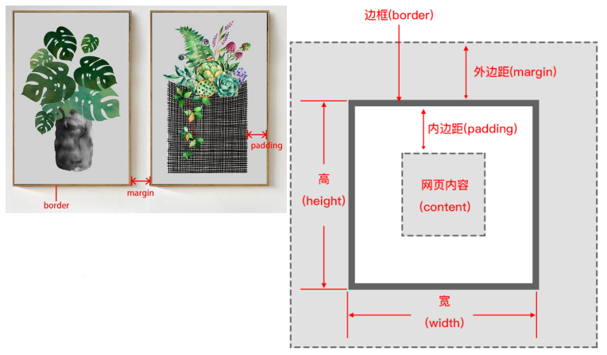
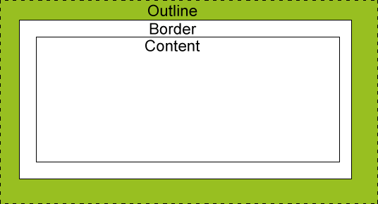

#CSS 盒子模型
所有HTML元素可以看作盒子  

##盒子的组成属性
* 内容(content)
* 内边距(padding)
* 边框(border)
* 外边距(margin)

### 内容(content)
内容就是盒子里面的内容，比如文字，图片等。  
* 通过`width`和`height`属性可以控制内容的大小。  
### 内边距(padding)
内边距是盒子与盒子之间的距离，内边距会影响盒子的大小。  
* 通过`padding`系列属性可以控制内边距的样式。

### 边框(border)
边框就是盒子与浏览器之间的距离，边框会影响盒子的实际大小。
* 通过`border`系列属性可以控制边框的样式。
### 外边距(margin)
外边距是盒子与盒子之间的距离，外边距不会影响盒子的实际大小。
* 通过`margin`系列属性可以控制外边距的样式。  
### 盒子的大小
盒子的大小是由内容、内边距、边框、外边距共同决定的。

#CSS 轮廓（outline）
轮廓（outline）是绘制于元素周围的一条线，位于边框边缘的外围，可起到`突出元素`的作用。 

### 轮廓（outline）的属性
* `outline-style`：轮廓的样式，可设置为`none`、`dotted`、`dashed`、`solid`、`double`、`groove`、`ridge`、`inset`、`outset`。
* `outline-width`：轮廓的宽度，可设置为`thin`、`medium`、`thick`。
* `outline-color`：轮廓的颜色。

### 轮廓（outline）的特性
* 轮廓不会影响任何盒子的实际大小。
* 轮廓不会改变元素的边框样式。
* 轮廓可以与任何其他样式一起使用。
* 轮廓可以是一个单独的边框，也可以是多个边框。

### 轮廓（outline）的用法
* 单独使用
* 与其他样式一起使用

