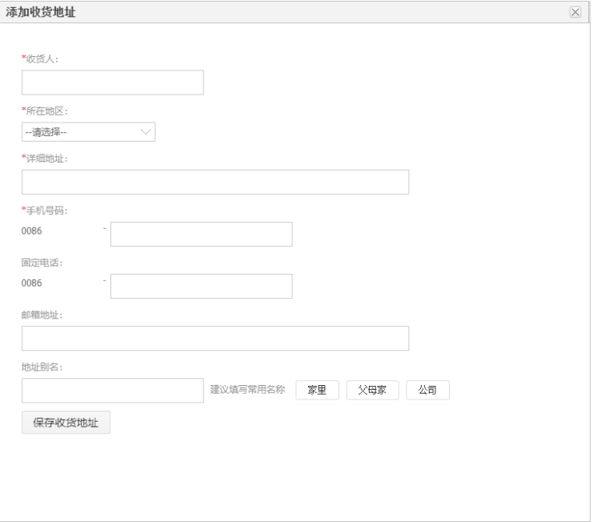

# From表单
在开发中凡是用户需要填写数据的都需要用到表单

```html
<form action="提交地址" method="提交方式">
    <input type="text" name="表单名称" value="表单值"/>
    <input type="password" name="表单名称" value="表单值"/>
    <input type="radio" name="表单名称" value="表单值"/>
    <input type="checkbox" name="表单名称" value="表单值"/>
    <input type="submit" value="提交"/>
    <input type="reset" value="重置"/>
    <input type="button" value="按钮"/>
</form>
```
## 表单的常用元素
| 元素       |名称| 描述                   |
| :-----------: | :-----------: | ------------------------ |
| `input`       |输入框| 用于收集用户输入的文本、数字、日期等数据。 |
| `button`     |按钮| 用于提交表单或触发其他操作。        |
| `select`     |下拉列表| 用于从一组选项中选择一个值。         |
| `option`     |选项| 用于定义下拉列表中的选项。         |
| `radio`       |单选| 用于选择一个选项。           |
| `checkbox`    |多选| 用于选择多个选项。         |
| `file`       |文件|用于上传文件。           |
| `textarea`   | 文本框|用于编写多行文本。         |
| form       | 表单| 用于处理表单数据，如提交、重置等操作。 |
| label       | 语义化元素 |用于定义表单控件的标签。         |
| fieldset   | 语义化元素| 用于将表单内容分组。         |
| legend     | 语义化元素| 用于为 fieldset 元素定义标题。         |
| datalist   | 语义化元素| 用于定义选项列表。         |
| keygen     | 语义化元素| 用于表单认证。         |
| output     | 语义化元素| 用于显示计算结果。         |
| progress   | 语义化元素| 用于显示任务的进度。         |
| meter      | 语义化元素| 用于显示度量衡。         |

### `form`：用于处理表单数据，如提交、重置等操作。
  * `action`：用于指定表单数据提交的**服务器地址**。
  * `method`：用于指定表单数据的**提交方式**，如 get（默认）和 post。
  * `enctype`：用于指定表单数据**编码方式**，如 application/x-www-form-urlencoded（默认）和 multipart/form-data。
  * `accept-charset`：用于指定允许提交**字符集*。
  * `name`：用于指定表单的名称。
  * `id`：用于指定表单的 ID。
  * `class`：用于指定表单的类名。
  * `target`：用于指定**表单提交后打开的目标窗口或框架**
    * _self（默认）本窗口
    * _blank 新窗口
    * _parent 父窗口
    * _top 
  * `onsubmit`：用于指定**表单提交时的回调函数**。
  * `onreset`：用于指定**表单重置时的回调函数**。
```html
<form action="https://example.com/submit" method="post" enctype="application/x-www-form-urlencoded">
  <input type="text" name="username" id="username" placeholder="用户名">
  <input type="password" name="password" id="password" placeholder="密码">
  <input type="submit" value="提交">
</form>

```
### `输入框`：主要用来作为一些必要信息的输入，比如：用户名、密码、邮箱、电话、地址等。
  * `type`：用于指定输入字段的类型，如 text（默认）、password、radio、checkbox、submit、reset、file 和 email。
  * `value`：用于指定输入字段的初始值。
  * `placeholder`：用于指定输入字段的提示文本。
  * required：用于指定输入字段必须填写。
  * pattern：用于指定输入字段的字符模式。
  * minlength：用于指定输入字段的最小长度。
  * maxlength：用于指定输入字段的最大长度。
  * autocomplete：用于指定输入字段是否应该使用浏览器自动完成功能。
  * autofocus：用于指定页面加载时是否应该自动聚焦到输入字段。
  * multiple：用于指定输入字段是否允许多个值。
  * step：用于指定输入字段合法数字间隔。
  * min：用于指定输入字段允许的最小值。
  * max：用于指定输入字段允许的最大值。

```html
  <input type="text" name="username" id="username" placeholder="用户名">
  <input type="password" name="password" id="password" placeholder="密码">
```

### `按钮`：主要用来作为一些操作的触发，比如：提交、重置、取消、登录、注册等。
  * `type`：用于指定按钮的类型，如 submit（默认）、reset、button 和 email。
  * `value`：用于指定按钮的初始值。
  * `disabled`：用于指定按钮是否应该被禁用。
  * `form`：用于指定按钮所属的表单。
  * formaction：用于指定表单的提交地址。
  * formmethod：用于指定表单的提交方式（如 get、post）。
  * formenctype：用于指定表单的编码方式（如 application/x-www-form-urlencoded、multipart/form-data）。
  * autofocus：用于指定页面加载时是否应该自动聚焦到按钮。
  * click：用于指定按钮的点击事件处理程序。
```html
    <button type="submit" name="submit">提交</button>
    <button type="reset" name="reset">重置表单数据</button>
    <button type="button" name="button">普通按钮</button>
```
### `下拉框`：主要用来作为一些选项的输入，比如：性别、城市、职业等。
  * multiple：用于指定允许用户选择多个选项。
  * size：用于指定下拉列表的大小。
  * disabled：用于指定下拉列表是否应该被禁用。
  * form：用于指定下拉列表所属的表单。
  * autofocus：用于指定页面加载时是否应该自动聚焦到下拉列表。
  * required：用于指定下拉列表必须有选择项。
  * onchange：用于指定下拉列表改变时的事件处理程序。
```html
<select name="gender" id="gender" class="form-control">
  <option value="">请选择性别</option>
  <option value="male">男</option>
  <option value="female">女</option>
</select>

```
### `单选`：主要用来作为一些选项的输入，比如：性别、城市、职业等。
  * value：用于指定单选按钮的值。
  * checked：用于指定单选按钮是否应该被选中。
  * disabled：用于指定单选按钮是否应该被禁用。
  * form：用于指定单选按钮所属的表单。
  * autofocus：用于指定页面加载时是否应该自动聚焦到单选按钮。
  * required：用于指定单选按钮必须被选中。
  * onchange：用于指定单选按钮改变时的事件处理程序。
```html
<input type="radio" name="gender" value="male" id="male" checked>
<label for="male">男</label>
<input type="radio" name="gender" value="female" id="female">
<label for="female">女</label>

```
### `多选`：主要用来作为一些选项的输入，比如：性别、城市、职业等。
  * id：用于指定复选框的 ID。
  * name：用于指定复选框所属的名称。
  * value：用于指定复选框的值。
  * checked：用于指定复选框是否应该被选中。
  * disabled：用于指定复选框是否应该被禁用。
  * form：用于指定复选框所属的表单。
  * autofocus：用于指定页面加载时是否应该自动聚焦到复选框。
  * required：用于指定复选框必须被选中。
  * onchange：用于指定复选框改变时的事件处理程序。
### `文本框`：主要用来作为一些文字的输入，比如：留言、评论、文章等。
  * type：定义输入元素的类型，其值应为 "text"。
  * name：为输入元素指定一个名称，以便在表单提交时识别。
  * id：为输入元素指定一个唯一的ID，以便在HTML文档中引用。
  * value：为输入元素设置一个初始值。
  * placeholder：为输入元素指定一个提示文本，当输入框为空时显示。
  * required：确保用户输入一些文本，否则表单无法提交。
  * disabled：禁用输入元素，使其无法与用户交互。
  * readonly：将输入元素设置为只读，以便用户只能查看其值，但不能修改。
  * maxlength：指定输入元素允许的最大字符数。
  * minlength：指定输入元素允许的最小字符数。
  * rows：指定文本区域的高度，以行数为单位。
  * cols：指定文本区域的高度，以字符数为单位。
```html
<form>
  <label for="message">消息：</label>
  <textarea name="message" id="message" rows="4" cols="50" placeholder="请输入消息" required></textarea>
  <input type="submit" value="提交">
</form>

```
### `文件`：主要用来作为一些文件的输入，比如：上传头像、上传图片、上传文件等。 
* type：定义输入元素的类型，其值应为 "file"。
* name：为输入元素指定一个名称，以便在表单提交时识别。
* id：为输入元素指定一个唯一的ID，以便在HTML文档中引用。
* accept：定义一个文件类型或文件类型列表，以便用户只能选择特定类型的文件。例如，accept="application/pdf" 将允许用户只选择PDF文件。
* multiple：允许用户选择多个文件，而不是只允许选择一个文件。
* required：确保用户必须选择一个文件，否则表单无法提交。
* disabled：禁用输入元素，使其无法与用户交互。
* readonly：将输入元素设置为只读，以便用户只能查看其值，但不能修改。
* maxlength：指定输入元素允许的最大字符数。
* minlength：指定输入元素允许的最小字符数。
```html
<form>
    <input type="file" name="file" id="file" accept="application/pdf" multiple required>
    <input type="submit" value="上传文件">
</form>

```
##语义化元素
```html
请选择性别：
<label for="male">男</label>
<input type="radio" name="gender" id="male"/>
<label for="female">女</label>
<input type="radio" name="gender" id="female"/>
```
```html
<fieldset>
<legend>个人信息:</legend>
<label for="name">姓名:</label>
<input type="text" id="name"><br>
</fieldset>
```