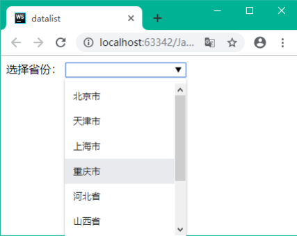
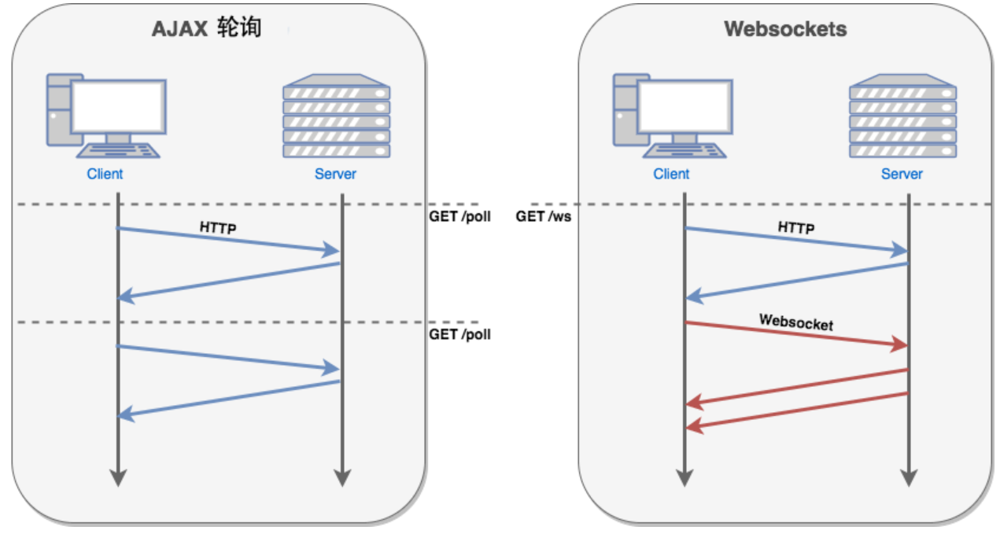

#HTML5 的改进
* 新元素
* 新属性
* 完全支持 CSS3
* Video 和 Audio
* 2D/3D 制图
* 本地存储
* 本地 SQL 数据
* Web 应用

##新元素
| 标签       | 定义                                                         |
| --------- | ------------------------------------------------------------ |
| `<canvas>` | 定义图形，比如图表和其他图像。该标签基于 JavaScript 的绘图 API。 |
| `<audio>`  | 定义音频内容。                                               |
| `<video>`  | 定义视频（video 或者 movie）。                               |
| `<source>` | 定义多媒体资源`<video>`和`<audio>`。                         |
| `<embed>`  | 定义嵌入的内容，比如插件。                                   |
| `<track>`  | 为诸如`<video>`和`<audio>`元素之类的媒介规定外部文本轨道。   |
| `<datalist>` | 定义选项列表。请与 input 元素配合使用该元素，来定义 input 可能的值。 |
| `<keygen>` | 规定用于表单的密钥对生成器字段。                             |
| `<output>` | 定义不同类型的输出，比如脚本的输出。                           |

`datalist`标签实例
```html
<body>
<label>选择省份:</label>
<input type="text" list="identity">
<datalist id="identity">
    <option>北京市</option>
    <option>天津市</option>
    <option>重庆市</option>
</datalist>
</body>
```

##多媒体标签
###音频元素
`audio`标签：负责播放音频
```html
<audio src="音频路径" controls="controls"></audio>

<audio controls="controls">
    <source src="音频路径" type="音频类型">
</audio>
```
属性
  * autoplay：如果设置为 true，则当页面加载时`自动播放`音频。
  * controls：如果设置为 true，则`显示音频控件`（如播放、暂停等）。
  * loop：如果设置为 true，则音频将在播放完毕后`重新播放`。
  * muted：如果设置为 true，则音频将`自动静音`。
  * preload：设置音频的预加载模式。可选值有 'none'（不预加载）、'metadata'（预加载音频元数据）和 'auto'（根据浏览器自动选择）。
  * src：指定音频文件的URL。
  * type：指定音频文件的类型。例如，'audio/mpeg'、'audio/wav' 等。
###视频元素
`video`标签：负责播放视频
```html
<video src="视频路径" controls="controls"></video>

<video controls="controls">
    <source src="视频路径" type="视频类型">
</video>
```
属性
  * autoplay：如果设置为 true，则当页面加载时自动播放视频。
  * controls：如果设置为 true，则显示视频控制按钮（如播放、暂停等）。
  * height：设置视频的高度。
  * loop：如果设置为 true，则视频将在播放完毕后重新播放。
  * muted：如果设置为 true，则视频将自动静音。
  * poster：设置视频的 poster 图片的 URL。
  * preload：设置视频的预加载模式。可选值有 'none'（不预加载）、'metadata'（预加载视频元数据）和 'auto'（根据浏览器自动选择）。
  * src：指定视频文件的URL。
  * type：指定视频文件的类型。例如，'video/mp4'、'video/webm' 等。
  * width：设置视频的宽度。
##Canvas 画布
###什么是 Canvas？
Canvas 是一个用 JavaScript 操作的`位图图像`，它`允许你绘制图形、图形和文本`。
###Canvas 元素
`<canvas>`元素是 HTML5 新增的元素，用于绘制图形。
```html
<canvas id="myCanvas" width="200" height="100"
    style="border:1px solid #000000;">
</canvas>
```
###绘制图形
```js
var canvas = document.getElementById('myCanvas');
var context = canvas.getContext('2d');

context.fillRect(10, 10, 50, 50);
```
###绘制文本
```js
var canvas = document.getElementById('myCanvas');
var context = canvas.getContext('2d');

context.font = 'italic 18px Arial';
context.fillText('Hello World', 10, 10);
```
## ❌ 内联 SVG
* SVG 指可伸缩矢量图形 (Scalable Vector Graphics)
* SVG 用于定义用于网络的基于矢量的图形
* SVG 使用 XML 格式定义图形
* SVG 图像在放大或改变尺寸的情况下其图形质量不会有损失
* SVG 是万维网联盟的标准
##本地存储
HTML5的web存储，一个比cookie更好的本地存储方式。  
早些时候,本地存储使用的是 cookie。但是Web 存储需要更加的安全与快速. 这些数据不会被保存在服务器上，但是这些数据只用于用户请求网站数据上.它也可以存储大量的数据，而不影响网站的性能.
数据以 键/值 对存在, web网页的数据只允许该网页访问使用。
###localStorage
localStorage - 用于长久保存整个网站的数据，保存的数据没有过期时间，直到手动去除。  
**只要在相同的协议、相同的主机名、相同的端口下，就能读取/修改到同一份localStorage数据**
```js
// 存储
localStorage.setItem("sitename", "菜鸟教程");
// 查找
document.getElementById("result").innerHTML = "网站名：" +  localStorage.getItem("sitename");
// 移除
localStorage.removeItem("sitename");


```
###sessionStorage
sessionStorage - 用于临时保存同一窗口(或标签页)的数据，在关闭窗口或标签页之后将会删除这些数据。  
**除了协议、主机名、端口外，还要求在同一窗口(或标签页)下，才能读取/修改到同一份sessionStorage数据**
```js
sessionStorage和localStorage可使用的API都相同
保存数据：sessionStorage.setItem(key,value);
读取数据：sessionStorage.getItem(key);
删除单个数据：sessionStorage.removeItem(key);
删除所有数据：sessionStorage.clear();
得到某个索引的key：sessionStorage.key(index);
```
###❌ Web SQL
一组使用 SQL 操作客户端数据库的 APIs
* openDatabase：这个方法使用现有的数据库或者新建的数据库创建一个数据库对象。
* transaction：这个方法让我们能够控制一个事务，以及基于这种情况执行提交或者回滚。
* executeSql：这个方法用于执行实际的 SQL 查询。
##Web Workers
web worker 是运行在后台的 JavaScript，不会影响页面的性能。  
web worker 是运行在后台的 JavaScript，独立于其他脚本，不会影响页面的性能。您可以继续做任何愿意做的事情：点击、选取内容等等，而此时 web worker 在后台运行。
##应用缓存（Cache Manifest）

##无障碍

##WebSocket

###WebSocket 是什么?
* WebSocket 是 HTML5 开始提供的一种在单个 TCP 连接上进行全双工通讯的协议。  
* WebSocket 使得客户端和服务器之间的数据交换变得更加简单，`允许服务端主动向客户端推送数据`。
在 WebSocket API 中，浏览器和服务器只需要完成一次握手，两者之间就直接可以创建持久性的连接，并进行双向数据传输。  
* 现在，很多网站为了实现推送技术，所用的技术都是 `Ajax 轮询`。**轮询是在特定的的时间间隔（如每1秒），由浏览器对服务器发出HTTP请求，然后由服务器返回最新的数据给客户端的浏览器**。 
    * 这种传统的模式带来很明显的缺点，即浏览器需要不断的向服务器发出请求，然而HTTP请求可能包含较长的头部，其中真正有效的数据可能只是很小的一部分，显然这样会浪费很多的带宽等资源。
HTML5 定义的 WebSocket 协议，能更好的节省服务器资源和带宽，并且能够更实时地进行通讯。


###WebSocket 协议
* WebSocket 连接必须由 HTTP 连接发起。
* WebSocket 连接必须是一个持久连接。
* 浏览器通过 JavaScript 向服务器发出建立 WebSocket 连接的请求，连接建立以后，客户端和服务器端就可以通过 TCP 连接进行通信。
* 浏览器端在建立 WebSocket 连接时，会发送一个 HTTP 请求。
* 服务器端收到这个请求以后，检查这个请求的 `Upgrade 字段是否为 WebSocket`，如果是，则说明客户端支持 WebSocket 协议，服务器端向客户端返回 `101` 状态码，表示协议切换成 WebSocket，并且切换完成。
* 然后，服务器端开始推送数据给客户端。
```html
<!DOCTYPE HTML>
<html>
   <head>
   <meta charset="utf-8">
   <title>菜鸟教程(runoob.com)</title>

      <script type="text/javascript">
         function WebSocketTest()
         {
            if ("WebSocket" in window)
            {
               alert("您的浏览器支持 WebSocket!");
               
               // 打开一个 web socket
               var ws = new WebSocket("ws://localhost:9998/echo");

               ws.onopen = function()
               {
                  // Web Socket 已连接上，使用 send() 方法发送数据
                  ws.send("发送数据");
                  alert("数据发送中...");
               };

               ws.onmessage = function (evt) 
               { 
                  var received_msg = evt.data;
                  alert("数据已接收...");
               };

               ws.onclose = function()
               
               { 
                  // 关闭 websocket
                  alert("连接已关闭..."); 
               };
            }
            
            else
            {
               // 浏览器不支持 WebSocket
               alert("您的浏览器不支持 WebSocket!");
            }
         }
      </script>

   </head>
   <body>
   
      <div id="sse">
         <a href="javascript:WebSocketTest()">运行 WebSocket</a>
      </div>
      
   </body>
</html>

```