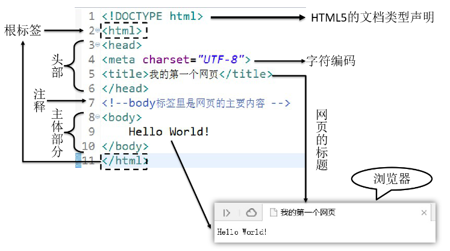

#HTML
HTML是`Hyper Text Markup Language`的缩写。意思是`超文本标记语言`
##超文本
* **HTML文件本质上是文本文件**，而普通的文本文件只能显示字符。
* HTML技术则通过`HTML标签`把其他网页、图片、音频、视频等各种多媒体资源显示出来，这就是超文本的含义  
  ——<font color="red">**本身是文本，但是呈现出来的最终效果超越了文本。**</font>
  
##HTML元素
HTML是一种`标记语言`，它最基本的元素是`标签`，它没有常量、变量、流程控制、异常处理、IO等等编程语言常用的功能。  
- **HTML很简单，每个标签都有它固定的含义和确定的页面显示效果。**
- 标签是HTML语言的基本元素，一个HTML页面由多个HTML标签组成。

###HTML标签

标签是通过`一组尖括号`+`标签名`的方式来定义的：
```html
<标签名>内容</标签名>
```
<标签名>叫`开始标签`，</标签名>叫`结束标签`。  
开始标签和结束标签一起构成了一个`完整的标签`。开始标签和结束标签之间的部分叫`文本标签体`，也简称`标签体`。  
**这种标签称为双标签，也是最常用的标签**
* 双标签
  * 上述这种由开始时结束标签构成的标签称为双标签  
* 单标签
  * 还有一种没有结束标签，只有开始标签的标签，称为单标签。
    ```html
    <input type="text" name="username" />
    ```
    
####属性
* 属性是HTML标签的`额外信息`，用来`描述`标签的`特征`。
* 属性值必须用`引号`包裹。
* 属性名和属性值之间用`空格`分隔。
* 属性名`区分大小写`。

例如：
```html

这是一个图片标签，用来从外部引入一个图片
src属性表示图片的路径
alt表示图片的描述
width和height表示图片的尺寸。
```
#### 注释
HTML注释的写法是：
```html
<!-- 注释内容 -->
```
注释的内容不会显示到浏览器窗口内，是开发人员用来对代码内容进行解释说明。
## 第一个HTML页面

```html
<!DOCTYPE html> 
<html> 
    <head> 
        <meta charset="utf-8">
        <title>我的第一个HTML页面</title>
    </head>
    <body>
        <h1>Hello World!!!</h1>
        <p>这是一个段落</p>
    </body>
</html>
```
###文档类型声明
HTML文件中第一行的内容，用来告诉浏览器当前HTML文档的基本信息，其中最重要的就是当前HTML文档遵循的语法标准。
###根标签---`html标签`
`html标签`是整个文档的根标签，所有其他普通标签都必须放在html标签里面。上面的文档类型不能当做普通标签看待。
###头部---`head标签`
`head标签`用于定义文档的头部，其他头部元素都放在head标签里。  
* 头部元素包括`title标签`、`script标签`、`style标签`、`link标签`、`meta标签`等等。
  * `title标签`：用于定义网页的标题，在浏览器窗口上显示的标题栏上显示。
  * `script标签`：用于在页内定义脚本文件，例如js文件。
  * `style标签`：用于定义网页的样式，例如css文件(行内样式)。
  * `link标签`：用于引入外部文件，例如css文件、js文件、图片文件等等。
  * `meta标签`：用于定义网页的元信息，例如网页编码、网页描述、网页关键词等等。
  * `base标签`：用于定义网页链接的默认地址，或者说叫所有链接的前缀
###主体---`body标签`
body标签定义网页的主体内容，在浏览器窗口内显示的内容都定义到body标签内。

#HTML语法规则
* 根标签有且只能有一个
* 无论是双标签还是单标签都必须正确关闭
* 标签可以嵌套但不能交叉嵌套
* 注释不能嵌套
* 属性必须有值，值必须加引号，单引号或双引号均可
* 标签名不区分大小写但建议使用小写

#[HTML速查列表](https://www.runoob.com/html/html-quicklist.html)