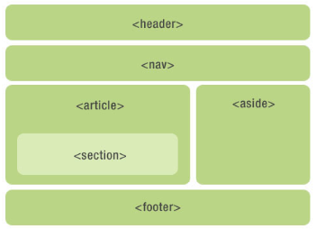

#语义化元素

一个语义元素能够清楚的描述其意义给浏览器和开发者。
* 无语义 元素实例: `
` 和 `` - 无需考虑内容.
* 语义元素实例: `<form>`, `<table>`, `` - 清楚的定义了它的内容

HTML5中新的语义元素
许多现有网站都包含以下HTML代码：  
`
`,`
`或者` 
`来指明导航链接, 头部, 以及尾部.

HTML5 提供了新的语义元素来明确一个Web页面的不同部分:

  | 标签       | 定义                                       | 说明                                     |
  | --------- | ---------------------------------------- | ---------------------------------------- |
  | `<header>` | 文档头部                                   | 通常包含页面标题、logo、导航链接等       |
  | `<nav>`   | 导航链接部分                               | 如页面的导航栏、侧边栏等               |
  | `<section>` | 文档中的一个区域                           | 通常包含一个或多个`<article>`、`<aside>`或其他`<section>`元素 |
  | `<article>` | 文档中的一个独立且自成一体的内容块         | 如文章、博客、新闻等                   |
  | `<aside>` | 文档中与内容相关的辅助信息                   | 如相关链接、提示、广告等               |
  | `<figcaption>` | 为`<figure>`元素添加标题                   |                                       |
  | `<figure>` | 定义一组相关图标或图像                     | 通常与`<figcaption>`元素一起使用         |
  | `<footer>` | 文档的底部                                   | 通常包含版权信息、联系信息等           |
