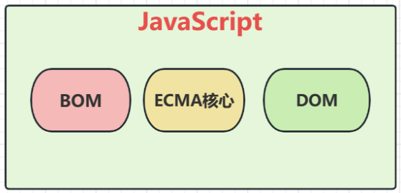
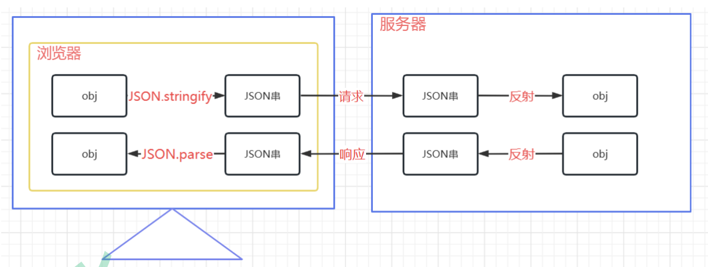
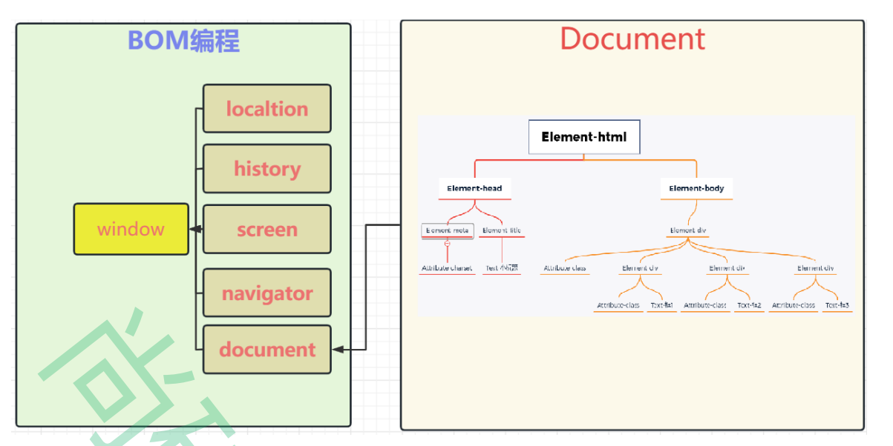
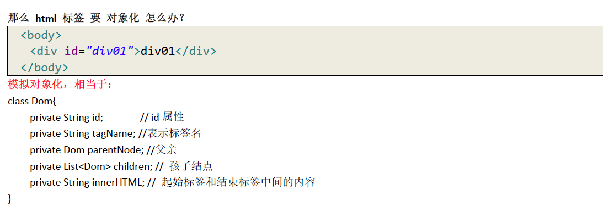

# JavaScript

```javascript
Javascript 语言诞生主要是完成页面的数据验证。因此它运行在客户端，需要运行浏览器来解析执行JavaScript 代码。
```

JS 是Netscape 网景公司的产品，最早取名为LiveScript;为了吸引更多java 程序员。更名为JavaScript。

##Js的特点
* 脚本语言：一种解释型的编程语言,源码`不需要编译`，浏览器会直接`逐行解释源码`并执行
* 基于对象：基于面向对象，能够`实现封装`，`模拟继承`，`不支持多态`
* 弱类型：Js是一种弱类型语言，变量的`类型在赋值时才会确定`，并且根据赋值的内容的不同，可以动态改变变量的类型
* 事件驱动：Js它不需要通过Web服务器就可以对用户的输入进行响应；
* 安全性：不允许直接访问本地硬盘
* 跨平台性：只要是可以解释JS 的浏览器都可以执行，和平台无关


### 与HTML结合的两种方式
1. 使用script标签，在标签中书写js代码
```html
<script>
    //js代码
</script>
```   
2. 使用script标签中的src属性，引入js文件
```html
<script src="js文件路径"></script>
```
##Js的组成(重点)

###ECMA及版本变化：
* ECMA-262是Js的标准规范，它就是定义了Js语言的`语法`：
* ECMA-262第6版-ES6、于2015年6月发布。
  **这一版包含了大概这个规范有史以来最重要的一批增强特性。但是并不是所有的浏览器都全面支持；**
###BOM编程：
* BOM是`Browser Object Model`的简写，即`浏览器对象模型`；
* B0M有一系列对象组成，是`访问`、`控制`、`修改`浏览器的属性和方法：
* B0M`没有统一的标准`（每种客户端都可以自定标准）；
* BOM编程是将浏览器窗口的各个组成部分抽象成各个对象，通过各个对象的API操作组件行为的一种编程；
####BOM编程的对象结构：
* window 顶级对象，代表整个`浏览器窗口`
  * location属性，代表浏览器的`地址栏`
  * history属性，代表浏览器的`访问历史`
  * screenj属性，代表`屏幕`
  * navigator属性，代表`浏览器软件本身`
  * document属性，代表浏览器窗口目前解析的`html文档`
  * console属性，代表浏览器开发者工具的`控制台`
  * localStorage)属性，代表浏览器的本地数据`持久化存储`
  * sessionStorage)属性，代表浏览器的本地数据`会话级存储`
  
###DOM编程：
* 简单来说，DOM编程就是使用`document对象`的API完成对`网页HTML`文档进行`动态修改`，以实现网页数据和样式动态变化效果的编程；
* `document对象代表整个html文档`，可用来访问页面中的所有元素，是最复杂的一个dom对象，可以说是学习好dom编程的关键所在；
* **DOM编程其实就是用window对象的document属性的相关API完成对页面元素的控制的编程；**
## 变量
* 值类型
    * 数字：`number`：数值类型统一为number,不区分整数和浮点数
    * 字符串：`string`：JS中不严格区分单双引号，都可以用于表示字符串
    * 布尔：`boolean`：在JS的if语句中，非空字符串会被转换为'真'，非零数字也会被认为是真。
* 引用类型：引用数据类型对象是Object类型，各种对象和数组在JS中都是Object类型
    * 对象：`Object`
    * 数组：`Array`
    * 函数：`function`：JS中的各种函数属于function数据类型
    * 正则：`RegExp`
    * 日期：`Date`

* 特殊值
    * `undefined`：未定义，所有js变量为赋值前的默认值都是undefined，`值类型`
    * `null`：空值,在JS中，如果给一个变量赋值为null,其数据类型是Object,可以通过typeof关键字判断数据类型，`引用类型`
    * `NAN`：全称是： Not a Number 非数字，非数值
    * `(+/-)Infinity`: (正/负)无穷大，在js中，任何数值除以0，结果都是Infinity

### 变量的定义

```javascript
var 变量名;
var 变量名 = 值;

//例如：
var num = 10;//此时num的数据类型为number
var str = 'a';//此时str的数据类型为string
str = "abc";//此时str的数据类型为string
str = 10; //此时str的数据类型为number
var bool = true;//此时bool的数据类型为boolean

//对象声明
var obj = new Object();//此时obj的数据类型为object

var person = {
    firstName: "John",
    lastName : "Doe",
    id : 5566,
    fullName : function()
    {
        return this.firstName + " " + this.lastName;
    }
};//此时person的数据类型为object
```
###变量的作用域
* `全局变量`：变量在函数外定义，即为全局变量。全局变量有 全局作用域: 网页中所有脚本和函数均可使用
* `局部变量`：变量在函数内声明，变量为局部变量，具有局部作用域，只能在函数内部访问。
###变量的生命周期
JavaScript 变量生命周期在它声明时初始化。
* 局部变量在函数执行完毕后销毁。
* 全局变量在页面关闭后销毁。
## 运算符
###算数运算符
`+` `-` `*` `/` `%`

* `/`在除0时，结果是Infinity,而不是报错；
* `%`在模0时，结果是NaN,意思为not a number,而不是报错；
```javascript
var a = 10/0;//此时a的数据类型为number
var b = 10/0;//此时a的数据类型为number
```
###复合算数运算符
`++` `--` `+=` `-=` `*=` `/=` `%=`

* 在`/=0`时，结果是Infinity,而不是报错：
* 在`%=0`时，结果是NaN,意思为not a number,而不是报错；
```javascript
var num = 10;
num /= 0;//此时num的数据类型为number
num %= 0;//此时num的数据类型为number
```
### 关系运算
`>` `<` `>=` `<=` `==` `===` `!=`
* 等于： == 如果两端的数据类型不一致，会尝试将两端的数据转换成number,再对比number大小
  * `'123'`这种字符串可以转换成数字；
  *  `true`会被转换成1，false会被转换成0；
* 全等于： === 如果两端数据类型不一致，直接返回false,数据类型一致再比较是否相同。
```javascript

```

### 逻辑运算
`&&` `||` `!`
```javascript

/*在JavaScript 语言中，所有的变量，都可以做为一个boolean 类型的变量去使用。
0 、null、undefined、""(空串) 都认为是false；*/

/*
&& 且运算。
有两种情况：
第一种：当表达式全为真的时候。返回最后一个表达式的值。
第二种：当表达式中，有一个为假的时候。返回第一个为假的表达式的值
|| 或运算
第一种情况：当表达式全为假时，返回最后一个表达式的值
第二种情况：只要有一个表达式为真。就会把回第一个为真的表达式的值
并且&& 与运算和||或运算有短路。
短路就是说，当这个&&或||运算有结果了之后。后面的表达式不再执行
*/
```
##对象
###对象的定义
```javascript
//对象的定义：先定义后赋值
var 变量名= new Object();    // 对象实例（空对象）
变量名.属性名= 值;           // 定义一个属性
变量名.函数名= function(){}  // 定义一个函数

var obj = new Object();
obj.name = "张三";
obj.sex = "男";
obj.get = function(){
  alert("姓名：" + this.name +"性别："+ this.sex);
}

//对象的定义：定义时同时赋值
var 变量名= { // 空对象
  属性名：值, // 定义一个属性
        属性名：值, // 定义一个属性
        函数名：function(){} // 定义一个函数
};

var person = {
firstName: "John",
lastName : "Doe",
id : 5566,
fullName : function()
{
  return this.firstName + " " + this.lastName;
}
};//此时person的数据类型为object

```


###对象的访问

```javascript
变量名.属性;
变量名["属性"];
变量名.函数名();

person.lastName;
person["lastName"];
name = person.fullName();
```

## 数组

### 数组的定义

```javascript
var arr = [];/*定义一个空数组，此时length = 0*/
/*js语言中的数组可以自动扩容，当我们对空数组赋值时它就会自动扩容，
无论是使用下标赋值还是统一赋值都会改变数组的长度
arr[0] = 1;arr.length = 1;数组在赋值时被扩容了*/

var arr = [1,2,3];/*定义一个数组，此时length = 3*/

var arr = new Array();
var arr = new Array(10);
var arr = new Array(10,20,30);
```

## 函数

### 函数的定义

```javascript
//第一种方式
function 函数名(){函数体}
function 函数名(形参名){函数体}
function 函数名(形参名){函数体 return 返回值}

//第二种方式
var 函数名= function(形参列表) { 函数体}


// 定义一个无参函数
function fun(){
alert("无参函数fun()被调用了");
}
// 函数调用===才会执行
// fun();
function fun2(a ,b) {
alert("有参函数fun2()被调用了a=>" + a + ",b=>"+b);
}
// fun2(12,"abc");
// 定义带有返回值的函数
function sum(num1,num2) {
var result = num1 + num2;
return result;
}
/***注：在Java 中函数允许重载。但是在JS中函数的重载会直接覆盖掉上一次的定义*/
```

#### 函数的隐形参数

```javascript
就是在function 函数中不需要定义，但却可以直接用来获取所有参数的变量。我们管它叫隐形参数。
隐形参数特别像java 基础的可变长参数一样。
public void fun( Object ... args );
可变长参数其他是一个数组。
那么js 中的隐形参数也跟java 的可变长参数一样。操作类似数组。
/**arguments会接收函数调用时传递过来的所有参数，无论函数定义是否为有形参
 * 例如：
 * function f(a,b){};
 * f(1,2,3,4,5,6);
 * 形参a会接收1：a = 1;
 * 形参b会接受2：b = 2;
 * arguments会接收 1,2,3,4,5,6：arguments = [1,2,3,4,5,6];*/


function fun(a) {
alert( arguments.length );//可看参数个数
alert( arguments[0] );
alert( arguments[1] );
alert( arguments[2] );
alert("a = " + a);
for (var i = 0; i < arguments.length; i++){
alert( arguments[i] );
}
alert("无参函数fun()");
}
// fun(1,"ad",true);
// 需求：要求编写一个函数。用于计算所有参数相加的和并返回
function sum(num1,num2) {
var result = 0;
for (var i = 0; i < arguments.length; i++) {
if (typeof(arguments[i]) == "number") {
result += arguments[i];
}
}
return result;
}
alert( sum(1,2,3,4,"abc",5,6,7,8,9) );
```
##JS的流程控制
###分支结构
####if结构
* if中的非空字符串会被认为是true
* if中的非零数字会被认为是true
```javascript
if('false'){// 非空字符串 if判断为true
    console.log(true)
}else{
    console.log(false)
}
if(''){// 长度为0字符串 if判断为false
    console.log(true)
}else{
    console.log(false)
}
if(1){// 非零数字 if判断为true
    console.log(true)
}else{
    console.log(false)
}
if(0){
    console.log(true)
}else{
  console.log(false)
}
```
####switch
```javascript
var monthStr=prompt("请输入月份","例如:10 ");
var month= 0umber.parseInt(monthStr)
switch(month){
    case 3:
    case 4:
    case 5:
console.log("春季");
break;
    case 6:
    case 7:
    case 8:
console.log("夏季");
break;
    case 9:
    case 10:
    case 11:
console.log("秋季");
break;
    case 1:
    case 2:
    case 12:
console.log("冬季");
break;
    default :
console.log("月份有误")
}
```
###循环结构
####while
```javascript
/* 打印99 乘法表 */
var i = 1;
while(i <= 9){
    var L = 1;
    while(L <= i){
document.write(L+"*"+i+"="+i*L+"nbsp;nbsp;nbsp;nbsp;nbsp;");
L++;
   }
    document.write("<hr/>");
    i++;
}
```
####for
```javascript
/* 打印99 乘法表 */
for(  var i = 1;i <= 9; i++){
    for(var L = 1;L <= i;L++){
        document.write(L+"*"+i+"="+i*L+"nbsp;nbsp;nbsp;nbsp;nbsp;");
   }
    document.write("<hr/>");
}
```
```javascript
for (var index in arr)
//括号中的临时变量表示的是元素的索引，不是元素的值。
//()中也不在使用：分隔，而是使用in关键字。
    
var cities =["北京","上海","深圳","武汉","西安","成都"];
for(var index in cities){
    console.log(cities[index]);
} 

```
##JSON

简单来说,`JSON就是一种字符串格式`，这种格式无论是在前端还是在后端，都可以很容易地和对象之间进行转换，
所以常用于前后端数据传递 
```javascript
JSON的语法：var stra="属性名：属性值，属性名'：属性名：'属性值，属性名'：['值1，值1，值3]
JS0N字符串一般用于传递数据，一般都是用对象的属性表示数据，所以在此不研究对象的函数只看对象的属性；        
var strb='{"name":"张三","age":18,"gender":"男"}";
```
* 通过JSON.parse()方法可以将一个JSON串转换成对象；
* 通过JSON.stringify()方法可以将一个对象转换成一个JSON格式的字符串；
## 事件

**什么是事件？事件是电脑输入设备与页面之间的交互的响应，被称为事件**

#### 常见的事件
* [鼠标事件](https://www.runoob.com/jsref/dom-obj-event.html)
* [键盘事件](https://www.runoob.com/jsref/dom-obj-event.html)
* [表单事件](https://www.runoob.com/jsref/dom-obj-event.html)
```javascript
onload 加载完成事件：       //页面加载完成之后，常用于做页面js 代码初始化操作
onclick 单击事件：          //常用于按钮的点击响应操作。
onblur 失去焦点事件：       //常用用于输入框失去焦点后验证其输入内容是否合法。
onchange 内容发生改变事件： //常用于下拉列表和输入框内容发生改变后操作
onsubmit 表单提交事件：     //常用于表单提交前，验证所有表单项是否合法。
```

### 事件的注册

```
①静态注册事件：通过html 标签的事件属性直接赋于事件响应后的代码，这种方式我们叫静态注册。
②动态注册事件：是指先通过js 代码得到标签的dom 对象，然后再通过dom 对象.事件名= function(){} 这种形式赋于事件
响应后的代码，叫动态注册。
动态注册基本步骤：
1、获取标签对象
2、标签对象.事件名= fucntion(){}
```

#### onload

```html
<script type="text/javascript">
// onload 事件的方法
function onloadFun() {
alert('静态注册onload 事件，所有代码');
}
}
</script>

<!--静态注册onload 事件
onload 事件是浏览器解析完页面之后就会自动触发的事件
<body onload="onloadFun();">
-->


<script type="text/javascript">
// onload 事件动态注册。是固定写法
window.onload = function () {
alert("动态注册的onload 事件");
}
</script>

```

### onclick

```javascript
<head>
<meta charset="UTF-8">
<title>Title</title>
<script type="text/javascript">
function onclickFun() {
alert("静态注册onclick 事件");
}
// 动态注册onclick 事件
window.onload = function () {
// 1 获取标签对象
/*
* document 是JavaScript 语言提供的一个对象（文档）<br/>
* get 获取
* Element 元素（就是标签）
* By 通过。。由。。经。。。
* Id id 属性
*
* getElementById 通过id 属性获取标签对象
**/
var btnObj = document.getElementById("btn01");
// alert( btnObj );
// 2 通过标签对象.事件名= function(){}
btnObj.onclick = function () {
alert("动态注册的onclick 事件");
}
}
</script>
</head>
<body>
<!--静态注册onClick 事件-->
<button onclick="onclickFun();">按钮1</button>
<button id="btn01">按钮2</button>
</body>
```

### onblur

```javascript
// 静态注册失去焦点事件
function onblurFun() {
// console 是控制台对象，是由JavaScript 语言提供，专门用来向浏览器的控制器打印输出， 用于测试使用
// log() 是打印的方法
console.log("静态注册失去焦点事件");
}

body>
用户名:<input type="text" onblur="onblurFun();"><br/>
密码:<input id="password" type="text" ><br/>


// 动态注册onblur 事件
window.onload = function () {
//1 获取标签对象
var passwordObj = document.getElementById("password");
// alert(passwordObj);
//2 通过标签对象.事件名= function(){};
passwordObj.onblur = function () {
console.log("动态注册失去焦点事件");
}
}
```

### onchange

```javascript
function onchangeFun() {
alert("女神已经改变了");
}

<!--静态注册onchange 事件-->
<select onchange="onchangeFun();">
<option>--女神--</option>
<option>芳芳</option>
<option>佳佳</option>
<option>娘娘</option>
</select>


window.onload = function () {
//1 获取标签对象
var selObj = document.getElementById("sel01");
// alert( selObj );
//2 通过标签对象.事件名= function(){}
selObj.onchange = function () {
alert("男神已经改变了");
}
}
```

### onsubmit

```javascript
// 静态注册表单提交事务
function onsubmitFun(){
// 要验证所有表单项是否合法，如果，有一个不合法就阻止表单提交
alert("静态注册表单提交事件----发现不合法");
return flase;
}

<!--return false 可以阻止表单提交-->
<form action="http://localhost:8080" method="get" onsubmit="return onsubmitFun();">
<input type="submit" value="静态注册"/>
</form>


window.onload = function () {
//1 获取标签对象
var formObj = document.getElementById("form01");
//2 通过标签对象.事件名= function(){}
formObj.onsubmit = function () {
// 要验证所有表单项是否合法，如果，有一个不合法就阻止表单提交
alert("动态注册表单提交事件----发现不合法");
return false;
}
}
```

## DOM

DOM 全称是Document Object Model 文档对象模型
大白话，就是把文档中的标签，属性，文本，转换成为对象来管理。
那么它们是如何实现把标签，属性，文本转换成为对象来管理呢。这就是我们马上要学习的重点。

### Document 对象

```
Document 对象的理解：
第一点：Document 它管理了所有的HTML 文档内容。
第二点：document 它是一种树结构的文档。有层级关系。
第三点：它让我们把所有的标签都对象化
第四点：我们可以通过document 访问所有的标签对象。
```



### Document 对象中的方法介绍

```javascript
<html lang="en">
  <head>
    <meta charset="UTF-8">
      <meta name="viewport" content="width=device-width, initial-scale=1.0">
        <title>Document</title>
        <script>
          
          1 获得document dom树
          window.document
          2 从document中获取要操作的元素
          1）直接获取
          var el1 =document.getElementById("username") // 根据元素的id值获取页面上唯一的
          一个元素
          var els =document.getElementsByTagName("input") // 根据元素的标签名获取多个同
          名元素
          var els =document.getElementsByName("aaa") // 根据元素的name属性值获得多个元素
          var els =document.getElementsByClassName("a") // 根据元素的class属性值获得多个
          元素
          2）间接获取
          var cs=div01.children // 通过父元素获取全部的子元素
          var firstChild =div01.firstElementChild // 通过父元素获取第一个子元素
          var lastChild = div01.lastElementChild   // 通过父元素获取最后一个子元素
          var parent = pinput.parentElement // 通过子元素获取父元素
          var pElement = pinput.previousElementSibling // 获取前面的第一个元素
          var nElement = pinput.nextElementSibling // 获取后面的第一个元素
          3 对元素进行操作
          1）操作元素的属性   元素名.属性名=""
          2）操作元素的样式   元素名.style.样式名="" 样式名"-" 要进行驼峰转换
          3）操作元素的文本   元素名.innerText   只识别文本
          元素名.innerHTML   同时可以识别html代码
          4）增删元素
          var element =document.createElement("元素名") // 创建元素
          父元素.appendChild(子元素)               // 在父元素中追加子元素
          父元素.insertBefore(新元素,参照元素)     // 在某个元素前增加元素
          父元素.replaceChild(新元素,被替换的元素) // 用新的元素替换某个子子元素
          元素.remove()                           // 删除当前元素
          
          function addCs(){
          // 创建一个新的元素
          // 创建元素
          var csli =document.createElement("li") // <li></li>
          // 设置子元素的属性和文本 <li id="cs">长沙</li>
          csli.id="cs"
          csli.innerText="长沙"
          // 将子元素放入父元素中
          var cityul =document.getElementById("city")
          // 在父元素中追加子元素
          cityul.appendChild(csli)
        }
          function addCsBeforeSz(){
          // 创建一个新的元素
          // 创建元素
          var csli =document.createElement("li") // <li></li>
          // 设置子元素的属性和文本 <li id="cs">长沙</li>
          csli.id="cs"
          csli.innerText="长沙"
          // 将子元素放入父元素中
          var cityul =document.getElementById("city")
          // 在父元素中追加子元素
          //cityul.insertBefore(新元素,参照元素)
          var szli =document.getElementById("sz")
          cityul.insertBefore(csli,szli)
        }
          function replaceSz(){
          // 创建一个新的元素
          // 创建元素
          var csli =document.createElement("li") // <li></li>
          // 设置子元素的属性和文本 <li id="cs">长沙</li>
          csli.id="cs"
          csli.innerText="长沙"
          // 将子元素放入父元素中
          var cityul =document.getElementById("city")
          // 在父元素中追加子元素
          //cityul.replaceChild(新元素,被替换的元素)
          var szli =document.getElementById("sz")
          cityul.replaceChild(csli,szli)
        }
          function removeSz(){
          var szli =document.getElementById("sz")
          // 哪个元素调用了remove该元素就会从dom树中移除
          szli.remove()
        }
          function clearCity(){
          var cityul =document.getElementById("city")
          /* var fc =cityul.firstChild
         while(fc != null ){
             fc.remove()
             fc =cityul.firstChild
         } */
          cityul.innerHTML=""
          //cityul.remove()
        }
        </script>
  </head>
  <body>
    <ul id="city">
      <li id="bL">北京</li>
      <li id="sh">上海</li>
      <li id="sz">深圳</li>
      <li id="gz">广州</li>
    </ul>
    <hr>
      <!-- 目标1 在城市列表的最后添加一个子标签 <li id="cs">长沙</li> -->
      <button onclick="addCs()">增加长沙</button>
      <!-- 目标2 在城市列表的深圳前添加一个子标签 <li id="cs">长沙</li> -->
      <button onclick="addCsBeforeSz()">在深圳前插入长沙</button>
      <!-- 目标3 将城市列表的深圳替换为 <li id="cs">长沙</li> -->
      <button onclick="replaceSz()">替换深圳</button>
      <!-- 目标4 将城市列表删除深圳 -->
      <button onclick="removeSz()">删除深圳</button>
      <!-- 目标5 清空城市列表 -->
      <button onclick="clearCity()">清空</button>
  </body>
</html>
```

### 节点的常用属性和方法

```
方法：
通过具体的元素节点调用
getElementsByTagName()
方法，获取当前节点的指定标签名孩子节点
appendChild( oChildNode )
方法，可以添加一个子节点，oChildNode 是要添加的孩子节点
```

```
属性：
childNodes
属性，获取当前节点的所有子节点
firstChild
属性，获取当前节点的第一个子节点
lastChild
属性，获取当前节点的最后一个子节点
parentNode
属性，获取当前节点的父节点
nextSibling
属性，获取当前节点的下一个节点
previousSibling
属性，获取当前节点的上一个节点
className
用于获取或设置标签的class 属性值
innerHTML
属性，表示获取/设置起始标签和结束标签中的内容
innerText
属性，表示获取/设置起始标签和结束标签中的文本 
```

##正则表达式
正则表达式也是对象，可以根据特定规则匹配字符串

### 创建正则表达式
```javascript
var patt=new RegExp(pattern,modifiers);
或者更简单的方式:
var patt=/pattern/modifiers; 
```
修饰符：  
`i`：忽略大小写  
`g`：全局匹配  
`m`：多行匹配  
```javascript
var patt1=new RegExp("a");
var patt2=/a/i;
```

###规则
[正则表达式规则](../JS/正则表达式.md)


