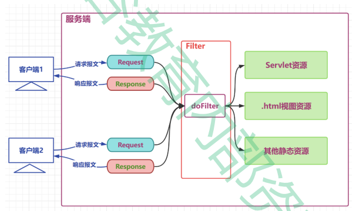
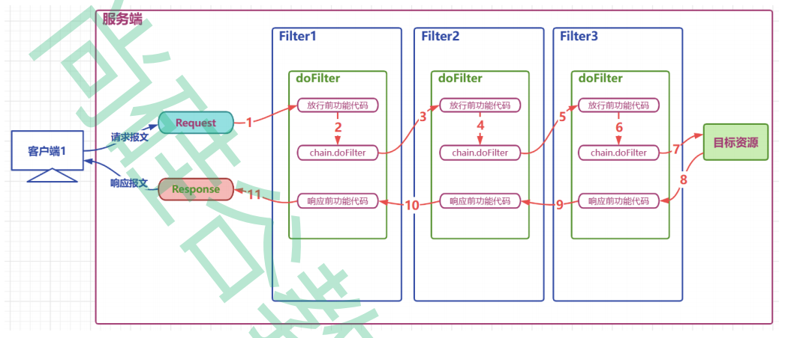

# 过滤器Filter


过滤器Filter是JavaWeb三大组件之一，`本质是工作于Servlet之前的一个接口`，用来过滤请求，对请求进行预处理，也可以对响应进行后处理。
* 在Web应用开发中，`使用过滤器来实现一些通用的操作，如：过滤掉非法请求、编码转换、登录检查等`。
```
1) Filter也属于Servlet规范
2) 
   
3) 
4) 过滤器链
   1）
   2）
   3）
   
  过滤器的应用：
  CharacterEncodingFilter.java
  OpenSessionInViewFilter.java
```
##常用方法
* init():初始化方法，在web应用启动时执行
* destroy():销毁方法，在web应用销毁时执行
* doFilter():拦截方法，每次拦截到请求，就会进入doFilter方法，一般在这里完成我们拦截到请求后的处理工作
* FilterChain:过滤器链，可以调用该对象的方法，将请求传递给下一个过滤器，或者直接将请求传递给目标资源

##工作原理

1.  客户端发送请求，请求被过滤器拦截
2.  过滤器对请求进行前置处理
3.  将请求传递给过滤器链
4.  匹配过滤器
5.  执行2-4
6.  交给目标资源
7.  目标资源处理请求，生成响应
8.  将请求传递给过滤器链
9.  根据前置处理的顺序逆向进行后置处理
10.  响应被返回给客户端
##过滤器链
一个web项目中可以同时定义多个过滤器，多个过滤器对`同一个请求`进行过滤时，工作位置有先后，整体形成一个工作链，称为过滤器链。
* 同一个请求被多个过滤器同时拦截，才能形成一个过滤器链；
* 过滤器链中的过滤器的顺序由filter-mapping顺序决定；
* 每个过滤器过滤的范围不同，针对同一个资源来说，过滤器链中的过滤器个数可能是不同的；
* 如果某个Filter是使用ServletName进行匹配规则的配置，那么这个Filter执行的优先级要更低；
```java
public class FilterTestOne implements Filter {
    @Override
    public void doFilter(ServletRequest servletRequest, ServletResponse servletResponse, FilterChain filterChain) throws IOException, ServletException {
        System.out.println("FilterTestOne doFilter");
        filterChain.doFilter(servletRequest, servletResponse);
        System.out.println("FilterTestOne doFilter end");
    }
}

public class FilterTestTwo implements Filter {
    @Override
    public void doFilter(ServletRequest servletRequest, ServletResponse servletResponse, FilterChain filterChain) throws IOException, ServletException {
        System.out.println("FilterTestTwo doFilter");
        filterChain.doFilter(servletRequest, servletResponse);
        System.out.println("FilterTestTwo doFilter after");
    }
}

public class FilterTestThree implements Filter {
    @Override
    public void doFilter(ServletRequest servletRequest, ServletResponse servletResponse, FilterChain filterChain) throws IOException, ServletException {
        System.out.println("FilterTestThree doFilter");
        filterChain.doFilter(servletRequest, servletResponse);
        System.out.println("FilterTestThree doFilter after");
    }
```
XML配置文件
```xml
<?xml version="1.0" encoding="UTF-8"?>
<web-app xmlns="http://xmlns.jcp.org/xml/ns/javaee"
         xmlns:xsi="http://www.w3.org/2001/XMLSchema-instance"
         xsi:schemaLocation="http://xmlns.jcp.org/xml/ns/javaee http://xmlns.jcp.org/xml/ns/javaee/web-app_4_0.xsd"
         version="4.0">
    
    <filter>
        <!--配置filter,并为filter起别名-->
        <filter-name>filter1</filter-name>
        <filter-class>com.tao.test.FilterTestOne</filter-class>
    </filter>
    <filter>
        <filter-name>filter2</filter-name>
        <filter-class>com.tao.test.FilterTestTwo</filter-class>
        <!--配置filter的初始参数-->
        <init-param>
            <param-name>dateTimePattern</param-name>
            <param-value>yyyy-MM-dd HH:mm:ss</param-value>
        </init-param>
    </filter>
    <filter>
        <filter-name>filter3</filter-name>
        <filter-class>com.tao.test.FilterTestThree</filter-class>
    </filter>

    <!--filter-mapping的顺序决定了过滤器的工作顺序-->
    <!--为别名对应的filter配置要过滤的目标资源-->
    <filter-mapping>
        <filter-name>filter1</filter-name>
        <url-pattern>*</url-pattern>
    </filter-mapping>
    <filter-mapping>
        <filter-name>filter2</filter-name>
        <!--通过映射路径确定过滤资源-->
        <url-pattern>*</url-pattern>
    </filter-mapping>
    <filter-mapping>
        <filter-name>filter3</filter-name>
        <url-pattern>*</url-pattern>
    </filter-mapping>
</web-app>
```
注解方式配置

```java

@WebFilter(
        filter0ame = "loggingFilter",
        urlPatterns = {"*"}
)
public class FilterTestOne implements Filter {
    
}
@WebFilter(
        filter0ame = "loggingFilter",
        urlPatterns = {"*"}
)
public class FilterTestTwo implements Filter {
@WebFilter(
        filter0ame = "loggingFilter",
        urlPatterns = {"*"}
)
public class FilterTestThree implements Filter {
```
* 执行的顺序依次是： A B C demo03 C2 B2 A2
* 如果采取的是注解的方式进行配置，那么过滤器链的拦截顺序是按照全类名的先后顺序排序的(`全类名的顺序`)
* 如果采取的是xml的方式进行配置，那么按照配置的先后顺序进行排序(`<filter-mapping>的顺序`)
##拦截规则
只有匹配到相应的拦截规则的请求才回被拦截

过滤器的拦截方式：

1.通过映射路径确定过滤资源
```xml
<url-pattern>/servletA</url-pattern>
```
2.通过后缀名确定过滤资源
```xml
<url-pattern>*.html</url-pattern>
```
3.通过servlet别名确定过滤资源
```xml
<servlet-name>servletB0ame</servlet-name>
```  

   
##示例代码
1. Filter开发步骤：新建类实现Filter接口，然后实现其中的三个方法：init、doFilter、destroy
2. 配置Filter，可以用注解`@WebFilter`，也可以使用xml文件 <filter> <filter-mapping>标签
3. Filter在配置时，和servlet一样，也可以配置通配符，例如 @WebFilter("*.do")表示拦截所有以.do结尾的请求
###配置模版
```xml
<!--配置filter,并为filter起别名-->
<filter>
 <filter-name>loggingFilter</filter-name>
 <filter-class>com.atguigu.filters.LoggingFilter</filter-class>
 <!--配置filter的初始参数-->
     <init-param>
        <param-name>dateTimePattern</param-name>
        <param-value>yyyy-MM-dd HH:mm:ss</param-value>
     </init-param>
</filter>
<!--为别名对应的filter配置要过滤的目标资源-->
<filter-mapping>
    <filter-name>loggingFilter</filter-name>
    <!--通过映射路径确定过滤资源-->
    <url-pattern>/servletA</url-pattern>
    <!--通过后缀名确定过滤资源-->
    <url-pattern>*.html</url-pattern>
    <!--通过servlet别名确定过滤资源-->
    <servlet-name>servletB0ame</servlet-name>
</filter-mapping>
```

```java

@WebFilter(
        filter0ame = "loggingFilter",
        initParams = {"9ebInitParam(name="dateTimePattern",value="yyyy - MM - dd HH:mm:ss")},
        urlPatterns= {"/servletA", "*.html"},
        servlet0ames = {"servletB0ame"}
)
public class LoggingFilter implements Filter {
    /* 内部代码 略 */
}
```