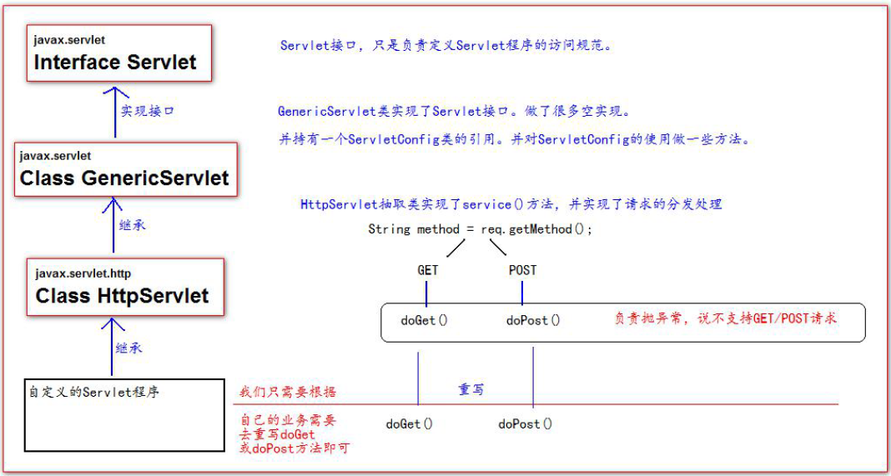

#HttpServlet类是什么？
HttpServlet类是Java Servlet API中的一个类，它提供了一个基础的HTTP Servlet实现。该类继承自GenericServlet类，并实现了Servlet
## Servlet类的继承关系



**Servlet的继承关系 - 重点查看的是服务方法（service()）**
###继承关系
```

    javax.servlet.Servlet接口
        javax.servlet.GenericServlet抽象类
            javax.servlet.http.HttpServlet抽象子类
```
###相关方法(重点)
javax.servlet.`Servlet`接口:
* void init(config) - 初始化方法
* void service(request,response) - 服务方法
* void destory() - 销毁方法

javax.servlet.`GenericServlet`抽象类：GenericServlet抽象类主要持有servletConfig对象，并且可以通过servletConfig获取servletContext对象
* void service(request,response) - 仍然是抽象的  

javax.servlet.http.`HttpServlet`子类：在HttpServlet中，通过请求中不同的参数(请求方式)，来决定调用不同的do方法(一共7种),必须重写对应do方法
* void service(request,response)方法
* doGet(request,response)方法
* doPost(request,response)方法
* doXxx方法
```java
 1. 在Servlet被访问时
 2. 容器调用service方法
 3. service方法调用与请求方式对应的doXxx方法
    3.1 String method = req.getMethod(); 获取请求的方式
    3.2各种if判断，根据请求方式不同，决定去调用不同的do方法(一共7种)
        if (method.equals("GET")) {
            this.doGet(req,resp);
        } else if (method.equals("HEAD")) {
            this.doHead(req, resp);
        } else if (method.equals("POST")) {
            this.doPost(req, resp);
        } else if (method.equals("PUT")) {
 4. 在HttpServlet这个抽象类中，do方法都差不多:
 protected void doGet(HttpServletRequest req, HttpServletResponse resp) throws ServletException, IOException {
     String protocol = req.getProtocol();
     String msg = lStrings.getString("http.method_get_not_supported");
     if (protocol.endsWith("1.1")) {
         resp.sendError(405, msg);
     } else {
         resp.sendError(400, msg);
     }
   }
```

<br/>

## ServletConfig

```
ServletConfig 类从类名上来看，就知道是Servlet 程序的配置信息类。
Servlet 程序和ServletConfig 对象都是由Tomcat 负责创建，我们负责使用。
Servlet 程序默认是第一次访问的时候创建，ServletConfig 是每个Servlet 程序创建时，
就创建一个对应的ServletConfig 对象。

ServletConfig类的本质就是对应Servlet程序的配置文件。
在IDEA中获取的ServletConfig类就是获取在web.xml中的对该Servlet程序的配置部分
```
#### ServletConfig 类的三大作用

```
1、可以获取Servlet 程序的别名servlet-name 的值  //getServletName
2、获取初始化参数init-param //getInitParameter()
3、获取ServletContext 对象 //getServletContext()
```


## ServletContext

```java
/*
1、ServletContext 是一个接口，它表示Servlet 上下文对象
2、一个web 工程，只有一个ServletContext 对象实例。
3、ServletContext 对象是一个域对象。
4、ServletContext 是在web 工程部署启动的时候创建。在web 工程停止的时候销毁。
*/

什么是域对象?
域对象，是可以像Map 一样存取数据的对象，叫域对象。
这里的域指的是存取数据的操作范围，ServletContext的作用域整个web工程。
          存数据                取数据                删除数据
Map       put()                 get()                 remove()
域对象    setAttribute()        getAttribute()        removeAttribute();
```

#### ServletContext 类的四个作用

```java
/**
1、获取web.xml 中配置的上下文参数context-param
2、获取当前的工程路径，格式: /工程路径
3、获取工程部署后在服务器硬盘上的绝对路径
4、像Map 一样存取数据*/

protected void doGet(HttpServletRequest request, HttpServletResponse response) throws
ServletException, IOException {
// 1、获取web.xml 中配置的上下文参数context-param
ServletContext context = getServletConfig().getServletContext();
String username = context.getInitParameter("username");
System.out.println("context-param 参数username 的值是:" + username);
System.out.println("context-param 参数password 的值是:" +context.getInitParameter("password"));
// 2、获取当前的工程路径，格式: /工程路径
System.out.println( "当前工程路径:" + context.getContextPath() );
// 3、获取工程部署后在服务器硬盘上的绝对路径
/**
* / 斜杠被服务器解析地址为:http://ip:port/工程名/ 映射到IDEA 代码的web 目录<br/>
*/
System.out.println("工程部署的路径是:" + context.getRealPath("/"));
System.out.println("工程下css 目录的绝对路径是:" + context.getRealPath("/css"));
System.out.println("工程下imgs 目录1.jpg 的绝对路径是:" + context.getRealPath("/imgs/1.jpg"));
}
```

### 设置编码

```
tomcat8之前，设置编码：
      1)get请求方式：
        //get方式目前不需要设置编码（基于tomcat8）
        //如果是get请求发送的中文数据，转码稍微有点麻烦（tomcat8之前）
        String fname = request.getParameter("fname");
        //1.将字符串打散成字节数组
        byte[] bytes = fname.getBytes("ISO-8859-1");
        //2.将字节数组按照设定的编码重新组装成字符串
        fname = new String(bytes,"UTF-8");
      2)post请求方式：
        request.setCharacterEncoding("UTF-8");
tomcat8开始，设置编码，只需要针对post方式
        request.setCharacterEncoding("UTF-8");
    注意：需要注意的是，设置编码(post)这一句代码必须在所有的获取参数动作之前
    


// 200 : 正常响应
// 302 : 重定向
// 404 : 找不到资源
// 405 : 请求方式不支持
// 500 : 服务器内部错误

```

### Http协议

```
Http协议
    1） Http 称之为 超文本传输协议
    2） Http是无状态的
    3） Http请求响应包含两个部分：请求和响应
      - 请求：
        请求包含三个部分： 1.请求行 ； 2.请求消息头 ； 3.请求主体
        1)请求行包含是三个信息： 1. 请求的方式 ； 2.请求的URL ； 3.请求的协议（一般都是HTTP1.1）
        2)请求消息头中包含了很多客户端需要告诉服务器的信息，比如：我的浏览器型号、版本、我能接收的内容的类型、
        我给你发的内容的类型、内容的长度等等(键值对)
        3)请求体，三种情况
          get方式，没有请求体，但是有一个queryString
          post方式，有请求体，form data
          json格式，有请求体，request payload
      - 响应：
        响应也包含三本： 1. 响应行 ； 2.响应头 ； 3.响应体
        1)响应行包含三个信息：1.协议 2.响应状态码(200) 3.响应状态(ok)
        2)响应头：包含了服务器的信息；服务器发送给浏览器的信息（内容的媒体类型、编码、内容长度等）
        3)响应体：响应的实际内容（比如请求add.html页面时，响应的内容就是<html><head><body><form....）
```

#### 会话session

```

    1） Http是无状态的
        - HTTP 无状态 ：服务器无法判断这两次请求是同一个客户端发过来的，还是不同的客户端发过来的
        - 无状态带来的现实问题：第一次请求是添加商品到购物车，第二次请求是结账；
          如果这两次请求服务器无法区分是同一个用户的，那么就会导致混乱
        - 通过会话跟踪技术来解决无状态的问题。

    2） 会话跟踪技术
        - 客户端第一次发请求给服务器，服务器获取session，获取不到，则创建新的，然后响应给客户端（以cookie方式）
        - 下次客户端给服务器发请求时，会把sessionID带给服务器，那么服务器就能获取到了，
          那么服务器就判断这一次请求和上次某次请求是同一个客户端，从而能够区分开客户端
        - 常用的API：
          request.getSession() -> 获取当前的会话，没有则创建一个新的会话
          request.getSession(true) -> 效果和不带参数相同
          request.getSession(false) -> 获取当前会话，没有则返回null，不会创建新的

          session.getId() -> 获取sessionID
          session.isNew() -> 判断当前session是否是新的
          session.getMaxInactiveInterval() -> session的非激活间隔时长，默认1800秒
          session.setMaxInactiveInterval()
          session.invalidate() -> 强制性让会话立即失效
          ....

    3） session保存作用域
      - session保存作用域是和具体的某一个session对应的
      - 常用的API：
        void session.setAttribute(k,v)
        Object session.getAttribute(k)
        void removeAttribute(k)

```

### 服务器内部转发以及客户端重定向

```

    1） 服务器内部转发 : request.getRequestDispatcher("...").forward(request,response);
      - 一次请求响应的过程，对于客户端而言，内部经过了多少次转发，客户端是不知道的
      - 地址栏没有变化
    2） 客户端重定向： response.sendRedirect("....");
      - 两次请求响应的过程。客户端肯定知道请求URL有变化
      - 地址栏有变化
    3)response.getwrite
```

### 域对象

```
1. 保存作用域
   原始情况下，保存作用域我们可以认为有四个： 
   page（页面级别，现在几乎不用） , request（一次请求响应范围）
   session（一次会话范围） , application（整个应用程序范围）
   1） request：一次请求响应范围
   2） session：一次会话范围有效
   3） application（servletContext）： 一次应用程序范围有效（提供服务器公共数据）

2. 路径问题
   1） 相对路径
   2） 绝对路径

3. 实现库存系统的功能
1. 最初的做法是： 一个请求对应一个Servlet，这样存在的问题是servlet太多了
2. 把一些列的请求都对应一个Servlet, IndexServlet/AddServlet/EditServlet/DelServlet/UpdateServlet -> 合并成FruitServlet
   通过一个operate的值来决定调用FruitServlet中的哪一个方法
   使用的是switch-case
3. 在上一个版本中，Servlet中充斥着大量的switch-case，试想一下，随着我们的项目的业务规模扩大，那么会有很多的Servlet，也就意味着会有很多的switch-case，这是一种代码冗余
   因此，我们在servlet中使用了反射技术，我们规定operate的值和方法名一致，那么接收到operate的值是什么就表明我们需要调用对应的方法进行响应，如果找不到对应的方法，则抛异常
4. 在上一个版本中我们使用了反射技术，但是其实还是存在一定的问题：每一个servlet中都有类似的反射技术的代码。因此继续抽取，设计了中央控制器类：DispatcherServlet
   DispatcherServlet这个类的工作分为两大部分：
   1.根据url定位到能够处理这个请求的controller组件：
    1)从url中提取servletPath : /fruit.do -> fruit
    2)根据fruit找到对应的组件:FruitController ， 这个对应的依据我们存储在applicationContext.xml中
      <bean id="fruit" class="com.atguigu.fruit.controllers.FruitController/>
      通过DOM技术我们去解析XML文件，在中央控制器中形成一个beanMap容器，用来存放所有的Controller组件
    3)根据获取到的operate的值定位到我们FruitController中需要调用的方法
   2.调用Controller组件中的方法：
    1) 获取参数
       获取即将要调用的方法的参数签名信息: Parameter[] parameters = method.getParameters();
       通过parameter.getName()获取参数的名称；
       准备了Object[] parameterValues 这个数组用来存放对应参数的参数值
       另外，我们需要考虑参数的类型问题，需要做类型转化的工作。通过parameter.getType()获取参数的类型
    2) 执行方法
       Object returnObj = method.invoke(controllerBean , parameterValues);
    3) 视图处理
       String returnStr = (String)returnObj;
       if(returnStr.startWith("redirect:")){
        ....
       }else if.....

```


