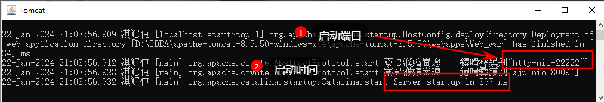
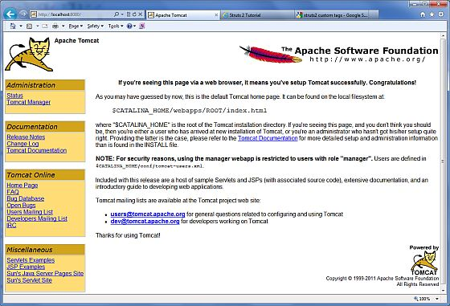

#下载
* 从 [官网](http://tomcat.apache.org/) 上下载最新版本的Tomcat压缩包。
* 解压下载的文件。
* 配置Tomcat环境变量-(可选)。
#使用
* 在 Windows 上，可以通过执行下面的命令来启动 Tomcat：
```shell
 #已配置环境变量 
 %CATALINA_HOME%\bin\startup.bat

 或者
 #tomcat解压包的bin目录下执行
 startup.bat
 #在任意目录下执行
 #tomcat解压包的bin目录+startup.bat
 C:\apache-tomcat-5.5.29\bin\startup.bat
```
* 在 Unix（Solaris、Linux 等） 上，可以通过执行下面的命令来启动 Tomcat：  
```shell
#已配置环境变量
$CATALINA_HOME/bin/startup.sh

 或者
 #和Windows类似执行startup.sh
/usr/local/apache-tomcat-5.5.29/bin/startup.sh
```

* 打开浏览器访问http://localhost:8080/ 看到Tomcat默认页面表示安装成功。(确保端口没有被占用)

* 关闭Tomcat服务：
```shell
#Win
C:\apache-tomcat-5.5.29\bin\shutdown
#Liunx
/usr/local/apache-tomcat-5.5.29/bin/shutdown.sh

```