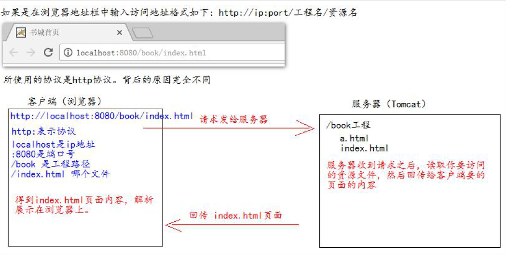

# Tomcat工程部署
   
```
第一种部署方法：只需要把web 工程的目录拷贝到Tomcat 的webapps 目录下即可。
```

```
第二种部署方法：
找到Tomcat 下的conf 目录\Catalina\localhost\ 下,创建如下的配置文件：

abc.xml 配置文件内容如下：
<!-- Context 表示一个工程上下文
path 表示工程的访问路径:/abc
docBase 表示你的工程目录在哪里
-->
<Context path="/abc" docBase="E:\book" />

访问这个工程的路径如下:http://ip:port/abc/ 就表示访问E:\book 目录
```

## 本地html 页面到浏览器和在浏览器中输入http://ip:端口号/工程名/访问

```
    手托html页面到浏览器,这个时候浏览器中的地址如下:
    file:///E:/book/index. html
    观察上图,我们发现,它使用的协议是file://协议。
    file协议表示告诉浏览器直接读取file:协议后面的路径,解析展示在浏览器上即可。
    
    输入访问地址访问：
    使用http协议访问是基于请求响应的模式来访问该资源的
```



## ROOT 的工程的访问，以及默认index.html 页面的访问

```
当我们在浏览器地址栏中输入访问地址如下：
http://ip:port/ ====>>>> 没有工程名的时候，默认访问的是ROOT工程。

当我们在浏览器地址栏中输入的访问地址如下：
http://ip:port/工程名/ ====>>>> 没有资源名，默认访问index.html页面
```

# 在IDEA中部署web项目

```
1. 新建项目 - 新建模块
   在新建模块时添加web

2. 在模块中添加web
   在项目结构project structure中的Facets中

3. 创建artifact - 部署包

4. lib - artifact
   先有artifact，后来才添加的mysql.jar。此时，这个jar包并没有添加到部署包中
   那么在projectSettings中有一个Problems中会有提示的,我们点击fix选择add to...
   另外，我们也可以直接把lib文件夹直接新建在WEB-INF下。
   这样不好的地方是这个lib只能是当前这个moudle独享。如果有第二个moudle我们需要再次重复的新建lib。

5. 在部署的时候，修改application Context。然后再回到server选项卡，检查URL的值。
   URL的值指的是tomcat启动完成后自动打开你指定的浏览器，然后默认访问的网址。
   启动后，报错404.404意味着找不到指定的资源。
   如果我们的网址是：http://localhost:8080/pro01/ , 那么表明我们访问的是index.html.
   我们可以通过<welcome-file-list>标签进行设置欢迎页(在tomcat的web.xml中设置，或者在自己项目的web.xml中设置)

6. 405问题。当前请求的方法不支持。比如，我们表单method=post , 那么Servlet必须对应doPost。否则报405错误。
   http默认请求默认是get模式


7. 空指针或者是NumberFormatException 。
   因为有价格和库存。如果价格取不到，结果你想对null进行Integer.parseInt()就会报错。
   错误的原因大部分是因为 name="price"此处写错了，结果在Servlet端还是使用request.getParameter("price")去获取。


8. <url-pattern>中以斜杠开头
```


## Tomcat输出乱码
确定到底是哪个地方导致的乱码。

```
//post模式下设置编码防止中文乱码

//get模式不需要设置（基于tomcat8）

/*
//get方式目前不需要设置编码（基于tomcat8）
//如果是get请求发送的中文数据，转码稍微有点麻烦（tomcat8之前）
String fname = request.getParameter("fname");
//1.将字符串打散成字节数组
byte[] bytes = fname.getBytes("ISO-8859-1");
//2.将字节数组按照设定的编码重新组装成字符串
fname = new String(bytes,"UTF-8");
*/
```