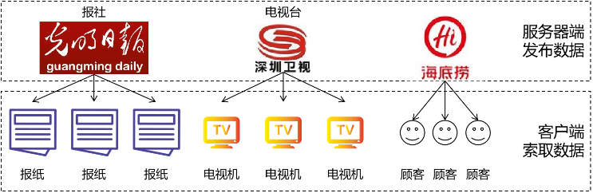
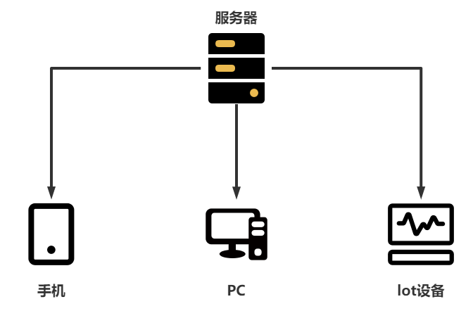
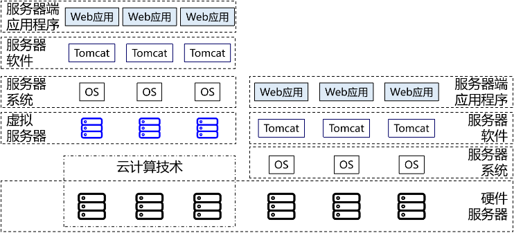
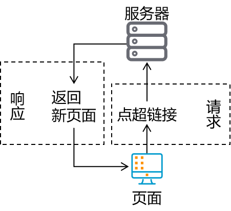
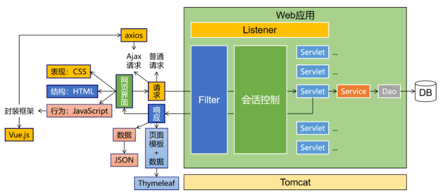

#Web的基础概念
##服务端和客户端
* 服务端：信息的生产者
* 客户端：信息的消费者

在生活中的例子：  
  
在互联网中的例子：  

### 互联网中的计算机
互联网的所有设备本质上都是计算机，计算机分为两种：
* 客户端计算机：运行客户端软件的计算机
      * 比如：手机，电脑，平板等   
* 服务器计算机：运行服务器软件的计算机
      * 比如：服务器，虚拟机等

### 互联网中的应用程序
计算机只是一个硬件，它不能做任何事情，要想让计算机做任何事情，需要安装应用程序。
* 客户端应用程序：运行在客户端计算机上的程序
      * 比如：QQ，微信，浏览器等
* 服务器应用程序：运行在服务器计算机上的程序
      * 比如：Web服务器，数据库服务器等
##Web应用程序：运行在服务器上的程序

##业务
项目中的功能就是业务
###请求和响应
请求和和响应是Web应用程序的基石，本质就是输入和输出
* 请求：客户端向服务器发送数据
* 响应：服务器向客户端返回数据
  

####HTTP协议
HTTP协议是Web应用程序之间通信的规则，客户端和服务器之间通过HTTP协议进行通信。
##项目的逻辑构成
* 请求：请求是项目中最基本的逻辑单元，就像万事万物都由原子构成
    * 举例：点超链接跳转到注册页面
* 功能：一个功能包含很多个请求
    * 举例：注册用户功能
        * 请求1：点超链接跳转到注册页面
        * 请求2：发送请求获取短信验证码
        * 请求3：检查用户名是否可用
        * 请求4：提交表单完成注册
* 模块：一个模块包含很多功能
    * 举例：用户信息管理模块
        * 功能1：用户注册功能
        * 功能2：用户登录功能
        * 功能3：个人中心——账户安全功能
        * 功能4：个人中心——账户绑定功能
        * 功能5：个人中心——收货地址功能
        * 功能6：个人中心——我的银行卡功能

* 子系统：根据项目规模的不同，子系统这层逻辑概念可能有也可能没有。如果设置了子系统，那么子系统中也必然包含很多模块。其实庞大项目的子系统已经相当于一个项目了，甚至比小型项目整个都大。
    * 举例：认证中心子系统
        * 模块1：用户信息管理模块
        * 模块2：权限管理模块
        * 模块3：授权管理模块
        * 模块4：权限检查模块
* 项目：为了解决现实生活中的实际问题开发一个项目，这个项目就是为这个需求提供的一整套解决方案。
    * 举例：电商项目
        * 子系统1：认证中心子系统
        * 子系统2：商品管理子系统
        * 子系统3：购物车子系统
        * 子系统4：仓储子系统
        * 子系统5：物流子系统
        * 子系统6：订单子系统 
          
## 架构
`架构`其实就是项目的`结构`。只不过`结构`这个词太小了，不适合用来描述项目这么大的东西，所以换了另一个更大的词：架构。
所以当我们聊一个项目的架构时，我们聊的是项目是由哪些部分组成的。
### 单一架构
一个项目就是一个工程，这样的结构就是单一架构，也叫all in one。我们现在的`JavaWeb`阶段、`SSM`阶段都是学习单一架构开发技术。
####单一架构技术体系
* 视图：用户的操作界面+数据的动态显示
    * 前端技术：HTML/CSS/JavaScript
* 服务器端页面模板技术：Thymeleaf
    * 控制层：处理请求+跳转页面
    * 服务器：Tomcat
    * 控制器：Servlet
    * 域对象：request、session、servletContext
    * 过滤器：Filter
    * 监听器：Listener
    * 异步交互：Ajax
* 业务逻辑层：业务逻辑计算
* 持久化层：操作数据库

#####技术简介
* HTML/CSS/JavaScript：前端技术：HTML负责前端页面的结构，CSS负责页面的样式，JavaScript负责页面的交互。
* Ajax：异步交互:主要是为了局部刷新页面，提高用户体验，并且减少请求，减少服务器压力。
    * 异步：异步就是不必等待当前操作完成就执行后续的操作。
* Thymeleaf：服务器端页面模板技术：主要是为了在后端进行数据动态渲染，形成完整页面后向用户进行响应。
* Tomcat：服务器：由Java语言开发的Web服务器，提供HTTP服务器。
    * Servlet：控制器：主要负责接收请求、处理请求、将结果响应给客户端。
* request、session、servletContext：域对象
* Filter：过滤器
* Listener：监听器

### 分布式架构
一个项目中包含很多工程，每个工程作为一个模块。模块之间存在调用关系。分布式架构阶段的技术分为两类：
* Java框架：SpringBoot、SpringCloud、Dubbo等等。
* 中间件：Redis、ElasticSearch、FastDFS、Nginx、Zookeeper、RabbitMQ等等。