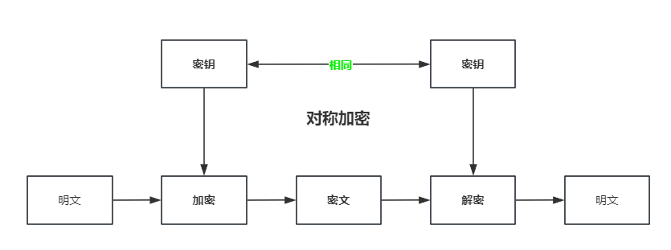

#Java security
## 1. 什么是Java Security？
Java Security是一个用于安全性的Java API，它提供了一组类和接口，用于实现安全相关的功能，如身份验证、加密、访问控制等。Java Security提供了一系列的标准算法和协议，以及一个通用的框架，使得开发人员可以轻松地实现安全功能。

## 2. Java Security的主要功能有哪些？
Java Security的主要功能包括：

- 身份验证：Java Security提供了一组类和接口，用于实现身份验证相关的功能，如密码验证、数字证书验证等。
- 加密：Java Security提供了一组类和接口，用于实现加密相关的功能，如对称加密、非对称加密等。
- 访问控制：Java Security提供了一组类和接口，用于实现访问控制相关的功能，如权限管理、角色管理等。
- 证书管理：Java Security提供了一组类和接口，用于实现证书管理相关的功能，如证书生成、证书存储等。
- 密钥管理：Java Security提供了一组类和接口，用于实现密钥管理相关的功能，如密钥生成、密钥存储等。

##加密和解密
加密是指将明文转换为密文的过程，解密是指将密文转换为明文的过程。
###加密算法分类
####按加密算法是否需要密钥被分为两类：
* 不基于密钥的有: Base64算法、MD5
* 基于密钥的有: 对称加密算法、非对称加密算法、数字签名算法、数字证书、HMAC、RC4(对称加密)
####按加密算法是否可逆被分为两类：
* 单向加密算法(**不可解密**)：MD5、SHA、HMAC
  * 常用来验证数据完整性
* 非单项加密算法(**可解密**)：BASE64、对称加密算法、非对称加密算法、数字签名算法、数字证书
  * 常用来加密数据

##MessageDigest
MessageDigest是Java提供的一个类，它用于对数据进行加密。该类提供了多种加密算法，如MD5、SHA-1、SHA-256等。
```java
import java.security.MessageDigest;
import java.security.NoSuchAlgorithmException;
public final class MessageDigestTest {
    public static void main(String[] args) {
        try {
            // 创建MessageDigest对象，指定要使用的加密算法
            MessageDigest MD5 = MessageDigest.getInstance("MD5");
            MessageDigest SHA_1 = MessageDigest.getInstance("SHA-1");
            MessageDigest SHA_256 = MessageDigest.getInstance("SHA-256");
            // 更新要加密的数据
            md.update("Hello World".getBytes());

            // 获取加密后的数据
            byte[] digest = md.digest();

            // 将加密后的数据转换为十六进制字符串
            String sb = new String(digest);
        }catch (NoSuchAlgorithmException e) {
            e.printStackTrace();
            throw new RuntimeException("加密出错");
        }
}
```
###MD5算法
MD5算法是一种常用的哈希算法，它可以将任意长度的数据转换为固定长度的哈希值。
```java
import java.security.MessageDigest;
import java.security.NoSuchAlgorithmException;

public final class MD5Util {
    public static String encrypt(String strSrc) {
        try {
            char hexChars[] = { '0', '1', '2', '3', '4', '5', '6', '7', '8',
                    '9', 'a', 'b', 'c', 'd', 'e', 'f' };
            byte[] bytes = strSrc.getBytes();
            MessageDigest md = MessageDigest.getInstance("MD5");
            md.update(bytes);
            bytes = md.digest();
            int j = bytes.length;
            char[] chars = new char[j * 2];
            int k = 0;
            //加盐
            for (int i = 0; i < bytes.length; i++) {
                byte b = bytes[i];
                chars[k++] = hexChars[b >>> 4 & 0xf];
                chars[k++] = hexChars[b & 0xf];
            }
            return new String(chars);
        } v

    }
}
```
###SHA算法
SHA算法是一种常用的哈希算法，它可以将任意长度的数据转换为固定长度的哈希值。
###Base64算法
Base64算法是一种将二进制数据转换为可打印字符串的算法，常用于数据传输和存储。
```java
import java.util.Base64;
public final class Base64Test {
    public static void main(String[] args) {
        String str = "Hello, World!";
        String encodedStr = Base64.getEncoder().encodeToString(str.getBytes());
        System.out.println("Encoded String: " + encodedStr);
        String decodedStr = new String(Base64.getDecoder().decode(encodedStr));
        System.out.println("Decoded String: " + decodedStr);
    }
```
##Cipher
Cipher类是Java Security包中的一个类，用于加密和解密数据。其中
- getInstance(String transformation)方法用于获取Cipher实例，transformation参数指定加密算法的名称。
- init(int opmode, Key key)方法用于初始化Cipher对象，opmode参数指定操作模式，Key参数指定密钥。
  -  ENCRYPT_MODE：加密模式
  -  DECRYPT_MODE：解密模式
- doFinal(byte[] input)方法用于执行加密或解密操作，input参数指定输入数据,输出加密后的字节数组。
##KeyPairGenerator
KeyPairGenerator类是Java Security包中的一个类，用于生成密钥对。
-  generateKeyPair()方法用于生成密钥对。
-  getPrivate()方法用于获取私钥。
-  getPublic()方法用于获取公钥。

### 对称加密
对称加密是一种加密算法，它使用同一个密钥来进行加密和解密操作。

Java Security提供了一组类和接口，用于实现对称加密算法，如AES、DES等。
```java
import javax.crypto.Cipher;
import javax.crypto.spec.SecretKeySpec;
import java.util.Base64;
public class SymmetricEncryptionExample {
    public static void main(String[] args) throws Exception {
        String plaintext = "Hello, World!";
        String key = "0123456789abcdef"; // 16字节密钥
        
        // 加密
        byte[] encryptedBytes = encrypt(plaintext, key);
        String encryptedText = Base64.getEncoder().encodeToString(encryptedBytes);
        System.out.println("Encrypted Text: " + encryptedText);
        
        // 解密
        String decryptedText = decrypt(encryptedBytes, key);
        System.out.println("Decrypted Text: " + decryptedText);
    }
    
    public static byte[] encrypt(String plaintext, String key) throws Exception {
        Cipher cipher = Cipher.getInstance("AES/ECB/PKCS5Padding"); // 使用AES算法，ECB模式，PKCS5Padding填充方式
        SecretKeySpec secretKeySpec = new SecretKeySpec(key.getBytes(), "AES");
        cipher.init(Cipher.ENCRYPT_MODE, secretKeySpec);
        return cipher.doFinal(plaintext.getBytes());
    }
    
    public static String decrypt(byte[] ciphertext, String key) throws Exception {
        Cipher cipher = Cipher.getInstance("AES/ECB/PKCS5Padding"); // 使用AES算法，ECB模式，PKCS5Padding填充方式
        SecretKeySpec secretKeySpec = new SecretKeySpec(key.getBytes(), "AES");
        cipher.init(Cipher.DECRYPT_MODE, secretKeySpec);
        byte[] decryptedBytes = cipher.doFinal(ciphertext);
        return new String(decryptedBytes);
    }
}
```
### 非对称加密
非对称加密是一种加密算法，它使用两个不同的密钥来进行加密和解密操作。
Java Security提供了一组类和接口，用于实现非对称加密算法，如RSA、DSA等。

##实现类

