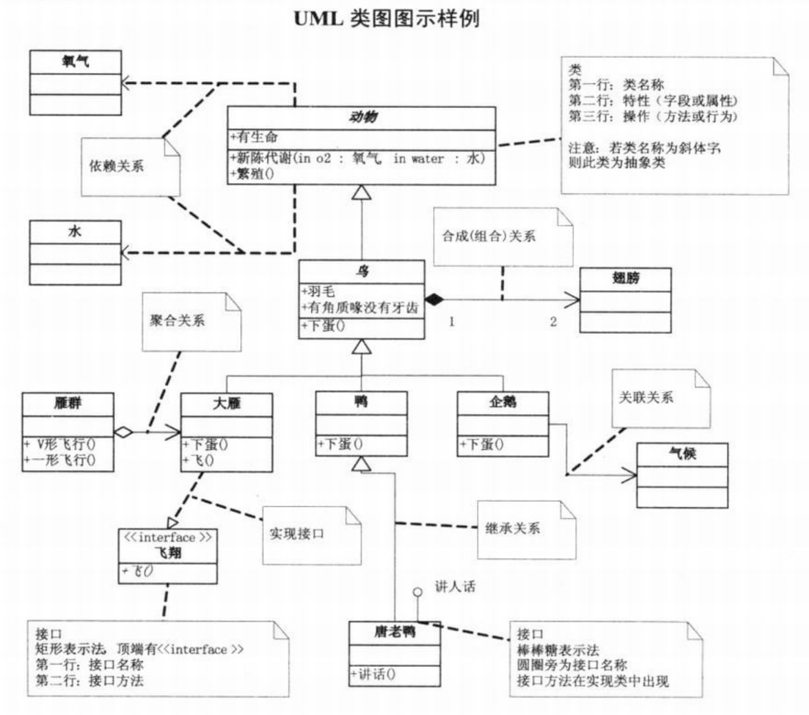

#UML类图
UML一一Unified modeling language UML(统一建模语言)，是一种用于软件系统分析和设计的语言工具，它用
于帮助软件开发人员进行思考和记录思路的结果

UML本身是一套符号的规定，就像数学符号和化学符号一样，**这些符号用于描述软件模型中的各个元素和他们之间的关系，比如类、接口、实现、泛化、依赖、组合、聚合等**，如图：

##类
UML类用一个矩形来表示，里面包含3个部分：
- 类的名字
- 类的属性（或称为特征）
- 类的方法（或称为行为）
###类中的符号
* `+`表示public
* `-`表示private
* `#`表示protected
* `~`表示package private

##类与类之间的关系
- 依赖（dependency):用虚线箭头表示
- 泛化/继承(generalization)：用实线空心三角箭头表示
- 实现(realization)：用虚线空心三角箭头表示
- 关联(association):用实线箭头表示
    - 关联关系是对象之间最常用的一种关系，它通常用来描述对象之间一对一、一对多、多对多的关系
- 聚合(aggregation):用实线空心菱形箭头表示
    - 聚合关系的实质就是在一个类声明了另一个对象，但是他们的生命周期是不同的
- 组合(composition):用实线实心菱形箭头表示
    - 组合关系是比聚合关系还要强的关系，组合关系中，一个类不仅声明了另一个对象，而且这个对象的生命周期也由这个类控制
